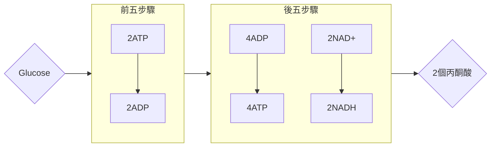
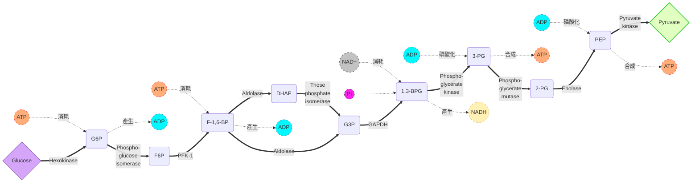
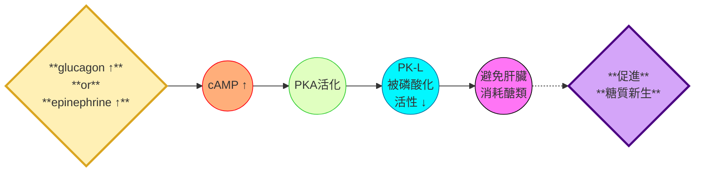
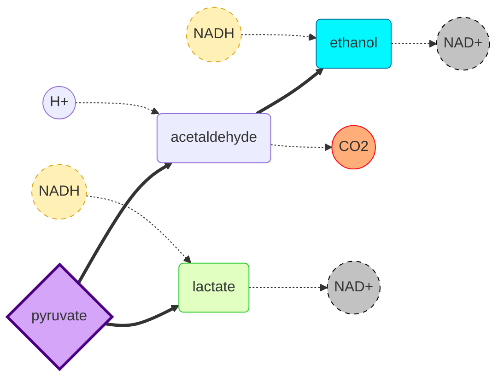

# biochemistry 2nd midterm
## Carbs metabolism
### glycolysis 簡介
- 糖解作用一共有10個步驟，一分子葡萄糖變成2個pyruvates，並產生2個ATP
- 10個步驟可看成兩大階段: **能量投入5階段**跟**能量生成5階段**

- 在需氧氣生物中，pyruvate會被氧化成acetyl-CoA，然後進行TCA cycle
#### 厭氧條件
- 最初的糖解作用需要在無往環境下進行
- 由於NAD+負責接收電子，會產生NADH，它會在生物體中積累，如果不把電子轉移回到其他物質，NAD+會被耗盡，導致糖解作用停止
- 因此，生物必須找到接收電子的受體，例如用硫酸根或是硝酸根離子 (同時配合ETC)，或是乾脆用導電的金屬，或是用底物來接收電子
- 例如，利用lactate dehydrogenase，可以把pyruvate變成乳酸:

$$
\begin{array}{l r}
\text{pyruvate}+\text{NADH}+H^+\rightleftharpoons \text{L-lactate}+\text{NAD}^{+} & \Delta G = -25.1\ \text{kJ/mol}
\end{array}
$$

- homolactic fermentation (所有糖變成乳酸) 用於發酵食物
- 酒精發酵涉及丙酮酸變成乙醛跟二氧化碳，然後轉化成乙醇:
  
$$
\begin{array}{l r}
\text{acetaldehyde}+\text{NADH}+H^2\rightleftharpoons\text{ethanol}+\text{NAD}^{+} & \Delta G = -23.7\ \text{kJ/mol}
\end{array}
$$

- 主要類型包含Homolactic (產生乳酸)、Alcoholic (產生酒精)、Butanediol (產生丁二醇)
- 這些被稱為無氧糖解作用，因為pyruvate會被還原，總體來說葡萄糖沒有發生淨氧化
- 骨骼肌劇烈運動主要導致乳酸發酵
#### 策略說明
- 首先，在真核細胞裡面，糖解作用發生於細胞質，而pyruvate的進一步代謝發生在粒線體
- 其化學作用可歸納為三個過程:
  - 葡萄糖中添加磷酸基團，得到磷酸基轉移潛力低的化合物
  - 透過化學方法，把這些中間產物變成磷酸基團轉移潛力高的物質
  - 這些產物遇到ADP時，隨即把磷酸基轉移給ADP，形成ATP
- G3P跟DHAP的轉移能力都比較低，然而到了後期的能量轉移階段，形成的1,3-BPG跟PEP就有高轉移能力，可形成ATP
- 磷酸化有分成三種:
  - 底物水平磷酸化 substrate-level phosphorylation
  - 氧化磷酸化 oxidative phosphorylation
  - 光合磷酸化 photophosphorylation
### 步驟簡介

### 糖解的能量投資時期
#### 1. 第一次ATP消耗
- 利用hexokinase，在葡萄糖的六號碳身上加上一個磷酸基
- 需要用到 $Mg^{2+}$
> [!Tip]
> 基本上所有和ATP作用有關的酵素都需要用到鎂離子 !

- 哺乳動物身上有不同的hexokinase，催化同一個分子的不同酵素被稱為isoenzyme 或是 isozyme
- 細胞內的葡萄糖濃度高 (通常高於任何hexokinase的 $K_m$ 值)
- 其中，hexokinase IV (又稱為glucokinase) 對葡萄糖有較低親和力，在圖呈現S (sigmoidal) 曲線，它主要在肝臟中出現，只有在極高血糖時才開始利用葡萄糖
>[!Important]
>這種特性讓肝臟能調節葡萄糖使用跟提供
##### 備註: 葡萄糖磷酸轉移酶系統 (PTS)
- 細菌的特殊醣類運作機制
- 能量來源以PEP為主，如下:

$$
\text{PEP}_{in}+\text{glucose}_{out}\rightarrow \text{pyruvate}_{in}+\text{G6P}_{in}
$$

#### 2. G6P的異構轉換
- 利用G6P isomerase，從G6P (aldose) 異構轉換成 F6P (ketose)
- 反應透過烯二醇中間體進行

#### 3. 第二次ATP消耗
- 利用phosphofructokinase (PFK)再加上一個磷酸基到果糖的1號碳上面，形成F-1,6-BP
- PFK是十分重要的關鍵調控酶，這一步需要花較多時間，屬於整個糖解作用的速率限制步驟
- 這屬於**不可逆反應**，一旦磷酸化成功，葡萄糖就是必得走為整個糖解途徑
- 它也是整個糖解作用的主要調控點，ATP、ADP、AMP、檸檬酸的濃度會影響PFK的活性
#### 4. 裂成兩半
- 利用fructose-1,6-bisphosphate aldolase (又稱為aldolase，醛縮酶)，形成兩個三碳糖，每個糖都有一個磷酸基，分別是甘油醛-3-磷酸 (G3P) 跟磷酸二氫丙酮 (DHAP)
- 雖然這個反應在標準狀態下是吸能的 ( $\Delta\ G$ 在10個步驟裡面最高，為 $+23.9\ \text{kJ/mol}$ )，但是由於該反應在細胞中進行，只要產物濃度夠低，反應就可以自然進行，因為:

$$
\Delta\ G=\Delta G^\circ\text{'} + RT\ln\frac{[product]}{[reactants]}
$$

>[!Tip]
>只要G3P消耗得快，反應就能一直進行 !

##### 備註: 席夫鹼的功能
- Schiff base是一種亞胺，醛縮酶活性位點上的Lys殘基，其胺基可以跟F16BP的羰基結合，形成Schiff base
- Schiff base幫忙穩定反應中間體，並且讓電子重新分布，好讓C-C鍵更容易斷裂，也讓反應更容易進行 ( $E_a\downarrow$ )

#### 5. DHAP轉換
- triose phosphate isomerase把DHAP變成G3P
- 這反應也是屬於若生理反應，但是一樣，只要G3P消耗得快就好

### 糖解的能量產生時期
#### 6. 先產生NADH
- G3P在NAD+跟一個磷酸基，在glyceraldehyde-3-phosphate dehydrogenase (GAPDH) 作用下，形成1,3二磷酸甘油酸 (1,3-BPG)，同時生成NADH，一個高能的化合物
- 在標準狀態寫屬於稍微吸能的反應
- GAPDH上面有一個cysteine殘基，其 $-SH$ 基攸關於反應的成功。 $-SH$ 會跟G3P的醛基結合，使其能夠穩定傳遞電子給NAD+，同時和另一個磷酸基結合
- 整體反應其實是放能 (醛變成酸) 跟吸能 (磷酸化) 兩個反應結合的結果:
  
$$\boxed{\text{aldehyde}}+H_2O+NAD^+\rightarrow \boxed{\text{acid}}+NADH+H^+\overset{+\text{Pi}}{\rightarrow}\boxed{\text{醯基磷酸酯}}+H_2O$$

- 碘乙酸會不可逆的烷基化GAPDH的cysteine殘基，導致酵素失去活性:

$$\boxed{GAPDG}-SH+ICH_2COO^- \rightarrow \boxed{GAPDG}-S-CH_2COO^- + HI$$

#### 7. 第一次底物水平磷酸化
- 1,3-BPG在phosphoglycerate kinase的作用， $Mg^{2+}$ 的催化下，一號碳脫去一個磷酸基團，形成ATP，和3-磷酸甘油酸 (3-PG)
- 和上一個反應做結合，相當於把醛變成酸所產生的能量，透過ATP的形式保存下來
- 3-PG的磷酸轉移能力較低
#### 8. 再一次異構化改變
- 在phosphoglycerate mutase和 $Mg^{2+}$ 作用下，移動Pi位置，形成2-PG
- 雖然為吸能反應，但是由於3-PG在細胞內濃度往往比2-PG多，反應能正常進行
- 該酵素的作用位點是一個磷酸化的His殘基，然後酵素 "丟Pi給二號碳，再拿走對方三號碳上的Pi"，完成交換
#### 9. 合成第二個高能化合物
- 在 $Mg^{2+}$ 跟enolase的幫助下，2-PG脫水變成PEP
- PEP是一個磷酸轉移能力特別高的化合物，由於PEP的Pi連接在烯醇結構上 ( $C=C-OH$ )，非常不穩定，因此其脫去Pi，轉變成Pyruvate時，會釋放出極大的能量
#### 10. 第二次底物水平磷酸化
- 在pyruvate kinase (PK) 跟 $Mg^{2+}$ 作用下，PEP轉移磷酸基給ADP，形成ATP跟pyruvate，並釋放大量能量，屬於**不可逆反應**
- PK 在代謝上也有做調控，也有多個isozymes，不同的isozymes在不同地方工作，例如，PK-M1在肌肉跟大腦中常見，PK-M2除了在胚胎發育中常見，也在腫瘤中出現
- 除了PK-M1之外，其他PK都需要F-1,6-BP進行變構變化才可以活化
- 當你吃了很多carbs，你的身體會大量製造PK，增加人體從糖解作用獲取能量的能力
- 肝臟型的PK，例如PK-L，也能受到磷酸化影響，細胞通路中的PKA會磷酸化PK-L，通常狀況為:

- 來做個glycolysis的總結

|反應|enzyme|多了ATP|實際釋放的自由能$\Delta G$|
|---|------|-------|-----------------------|
|G → G6P|HK|$-1$|$-33.5$|
|G6P → F6P|PGI||$-2.5$|
|F6P → F-1,6-BP|PFK|$-1$|$-22.2$|
|F-1,6-BP → G3P+DHAP|ALD||$-1.3$|
|DHAP → G3P|TPI||$\approx 0$|
|G3P → 1,3-BPG|GAPDH||$-1.7\times 2$|
|1,3-BPG → 3-PG|PGK|$+1\times 2$|$\approx 0$|
|3-PG → 2-PG|PGM||$\approx 0$|
|2-PG → PEP|ENO|$+1\times 2$|$-3.3\times 2$|
|PEP → Pyr|PK||$-16.7\times 2$|
|**Net**||$+2$|$-102.9$|

---

### Metabolic fates of pyruvate
- 在有氧呼吸的細胞中，糖解作用的速率往往較高。粒線體裡面NADH再氧化的速率通常太慢了
- 因此，G3P氧化時產生的NADH，一部份會拿來進行發酵作用，再生成NAD+
#### 乳酸代謝
- 人的骨骼肌在運動時就非常仰賴乳酸發酵
- 乳酸其實可以**重新利用**，在慢肌纖維中可以轉換回pyruvate，然後進入TCA循環
- 多數乳酸都拿去再氧化 (75%)，剩下的就拿到肝臟進行糖質新生
- 乳酸脫氫酶 (LDH)
> [!Note] 
> LDH通常可以用來偵測心肌梗塞，因為其只會存在細胞內，如果偵測到血液中有LDH，那就代表有細胞受損的狀態
#### 乙醇代謝
- 酵母菌可透過兩個步驟將丙酮酸轉化成乙醇
- 第一步驟利用pyruvate decarboxylase，把丙酮酸變成乙醛，同時產生二氧化碳
- 第二步驟利用乙醇脫氫酶，把乙醛變成乙醇。這一步驟為可逆反應，同時在新生NAD+
- 生物燃料的其中一個選項就是乙醇，透過培養或是改造細菌，使其可以分解纖維素
- 動物也有乙醇脫氫酶。由於我們剛才已經說了，乙醇跟乙醛的反應是可逆的:
  
$$
CH_3COH + NADH + H^{+}  \rightleftharpoons CH_3CH_2OH + NAD^+
$$

- 人類就是做逆反應，所以反而會大量消耗NAD+，導致糖解作用的抑制

#### 能量跟電子平衡
- 底物水平磷酸化+發酵作用屬於一個 "非氧化過程"，期間並沒有碳的氧化態變化，電子不多也不少
- 整個糖解作用中，HK、PFK、PK這三個酶造成的反應，屬於非平衡反應，放能巨大，並且不可逆，也是糖解作用的調節位點
- 雖然糖解作用產生的ATP不多，但是其在身體裡面大量反應，產生ATP的速率因此提高 (氧化磷酸化的100倍)，屬於非常快速但效率低的能量使用方式
- 肌肉跟癌細胞就大量利用糖解作用活動跟生長

