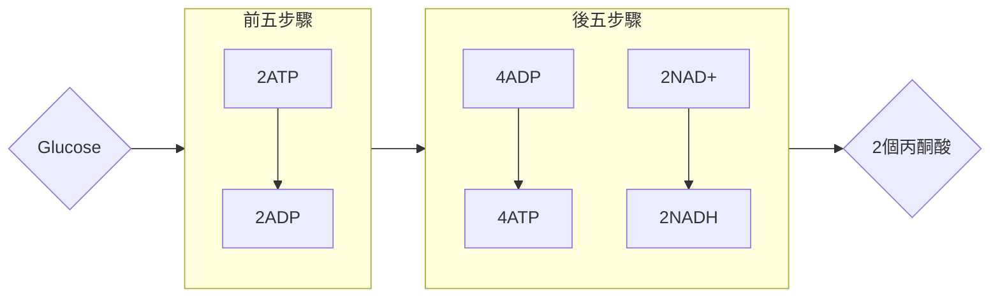
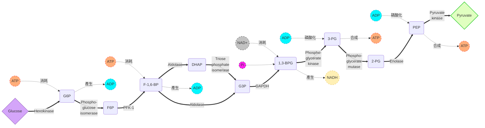
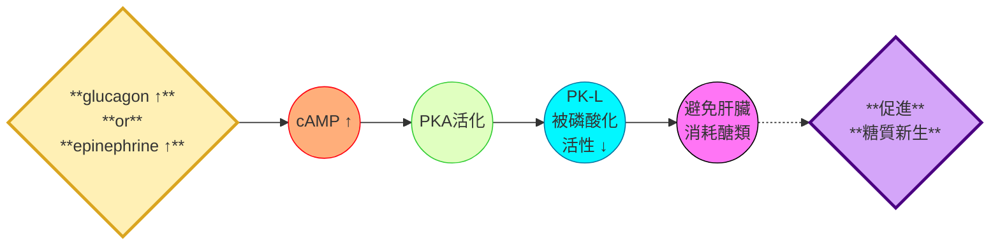
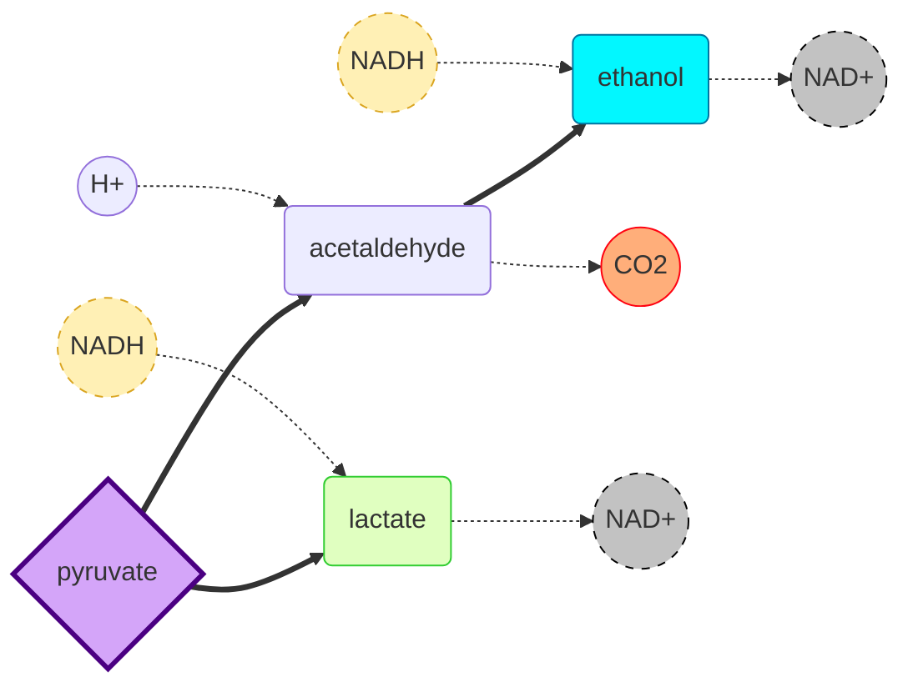
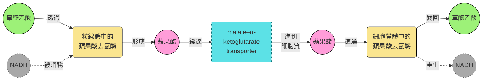
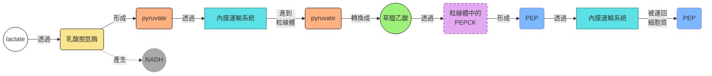
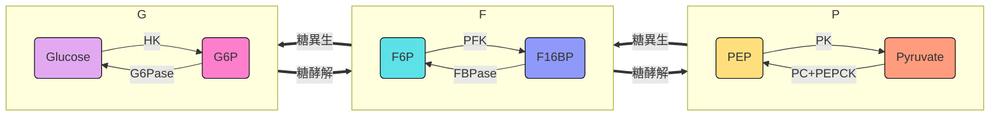
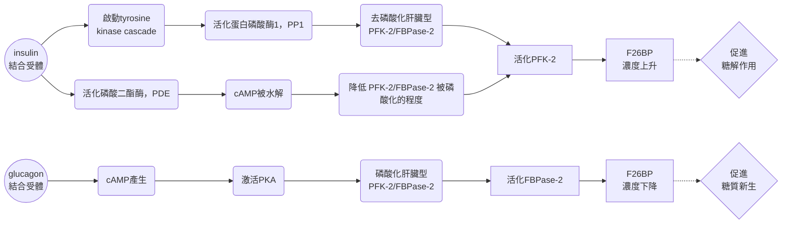
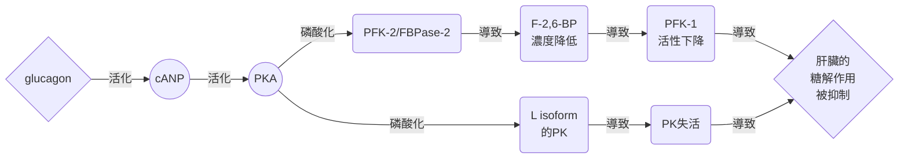

# biochemistry 2nd midterm
## Carbs metabolism
### glycolysis 簡介
- 糖解作用一共有10個步驟，一分子葡萄糖變成2個pyruvates，並產生2個ATP
- 10個步驟可看成兩大階段: **能量投入5階段**跟**能量生成5階段**

```mermaid
flowchart LR
  subgraph 前五步驟
    2ATP-->2ADP
  end
  
  subgraph 後五步驟
    4ADP-->4ATP
    2NAD+-->2NADH
  end
  Glucose{Glucose}
  Glucose-->前五步驟
  前五步驟-->後五步驟
  後五步驟-->pyruvate{2個丙酮酸}
```
- 在需氧氣生物中，pyruvate會被氧化成acetyl-CoA，然後進行TCA cycle
#### 厭氧條件
- 最初的糖解作用需要在無往環境下進行
- 由於NAD+負責接收電子，會產生NADH，它會在生物體中積累，如果不把電子轉移回到其他物質，NAD+會被耗盡，導致糖解作用停止
- 因此，生物必須找到接收電子的受體，例如用硫酸根或是硝酸根離子 (同時配合ETC)，或是乾脆用導電的金屬，或是用底物來接收電子
- 例如，利用lactate dehydrogenase，可以把pyruvate變成乳酸:

$$
\begin{array}{l r}
\text{pyruvate}+\text{NADH}+H^+\rightleftharpoons \text{L-lactate}+\text{NAD}^{+} & \Delta G = -25.1\ \text{kJ/mol}
\end{array}
$$

- homolactic fermentation (所有糖變成乳酸) 用於發酵食物
- 酒精發酵涉及丙酮酸變成乙醛跟二氧化碳，然後轉化成乙醇:
  
$$
\begin{array}{l r}
\text{acetaldehyde}+\text{NADH}+H^2\rightleftharpoons\text{ethanol}+\text{NAD}^{+} & \Delta G = -23.7\ \text{kJ/mol}
\end{array}
$$

- 主要類型包含Homolactic (產生乳酸)、Alcoholic (產生酒精)、Butanediol (產生丁二醇)
- 這些被稱為無氧糖解作用，因為pyruvate會被還原，總體來說葡萄糖沒有發生淨氧化
- 骨骼肌劇烈運動主要導致乳酸發酵
#### 策略說明
- 首先，在真核細胞裡面，糖解作用發生於細胞質，而pyruvate的進一步代謝發生在粒線體
- 其化學作用可歸納為三個過程:
  - 葡萄糖中添加磷酸基團，得到磷酸基轉移潛力低的化合物
  - 透過化學方法，把這些中間產物變成磷酸基團轉移潛力高的物質
  - 這些產物遇到ADP時，隨即把磷酸基轉移給ADP，形成ATP
- G3P跟DHAP的轉移能力都比較低，然而到了後期的能量轉移階段，形成的1,3-BPG跟PEP就有高轉移能力，可形成ATP
- 磷酸化有分成三種:
  - 底物水平磷酸化 substrate-level phosphorylation
  - 氧化磷酸化 oxidative phosphorylation
  - 光合磷酸化 photophosphorylation
### 步驟簡介

```mermaid
flowchart LR

    classDef ATP fill:#ffae7a,stroke:#ff0211,stroke-dasharray: 5 5
    classDef ADP fill: #02f7ff, stroke: #0075a1, stroke-dasharray: 5 5

    Glucose{Glucose} ==>|Hexokinase| G6P(G6P)
    G6P ==>|Phospho-<br>glucose<br>isomerase| F6P(F6P)
    F6P ==>|PFK-1| F16BP
    F16BP(F-1,6-BP) ==>|Aldolase| DHAP
    F16BP ==>|Aldolase| GAP(G3P)
    DHAP(DHAP) ==>|Triose<br/>phosphate<br/>isomerase| GAP

    GAP ==>|GAPDH| BPG13(1,3-BPG)
    P((Pi))-.->BPG13
    BPG13 ==>|Phospho-<br>glycerate<br/>kinase| PG3(3-PG)
    PG3 ==>|Phospho-<br>glycerate<br>mutase| PG2(2-PG)
    PG2 ==>|Enolase| PEP(PEP)
    PEP ==>|Pyruvate<br>kinase| Pyruvate{Pyruvate}
    
    ATP1((ATP))-.->|消耗|G6P
    G6P-.->|產生|ADP1((ADP))
    ATP2((ATP))-.->|消耗|F16BP
    F16BP-.->|產生|ADP2((ADP))
    NAD1((NAD+))-.->|消耗|BPG13
    BPG13-.->|產生|NADH1((NADH))
    ADP3((ADP))-.->|磷酸化|PG3
    PG3-.->|合成|ATP3((ATP))
    ADP4((ADP))-.->|磷酸化|PEP
    PEP-.->|合成|ATP4((ATP))
    
    class ATP1 ATP;
    class ATP2 ATP;
    class ATP3 ATP;
    class ATP4 ATP;
    class ADP1 ADP;
    class ADP2 ADP;
    class ADP3 ADP;
    class ADP4 ADP;
    
    style Glucose fill:#d4a5f9,stroke:#4b0082
    style Pyruvate fill:#e0ffc0,stroke:#32cd32, stroke-width: 2px
    style NADH1 fill:#fff0b5,stroke:#daa520, stroke-dasharray: 5 5
    style NAD1 fill:#c2c2c2,stroke:#000, stroke-dasharray: 5 5
    style P fill: #ff21ef, stroke: #000 ,stroke-dasharray: 5 5
```
### 糖解的能量投資時期
#### 1. 第一次ATP消耗
- 利用hexokinase，在葡萄糖的六號碳身上加上一個磷酸基
- 需要用到 $Mg^{2+}$
> [!Tip]
> 基本上所有和ATP作用有關的酵素都需要用到鎂離子 !

- 哺乳動物身上有不同的hexokinase，催化同一個分子的不同酵素被稱為isoenzyme 或是 isozyme
- 細胞內的葡萄糖濃度高 (通常高於任何hexokinase的 $K_m$ 值)
- 其中，hexokinase IV (又稱為glucokinase) 對葡萄糖有較低親和力，在圖呈現S (sigmoidal) 曲線，它主要在肝臟中出現，只有在極高血糖時才開始利用葡萄糖
>[!Important]
>這種特性讓肝臟能調節葡萄糖使用跟提供
##### 備註: 葡萄糖磷酸轉移酶系統 (PTS)
- 細菌的特殊醣類運作機制
- 能量來源以PEP為主，如下:

$$
\text{PEP}_{in}+\text{glucose}_{out}\rightarrow \text{pyruvate}_{in}+\text{G6P}_{in}
$$

#### 2. G6P的異構轉換
- 利用G6P isomerase，從G6P (aldose) 異構轉換成 F6P (ketose)
- 反應透過烯二醇中間體進行

#### 3. 第二次ATP消耗
- 利用phosphofructokinase (PFK)再加上一個磷酸基到果糖的1號碳上面，形成F-1,6-BP
- PFK是十分重要的關鍵調控酶，這一步需要花較多時間，屬於整個糖解作用的速率限制步驟
- 這屬於**不可逆反應**，一旦磷酸化成功，葡萄糖就是必得走為整個糖解途徑
- 它也是整個糖解作用的主要調控點，ATP、ADP、AMP、檸檬酸的濃度會影響PFK的活性
#### 4. 裂成兩半
- 利用fructose-1,6-bisphosphate aldolase (又稱為aldolase，醛縮酶)，形成兩個三碳糖，每個糖都有一個磷酸基，分別是甘油醛-3-磷酸 (G3P) 跟磷酸二氫丙酮 (DHAP)
- 雖然這個反應在標準狀態下是吸能的 ( $\Delta\ G$ 在10個步驟裡面最高，為 $+23.9\ \text{kJ/mol}$ )，但是由於該反應在細胞中進行，只要產物濃度夠低，反應就可以自然進行，因為:

$$
\Delta\ G=\Delta G^\circ\text{'} + RT\ln\frac{[product]}{[reactants]}
$$

>[!Tip]
>只要G3P消耗得快，反應就能一直進行 !

##### 備註: 席夫鹼的功能
- Schiff base是一種亞胺，醛縮酶活性位點上的Lys殘基，其胺基可以跟F16BP的羰基結合，形成Schiff base
- Schiff base幫忙穩定反應中間體，並且讓電子重新分布，好讓C-C鍵更容易斷裂，也讓反應更容易進行 ( $E_a\downarrow$ )

#### 5. DHAP轉換
- triose phosphate isomerase把DHAP變成G3P
- 這反應也是屬於若生理反應，但是一樣，只要G3P消耗得快就好

### 糖解的能量產生時期
#### 6. 先產生NADH
- G3P在NAD+跟一個磷酸基，在glyceraldehyde-3-phosphate dehydrogenase (GAPDH) 作用下，形成1,3二磷酸甘油酸 (1,3-BPG)，同時生成NADH，一個高能的化合物
- 在標準狀態寫屬於稍微吸能的反應
- GAPDH上面有一個cysteine殘基，其 $-SH$ 基攸關於反應的成功。 $-SH$ 會跟G3P的醛基結合，使其能夠穩定傳遞電子給NAD+，同時和另一個磷酸基結合
- 整體反應其實是放能 (醛變成酸) 跟吸能 (磷酸化) 兩個反應結合的結果:
  
$$\boxed{\text{aldehyde}}+H_2O+NAD^+\rightarrow \boxed{\text{acid}}+NADH+H^+\overset{+\text{Pi}}{\rightarrow}\boxed{\text{醯基磷酸酯}}+H_2O$$

- 碘乙酸會不可逆的烷基化GAPDH的cysteine殘基，導致酵素失去活性:

$$\boxed{GAPDG}-SH+ICH_2COO^- \rightarrow \boxed{GAPDG}-S-CH_2COO^- + HI$$

#### 7. 第一次底物水平磷酸化
- 1,3-BPG在phosphoglycerate kinase的作用， $Mg^{2+}$ 的催化下，一號碳脫去一個磷酸基團，形成ATP，和3-磷酸甘油酸 (3-PG)
- 和上一個反應做結合，相當於把醛變成酸所產生的能量，透過ATP的形式保存下來
- 3-PG的磷酸轉移能力較低
#### 8. 再一次異構化改變
- 在phosphoglycerate mutase和 $Mg^{2+}$ 作用下，移動Pi位置，形成2-PG
- 雖然為吸能反應，但是由於3-PG在細胞內濃度往往比2-PG多，反應能正常進行
- 該酵素的作用位點是一個磷酸化的His殘基，然後酵素 "丟Pi給二號碳，再拿走對方三號碳上的Pi"，完成交換
#### 9. 合成第二個高能化合物
- 在 $Mg^{2+}$ 跟enolase的幫助下，2-PG脫水變成PEP
- PEP是一個磷酸轉移能力特別高的化合物，由於PEP的Pi連接在烯醇結構上 ( $C=C-OH$ )，非常不穩定，因此其脫去Pi，轉變成Pyruvate時，會釋放出極大的能量
#### 10. 第二次底物水平磷酸化
- 在pyruvate kinase (PK) 跟 $Mg^{2+}$ 作用下，PEP轉移磷酸基給ADP，形成ATP跟pyruvate，並釋放大量能量，屬於**不可逆反應**
- PK 在代謝上也有做調控，也有多個isozymes，不同的isozymes在不同地方工作，例如，PK-M1在肌肉跟大腦中常見，PK-M2除了在胚胎發育中常見，也在腫瘤中出現
- 除了PK-M1之外，其他PK都需要F-1,6-BP進行變構變化才可以活化
- 當你吃了很多carbs，你的身體會大量製造PK，增加人體從糖解作用獲取能量的能力
- 肝臟型的PK，例如PK-L，也能受到磷酸化影響，細胞通路中的PKA會磷酸化PK-L，通常狀況為:

```mermaid
flowchart LR
Start{**glucagon ↑**<br>**or**<br>**epinephrine ↑**}
Start-->cAMP((cAMP ↑))
cAMP-->PKA((PKA活化))
PKA-->PK((PK-L<br>被磷酸化<br>活性 ↓))
PK-->Result((避免肝臟<br>消耗醣類))
Result-.->Gng{**促進**<br>**糖質新生**}

style Start fill:#fff0b5,stroke:#daa520,stroke-width:3px
style cAMP fill:#ffae7a,stroke:#ff0211
style PKA fill:#e0ffc0,stroke:#32cd32
style PK fill: #02f7ff, stroke: #0075a1
style Result fill: #ff75f5, stroke: #000 
style Gng fill:#d4a5f9,stroke:#4b0082,stroke-width:3px

```
- 來做個glycolysis的總結

|反應|enzyme|多了ATP|實際釋放的自由能$\Delta G$|
|---|------|-------|-----------------------|
|G → G6P|HK|$-1$|$-33.5$|
|G6P → F6P|PGI||$-2.5$|
|F6P → F-1,6-BP|PFK|$-1$|$-22.2$|
|F-1,6-BP → G3P+DHAP|ALD||$-1.3$|
|DHAP → G3P|TPI||$\approx 0$|
|G3P → 1,3-BPG|GAPDH||$-1.7\times 2$|
|1,3-BPG → 3-PG|PGK|$+1\times 2$|$\approx 0$|
|3-PG → 2-PG|PGM||$\approx 0$|
|2-PG → PEP|ENO|$+1\times 2$|$-3.3\times 2$|
|PEP → Pyr|PK||$-16.7\times 2$|
|**Net**||$+2$|$-102.9$|

---

### Metabolic fates of pyruvate
- 在有氧呼吸的細胞中，糖解作用的速率往往較高。粒線體裡面NADH再氧化的速率通常太慢了
- 因此，G3P氧化時產生的NADH，一部份會拿來進行發酵作用，再生成NAD+
#### 乳酸代謝
- 人的骨骼肌在運動時就非常仰賴乳酸發酵
- 乳酸其實可以**重新利用**，在慢肌纖維中可以轉換回pyruvate，然後進入TCA循環
- 多數乳酸都拿去再氧化 (75%)，剩下的就拿到肝臟進行糖質新生
- 乳酸脫氫酶 (LDH)
> [!Note] 
> LDH通常可以用來偵測心肌梗塞，因為其只會存在細胞內，如果偵測到血液中有LDH，那就代表有細胞受損的狀態
#### 乙醇代謝
- 酵母菌可透過兩個步驟將丙酮酸轉化成乙醇
- 第一步驟利用pyruvate decarboxylase，把丙酮酸變成乙醛，同時產生二氧化碳
- 第二步驟利用乙醇脫氫酶，把乙醛變成乙醇。這一步驟為可逆反應，同時在新生NAD+
- 生物燃料的其中一個選項就是乙醇，透過培養或是改造細菌，使其可以分解纖維素
- 動物也有乙醇脫氫酶。由於我們剛才已經說了，乙醇跟乙醛的反應是可逆的:
  
$$
CH_3COH + NADH + H^{+}  \rightleftharpoons CH_3CH_2OH + NAD^+
$$

- 人類就是做逆反應，所以反而會大量消耗NAD+，導致糖解作用的抑制

```mermaid
flowchart LR

   classDef NADH fill:#fff0b5,stroke:#daa520, stroke-dasharray: 5 5
   classDef NAD fill:#c2c2c2,stroke:#000, stroke-dasharray: 5 5

P{pyruvate}
P==>Ach(acetaldehyde)
P==>La(lactate)
Ach==>Eth(ethanol)

H((H+))-.->Ach
Ach-.->CO2((CO2))

NADH1((NADH))-.->La
La-.->NAD1((NAD+))

NADH2((NADH))-.->Eth
Eth-.->NAD2((NAD+))

  class NAD1 NAD;
  class NAD2 NAD
  class NADH1 NADH
  class NADH2 NADH
  
  style P fill:#d4a5f9,stroke:#4b0082,stroke-width:3px
  style La fill:#e0ffc0,stroke:#32cd32
  style Eth fill: #02f7ff, stroke: #0075a1
  style CO2 fill:#ffae7a,stroke:#ff0211
```
#### 能量跟電子平衡
- 底物水平磷酸化+發酵作用屬於一個 "非氧化過程"，期間並沒有碳的氧化態變化，電子不多也不少
- 整個糖解作用中，HK、PFK、PK這三個酶造成的反應，屬於非平衡反應，放能巨大，並且不可逆，也是糖解作用的調節位點
- 雖然糖解作用產生的ATP不多，但是其在身體裡面大量反應，產生ATP的速率因此提高 (氧化磷酸化的100倍)，屬於非常快速但效率低的能量使用方式
- 肌肉跟癌細胞就大量利用糖解作用活動跟生長

### Gluconeogenesis
- 身體需要讓血糖維持在一個level，糖質新生就是幫忙重生葡萄糖的好方法

#### 簡單來說
- 它用特定的酵素來取代糖解作用中的不可逆反應
- 基本上，在糖解作用中，不可逆反應都是屬於高放能反應，例如hexokinese、posphofructokinase、pyruvate kinase。而糖質新生就是用特定的其餘三個酶 "繞過" 原反應。這個過程需要大量能量

##### 1. 丙酮酸變成PEP
- 通常反應分為兩部分。第一部分是利用pyruvate carboxylase，把pyruvate變成oxaloacetate (草醯乙酸):

$$
\text{pyruvate}+HCO_3^{-}+ATP \rightleftharpoons OAA + ADP + Pi + 2H^{+}\quad \Delta G^\circ\text{'}=-2.1\ \text{kJ/mol}
$$

- 此時的OAA需要被轉到細胞質中，但是粒線體沒有專門運輸OAA的蛋白質，因此要經過轉換。轉換的重點就是malate dehydrogenase
- 這東西在粒線體跟細胞質裡面都有，而malate才能夠在粒線體跟細胞質間 "穿梭自如"。反應如下: 

```mermaid
flowchart LR

OAA1((草醯乙酸))
OAA1-->|透過|mdhm(粒線體中的<br>蘋果酸去氫酶)
mdhm-->|形成|m1((蘋果酸))

NADH1((NADH))-.->|被消耗|mdhm
m1-->|經過|makt[malate–α-<br>ketoglutarate<br>transporter]
makt-->|進到<br>細胞質|m2((蘋果酸))

m2-->|透過|mdhc(細胞質體中的<br>蘋果酸去氫酶)
mdhc-->|變回|OAA2((草醯乙酸))
mdhc-.->|重生|NADH2((NADH))

%% 色彩調整中

style OAA1 fill: #9df178, stroke: #000
style OAA2 fill: #9df178, stroke: #000
style mdhm fill: #fae58f, stroke: #000
style mdhc fill: #fae58f, stroke: #000
style makt fill: #5ce1e6, stroke: #006e72, stroke-dasharray: 5 5
style m1 fill: #ff9dd9, stroke: #000
style m2 fill: #ff9dd9, stroke: #000

style NADH1 fill: #a8a8a8, stroke: #5b5b5b, stroke-dasharray: 3 3
style NADH2 fill: #a8a8a8, stroke: #5b5b5b, stroke-dasharray: 3 3

```
- 然後OAA再透過phosphoenolpyruvate carboxykinase (PEPCK) ，並且在GTP的情況下形成PEP:

$$OAA + GTP \rightleftharpoons PEP + CO_2 + GDP\quad \Delta G^\circ\text{'}=+2.9\ \text{kJ/mol}$$

- 當還有另外一種路徑可以參考，就是透過乳酸跟乳酸脫氫酶 (lactate dehydrogenase)
- 這個路徑跟糖解作用路徑完美循環，這個循環又被稱為**Cori cycle**

```mermaid
flowchart LR

L((lactate))
L-->|透過|LDH(乳酸脫氫酶)
LDH-->|形成|Py1(pyruvate)
LDH-.->|產生|NADH((NADH))
Py1-->|透過|Pt1[內膜運輸系統]
Pt1-->|進到<br>粒線體|Py2(pyruvate)
Py2-->|轉換成|OAA((草醯乙酸))
OAA-->|透過|PEPCK(粒線體中的<br>PEPCK)
PEPCK-->|形成|PEP1(PEP)
PEP1-->|透過|Pt2[內膜運輸系統]
Pt2-->|被運回<br>細胞質|PEP2(PEP)

style L fill: #ffffff, stroke: #000
style LDH fill: #fae58f, stroke: #000
style Py1 fill: #ffb181, stroke: #000
style Py2 fill: #ffb181, stroke: #000
style NADH fill: #a8a8a8, stroke: #5b5b5b, stroke-dasharray: 3 3
style Pt1 fill: #5ce1e6, stroke: #006e72, strke-dasharray: 5 5
style Pt2 fill: #5ce1e6, stroke: #006e72, strke-dasharray: 5 5
style OAA fill: #9df178, stroke: #000
style PEPCK fill: #e2a9f1, stroke: #750692, stroke-dasharray: 5 5 
style PEP1 fill: #7bb8ff, strole: #000
style PEP2 fill: #7bb8ff, strole: #000

```

##### 2. F-1,6-BP變成F6P
- 在 $Mg^{2+}$ 跟 fructose-1,6- bisphosphatase 作用下形成:

$$
\text{F-1,6-BP} + H_2O\rightarrow \text{F6P} + Pi\quad G^\circ\text{'}=-16.3\ \text{kJ/mol}
$$

##### 3. G6P變成葡萄糖
- 在 $Mg^{2+}$ 跟 glucose-6-phosphatase 作用下形成:

$$
\text{G6P} + H_2O\rightarrow \text{glucose} + Pi\quad G^\circ\text{'}=-13.8\ \text{kJ/mol}
$$

#### 總消耗

$$
\begin{align}
& 2\ \text{pyruvate} + 4ATP + 2GTP + 2NADH + 2H^{+} + 4H_2O\rightarrow \text{glucose} + 4ADP + 2GDP + 6Pi + 2NAD^{+}\\
& G^\circ\text{'}=-33\ \text{kJ/mol}
\end{align}
$$

> [!Important] 
> 要是我們全部換成高能磷酸鹽的形式來看， $1NADH=2.5\ ATP$ ，總體來說就是**使用11個ATP來把兩個丙酮酸變成一個葡萄糖**

#### 底物介紹
- 糖質新生的前驅物包含lactate、alanine、glycerol、propionate (丙酸)

##### amino acid
- 主要是用降解途徑，生成TCA cycle中間體，然後它們都可以透過循環變成OAA，進而進入我們剛才的反應鏈
- 能夠透過糖質新生產生葡萄糖的胺基酸被稱為glucogenic (leucine跟lysine例外)

##### glycerol
- 這東西難以進行糖質新生，因為脂肪酸主要透過 $\beta$ 氧化形成acetyl-CoA，而acetyl-CoA不能拿來做甚麼，無法形成任何糖質新生前體 🙂
- 唯一能做糖質新生的東西叫做甘油，甘油透過磷酸化形成甘油-3-磷酸，並且轉換成DHAP，而DHAP就可以進入糖質新生的路徑上

##### propinate
- 這東西在草食動物比較常見，咱們用一個公式帶過就好:

$$
\text{propionyl-CoA}\overset{CO_2}{\rightarrow} \text{methylmalonyl-CoA}\rightarrow \text{succinyl-CoA}\rightarrow \text{OAA}
$$

#### 酒精跟糖質新生
- 可能會導致低血糖 (hypoglycemia)，因為乙醇會把 $NAD^+$ 給用光:

$$C_2H_5OH + NAD^{+}\rightleftharpoons CH_3COH + NADH + H^{+}$$

#### 腎臟如何做酸鹼中和
- 人體代謝會產酸，這些多出來的氫離子 (通常跟 $HCO_3^-$ 結合)，會在腎臟透過跟氨來結合，形成 $NH_4^+$ 排入尿液
- 那氨怎麼產生的? 答案叫做glutamine (麩醯胺酸)。
- glutamine會在glutaminase and glutamate dehydrogenase的作用下，經過兩步，生成兩個氨:

$$
\begin{array}
\text{glutamine} + H_2O\rightarrow \text{glutamate} + NH_4^+\\
\text{glutamate} + NAD^+ + H_2O\rightarrow \alpha -\text{ketoglutarate} + NH_4^+ + NADH
\end{array}
$$

- $\alpha$ -ketoglutarate可以在TCA循環裡面變成OAA，後進入糖質新生

### 影響因素
- 糖質新生極大受到飲食的影響。在低碳的情況下，或是斷食的時後，這條路徑會被放大。這東西也受到激素影響，例如insulin跟glucagon 
- 基本上糖質新生跟糖解作用，我們只需要focus on各自的三個酵素: 糖解作用就是HK、PFK、PK。而糖質新生就是G6Pase、FBPase、以及pyruvate carboxylase + PEPCK
> [!Important]
> 再提醒一次，調控只能作用於遠離平衡的反應

```mermaid
flowchart RL

subgraph G
  direction LR
  Glu(Glucose)-->|HK|G6P(G6P)
  G6P-->|G6Pase|Glu
end

subgraph F
  direction LR
  F6P(F6P)-->|PFK|FBP(F16BP)
  FBP-->|FBPase|F6P
end

subgraph P
  direction LR
  PEP(PEP)-->|PK|Pyr(Pyruvate)
  Pyr-->|PC+PEPCK|PEP
end

G==>|糖酵解|F==>|糖酵解|P
P==>|糖異生|F==>|糖異生|G

style Glu fill: #e2a9f1, stroke: #000
style G6P fill: #fd7fcc, stroke: #000
style F6P fill: #5ce1e6, stroke: #000
style FBP fill: #8e99fa, stroke: #000
style PEP fill: #ffdf7d, stroke: #000
style Pyr fill: #ff9c7d, stroke: #000
```
> [!Tip]
> 促進糖解作用的狀況通常會抑制糖質新生，反之

#### PFK and F16BPase
- PFK會被AMP跟ADP激活 (因為能量變少了)，而F16BPase相反，會被AMP跟ADP抑制 (能量都不夠了還跟你造糖?)
- PFK會被ATP跟檸檬酸抑制
- 同時還有一個特別的物質: **F-2,6-BP**，會促進糖解作用 (活化PFK)，同時會抑制糖質新生 (抑制F16BPase)
> [!Important]
> 最強的糖解作用促進劑，就是F-2,6-BP 🐱

##### PFK 跟 ATP 的愛恨情仇
- PFK在作用時需要ATP提供Pi好對F6P進行磷酸化。但是ATP本身的濃度會影響PFK的活性。我們一樣可以用R state跟T state來說明
- 當ATP作為底物
  - 在低ATP濃度時，ATP主要與活性位點結合，促進反應進行。此時PFK偏向R state，酵素活性高，糖解作用加速
- 當 ATP 作為抑制劑
  - 在高 ATP 濃度時，ATP除了結合活性位點，還會結合到同源異構位點 (allosteric site)。這會穩定酵素的T state，降低對F6P的親和力，抑制反應
- F26BP會強力促進R state，提高PFK對F6P的親和力，是糖解的主要激活因子
- Citrate在高濃度時促進T state，降低親和力

##### PFK-2/BFPase-2: 當一人包攬了兩個工作時
- F-2,6-BP的形成來自於一個特殊的酵素: PFK-2/BFPase-2
- 這是一個 "雙功能酵素"，同一條多肽上有兩個不同的催化域
  - PFK-2 活性: F6P → F2,6BP
  - FBPase-2 活性: F2,6BP → F6P
- 這個反應的 $\Delta G$ 相對較小，所以可以在生理條件下雙向進行
- 它的主要角色就是生成或是代謝F-2,6-BP 來控制PFK-1和FBPase-1的活性。而這個雙功能酵素的活性受激素調控:
  - insulin → 活化 PFK-2 → 增加 F2,6BP → 促進糖解
  - glucagon → 活化 FBPase-2 → 降低 F2,6BP → 促進糖質新生
- 一張圖讓你懂:

```mermaid
flowchart LR

in((insulin<br>結合受體))
in-->TKC(啟動tyrosine<br>kinase cascade)
TKC-->PP1(活化蛋白磷酸酶1，PP1)
PP1-->R1(去磷酸化肝臟型<br> PFK-2/FBPase-2)
R1-->PFK2[活化PFK-2]
PFK2-->F26BPU[F26BP<br>濃度上升]
F26BPU-.->Gy{促進<br>糖解作用}

in-->PDE(活化磷酸二酯酶，PDE)
PDE-->cAMPD(cAMP被水解)
cAMPD-->R2(降低 PFK-2/FBPase-2 被磷酸化的程度)
R2-->PFK2

ga((glucagon<br>結合受體))
ga-->cAMPU(cAMP產生)
cAMPU-->PKA(激活PKA)
PKA-->R3(磷酸化肝臟型<br> PFK-2/FBPase-2)
R3-->FBPase-2[活化FBPase-2]
FBPase-2-->F26BPD[F26BP<br>濃度下降]
F26BPD-.->Gng{促進<br>糖質新生}

```
 

- 心肌跟骨骼肌的PFK-2/BFPase-2，主要是透過別的方式來調控活性，而不是激素
- 🫀心肌的部分:
   - 主要調控因子: epinephrine
   - 腎上腺素透過 $\beta$ -adrenergic receptor → 活化 PKA → 磷酸化心肌型 PFK-2 → 增加 F26BP → 促進糖解作用
- 💪骨骼肌的部分: 
   - 主要調控因子: 肌肉的收縮訊號
   - AMP/ADP在肌肉收縮時累積，活化 AMPK → 促進 PFK-2 活性 → 增加 F26BP → 促進糖解作用

#### PK and PC+PEPCK
- 高ATP會降低PK跟PEP的親合度，除此之外，alanine (要用來被糖質新生)、acetyl-CoA、cAMP-介導的磷酸化也會降低該酵素的活性 (尤其是在肝臟)
- 相反，F-1,6-BP可以促進PK的活化 (因為它就是要被糖解的東西，促進PK活化可以避免受質累積)，這又被稱為 "前饋活化" (feedforward activation)
- PC主要受到Acetyl-CoA活化 (代表TCA cycle的能量多，剩下的可以糖質新生)
- 而PEPCK很特別，受到激素的調控，而且調控的是基因水平，是 "增加或是減少PEPCK的轉錄轉譯"。具體來說:
  - Glucagon: 透過 cAMP → PKA → 活化CREB，促進 PEPCK 基因的轉錄。
  - Cortisol: 透過 glucocorticoid receptor，結合到 PEPCK 基因的 promoter，增強轉錄
  - Insulin: 透過降低FOXO1等轉錄因子活性，抑制 PEPCK 的基因表現

##### 升糖素 and PK
- 升糖素的路徑對應，在**肝臟**中，其實可以用一張圖解釋:

```mermaid
flowchart LR
Ga{glucagon}
Ga-->|活化|cAMP((cANP))
cAMP-->|活化|PKA((PKA))
PKA-->|磷酸化|PFK2(PFK-2/FBPase-2)
PFK2-->|導致|F26BP(F-2,6-BP<br>濃度降低)
F26BP-->|導致|PFK1(PFK-1<br>活性下降)
PFK1-->|導致|R{肝臟的<br>糖解作用<br>被抑制}

PKA-->|磷酸化|PK(L isoform<br>的PK)
PK-->|導致|Da(PK失活)
Da-->|導致|R
```
> [!Warning]
> 這個調控主要存在於肝臟 isoform，骨骼肌的 PK 不受同樣的激素調控。

#### HK 跟 G6Pase
- 它們同時受到一個東西影響: G6P。G6P增加，抑制糖解，促進糖質新生，反之
- G6Pase會因為反應物G6P增加而增加活性 (廢話)，而HK情形更為複雜: 通常，HK-I、II、III在組織中，G6P會反過來結合到HK，降低其活性。但是在肝臟的HK (HK-IV，葡萄糖激酶，Glucokinase) 不會受到G6P影響
- HK-IV受到葡萄醣激酶調節蛋白 (GKRP) 影響。GKRP會把HK-IV鎖起來，不讓它跟葡萄糖反應

##### 備註: GKRP受到誰控制?
- 通常，F6P促進GKRP鎖住HK-IV，F1P促進GKRP釋放HK-IV
- 假如說用F6P來思考邏輯:
  - 胰島素來臨 → 促進PFK-2活化 → F6P被消耗形成F26BP → 促進PFK-1活化 → F6P被消耗形成F16BP → 糖解加速中...
  - 同時: F6P大量減少 → HK-IV被解放 → 增加葡萄糖分解 → F6P補充 → 糖解持續...
  - 升糖素來臨 → 促進FBPase-2活化 → F26BP降低 → 糖解下降中...
  - 同時，由於F6P濃度並沒有下降，HK-IV被鎖住 → 糖解減弱
- 也就是說，胰島素可以透過導致F6P濃度的下降，促使HK-IV被解放

##### 不只如此
- HK-IV本來就可以跟去磷酸化的PFK-2/FBPase-2結合，形成複合物，這會影響HK-IV對葡萄糖的親和性，進一步促進糖解
- 也就是說，胰島素也可以透過PFK-2/FBPase-2，直接增加HK活性

