# biochemistry 2nd midterm
## Carbs metabolism
### glycolysis 簡介
- 糖解作用一共有10個步驟，一分子葡萄糖變成2個pyruvates，並產生2個ATP
- 10個步驟可看成兩大階段: **能量投入5階段**跟**能量生成5階段**
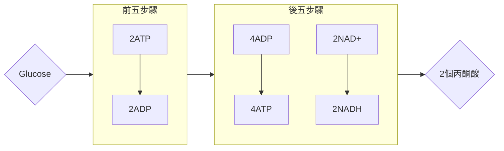
```mermaid
flowchart LR
  subgraph 前五步驟
    2ATP-->2ADP
  end
  
  subgraph 後五步驟
    4ADP-->4ATP
    2NAD+-->2NADH
  end
  Glucose{Glucose}
  Glucose-->前五步驟
  前五步驟-->後五步驟
  後五步驟-->pyruvate{2個丙酮酸}
```
- 在需氧氣生物中，pyruvate會被氧化成acetyl-CoA，然後進行TCA cycle
#### 厭氧條件
- 最初的糖解作用需要在無往環境下進行
- 由於NAD+負責接收電子，會產生NADH，它會在生物體中積累，如果不把電子轉移回到其他物質，NAD+會被耗盡，導致糖解作用停止
- 因此，生物必須找到接收電子的受體，例如用硫酸根或是硝酸根離子 (同時配合ETC)，或是乾脆用導電的金屬，或是用底物來接收電子
- 例如，利用lactate dehydrogenase，可以把pyruvate變成乳酸:

$$
\begin{array}{l r}
\text{pyruvate}+\text{NADH}+H^+\rightleftharpoons \text{L-lactate}+\text{NAD}^{+} & \Delta G = -25.1\ \text{kJ/mol}
\end{array}
$$

- homolactic fermentation (所有糖變成乳酸) 用於發酵食物
- 酒精發酵涉及丙酮酸變成乙醛跟二氧化碳，然後轉化成乙醇:
  
$$
\begin{array}{l r}
\text{acetaldehyde}+\text{NADH}+H^2\rightleftharpoons\text{ethanol}+\text{NAD}^{+} & \Delta G = -23.7\ \text{kJ/mol}
\end{array}
$$

- 主要類型包含Homolactic (產生乳酸)、Alcoholic (產生酒精)、Butanediol (產生丁二醇)
- 這些被稱為無氧糖解作用，因為pyruvate會被還原，總體來說葡萄糖沒有發生淨氧化
- 骨骼肌劇烈運動主要導致乳酸發酵
#### 策略說明
- 首先，在真核細胞裡面，糖解作用發生於細胞質，而pyruvate的進一步代謝發生在粒線體
- 其化學作用可歸納為三個過程:
  - 葡萄糖中添加磷酸基團，得到磷酸基轉移潛力低的化合物
  - 透過化學方法，把這些中間產物變成磷酸基團轉移潛力高的物質
  - 這些產物遇到ADP時，隨即把磷酸基轉移給ADP，形成ATP
- G3P跟DHAP的轉移能力都比較低，然而到了後期的能量轉移階段，形成的1,3-BPG跟PEP就有高轉移能力，可形成ATP
- 磷酸化有分成三種:
  - 底物水平磷酸化 substrate-level phosphorylation
  - 氧化磷酸化 oxidative phosphorylation
  - 光合磷酸化 photophosphorylation
### 步驟簡介
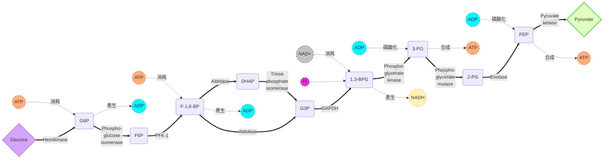
```mermaid
flowchart LR

    classDef ATP fill:#ffae7a,stroke:#ff0211,stroke-dasharray: 5 5
    classDef ADP fill: #02f7ff, stroke: #0075a1, stroke-dasharray: 5 5

    Glucose{Glucose} ==>|Hexokinase| G6P(G6P)
    G6P ==>|Phospho-<br>glucose<br>isomerase| F6P(F6P)
    F6P ==>|PFK-1| F16BP
    F16BP(F-1,6-BP) ==>|Aldolase| DHAP
    F16BP ==>|Aldolase| GAP(G3P)
    DHAP(DHAP) ==>|Triose<br/>phosphate<br/>isomerase| GAP

    GAP ==>|GAPDH| BPG13(1,3-BPG)
    P((Pi))-.->BPG13
    BPG13 ==>|Phospho-<br>glycerate<br/>kinase| PG3(3-PG)
    PG3 ==>|Phospho-<br>glycerate<br>mutase| PG2(2-PG)
    PG2 ==>|Enolase| PEP(PEP)
    PEP ==>|Pyruvate<br>kinase| Pyruvate{Pyruvate}
    
    ATP1((ATP))-.->|消耗|G6P
    G6P-.->|產生|ADP1((ADP))
    ATP2((ATP))-.->|消耗|F16BP
    F16BP-.->|產生|ADP2((ADP))
    NAD1((NAD+))-.->|消耗|BPG13
    BPG13-.->|產生|NADH1((NADH))
    ADP3((ADP))-.->|磷酸化|PG3
    PG3-.->|合成|ATP3((ATP))
    ADP4((ADP))-.->|磷酸化|PEP
    PEP-.->|合成|ATP4((ATP))
    
    class ATP1 ATP;
    class ATP2 ATP;
    class ATP3 ATP;
    class ATP4 ATP;
    class ADP1 ADP;
    class ADP2 ADP;
    class ADP3 ADP;
    class ADP4 ADP;
    
    style Glucose fill:#d4a5f9,stroke:#4b0082
    style Pyruvate fill:#e0ffc0,stroke:#32cd32, stroke-width: 2px
    style NADH1 fill:#fff0b5,stroke:#daa520, stroke-dasharray: 5 5
    style NAD1 fill:#c2c2c2,stroke:#000, stroke-dasharray: 5 5
    style P fill: #ff21ef, stroke: #000 ,stroke-dasharray: 5 5
```
### 糖解的能量投資時期
#### 1. 第一次ATP消耗
- 利用hexokinase，在葡萄糖的六號碳身上加上一個磷酸基
- 需要用到 $Mg^{2+}$
> [!Tip]
> 基本上所有和ATP作用有關的酵素都需要用到鎂離子 !

- 哺乳動物身上有不同的hexokinase，催化同一個分子的不同酵素被稱為isoenzyme 或是 isozyme
- 細胞內的葡萄糖濃度高 (通常高於任何hexokinase的 $K_m$ 值)
- 其中，hexokinase IV (又稱為glucokinase) 對葡萄糖有較低親和力，在圖呈現S (sigmoidal) 曲線，它主要在肝臟中出現，只有在極高血糖時才開始利用葡萄糖
>[!Important]
>這種特性讓肝臟能調節葡萄糖使用跟提供
##### 備註: 葡萄糖磷酸轉移酶系統 (PTS)
- 細菌的特殊醣類運作機制
- 能量來源以PEP為主，如下:

$$
\text{PEP}_{in}+\text{glucose}_{out}\rightarrow \text{pyruvate}_{in}+\text{G6P}_{in}
$$

#### 2. G6P的異構轉換
- 利用G6P isomerase，從G6P (aldose) 異構轉換成 F6P (ketose)
- 反應透過烯二醇中間體進行

#### 3. 第二次ATP消耗
- 利用phosphofructokinase (PFK)再加上一個磷酸基到果糖的1號碳上面，形成F-1,6-BP
- PFK是十分重要的關鍵調控酶，這一步需要花較多時間，屬於整個糖解作用的速率限制步驟
- 這屬於**不可逆反應**，一旦磷酸化成功，葡萄糖就是必得走為整個糖解途徑
- 它也是整個糖解作用的主要調控點，ATP、ADP、AMP、檸檬酸的濃度會影響PFK的活性
#### 4. 裂成兩半
- 利用fructose-1,6-bisphosphate aldolase (又稱為aldolase，醛縮酶)，形成兩個三碳糖，每個糖都有一個磷酸基，分別是甘油醛-3-磷酸 (G3P) 跟磷酸二氫丙酮 (DHAP)
- 雖然這個反應在標準狀態下是吸能的 ( $\Delta\ G$ 在10個步驟裡面最高，為 $+23.9\ \text{kJ/mol}$ )，但是由於該反應在細胞中進行，只要產物濃度夠低，反應就可以自然進行，因為:

$$
\Delta\ G=\Delta G^\circ\text{'} + RT\ln\frac{[product]}{[reactants]}
$$

>[!Tip]
>只要G3P消耗得快，反應就能一直進行 !

##### 備註: 席夫鹼的功能
- Schiff base是一種亞胺，醛縮酶活性位點上的Lys殘基，其胺基可以跟F16BP的羰基結合，形成Schiff base
- Schiff base幫忙穩定反應中間體，並且讓電子重新分布，好讓C-C鍵更容易斷裂，也讓反應更容易進行 ( $E_a\downarrow$ )

#### 5. DHAP轉換
- triose phosphate isomerase把DHAP變成G3P
- 這反應也是屬於若生理反應，但是一樣，只要G3P消耗得快就好

### 糖解的能量產生時期
#### 6. 先產生NADH
- G3P在NAD+跟一個磷酸基，在glyceraldehyde-3-phosphate dehydrogenase (GAPDH) 作用下，形成1,3二磷酸甘油酸 (1,3-BPG)，同時生成NADH，一個高能的化合物
- 在標準狀態寫屬於稍微吸能的反應
- GAPDH上面有一個cysteine殘基，其 $-SH$ 基攸關於反應的成功。 $-SH$ 會跟G3P的醛基結合，使其能夠穩定傳遞電子給NAD+，同時和另一個磷酸基結合
- 整體反應其實是放能 (醛變成酸) 跟吸能 (磷酸化) 兩個反應結合的結果:
  
$$\boxed{\text{aldehyde}}+H_2O+NAD^+\rightarrow \boxed{\text{acid}}+NADH+H^+\overset{+\text{Pi}}{\rightarrow}\boxed{\text{醯基磷酸酯}}+H_2O$$

- 碘乙酸會不可逆的烷基化GAPDH的cysteine殘基，導致酵素失去活性:

$$\boxed{GAPDG}-SH+ICH_2COO^- \rightarrow \boxed{GAPDG}-S-CH_2COO^- + HI$$

#### 7. 第一次底物水平磷酸化
- 1,3-BPG在phosphoglycerate kinase的作用， $Mg^{2+}$ 的催化下，一號碳脫去一個磷酸基團，形成ATP，和3-磷酸甘油酸 (3-PG)
- 和上一個反應做結合，相當於把醛變成酸所產生的能量，透過ATP的形式保存下來
- 3-PG的磷酸轉移能力較低
#### 8. 再一次異構化改變
- 在phosphoglycerate mutase和 $Mg^{2+}$ 作用下，移動Pi位置，形成2-PG
- 雖然為吸能反應，但是由於3-PG在細胞內濃度往往比2-PG多，反應能正常進行
- 該酵素的作用位點是一個磷酸化的His殘基，然後酵素 "丟Pi給二號碳，再拿走對方三號碳上的Pi"，完成交換
#### 9. 合成第二個高能化合物
- 在 $Mg^{2+}$ 跟enolase的幫助下，2-PG脫水變成PEP
- PEP是一個磷酸轉移能力特別高的化合物，由於PEP的Pi連接在烯醇結構上 ( $C=C-OH$ )，非常不穩定，因此其脫去Pi，轉變成Pyruvate時，會釋放出極大的能量
#### 10. 第二次底物水平磷酸化
- 在pyruvate kinase (PK) 跟 $Mg^{2+}$ 作用下，PEP轉移磷酸基給ADP，形成ATP跟pyruvate，並釋放大量能量，屬於**不可逆反應**
- PK 在代謝上也有做調控，也有多個isozymes，不同的isozymes在不同地方工作，例如，PK-M1在肌肉跟大腦中常見，PK-M2除了在胚胎發育中常見，也在腫瘤中出現
- 除了PK-M1之外，其他PK都需要F-1,6-BP進行變構變化才可以活化
- 當你吃了很多carbs，你的身體會大量製造PK，增加人體從糖解作用獲取能量的能力
- 肝臟型的PK，例如PK-L，也能受到磷酸化影響，細胞通路中的PKA會磷酸化PK-L，通常狀況為:
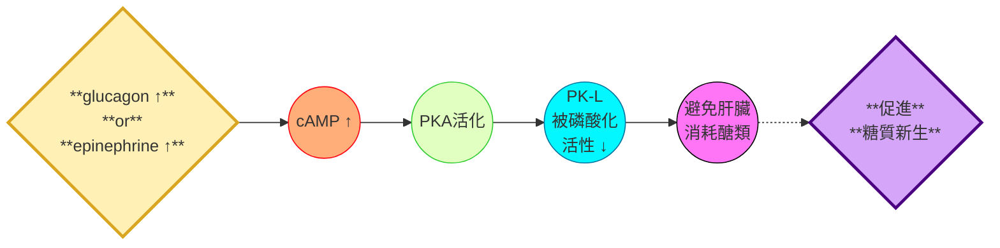
```mermaid
flowchart LR
Start{**glucagon ↑**<br>**or**<br>**epinephrine ↑**}
Start-->cAMP((cAMP ↑))
cAMP-->PKA((PKA活化))
PKA-->PK((PK-L<br>被磷酸化<br>活性 ↓))
PK-->Result((避免肝臟<br>消耗醣類))
Result-.->Gng{**促進**<br>**糖質新生**}

style Start fill:#fff0b5,stroke:#daa520,stroke-width:3px
style cAMP fill:#ffae7a,stroke:#ff0211
style PKA fill:#e0ffc0,stroke:#32cd32
style PK fill: #02f7ff, stroke: #0075a1
style Result fill: #ff75f5, stroke: #000 
style Gng fill:#d4a5f9,stroke:#4b0082,stroke-width:3px

```
- 來做個glycolysis的總結

|反應|enzyme|多了ATP|實際釋放的自由能$\Delta G$|
|---|------|-------|-----------------------|
|G → G6P|HK|$-1$|$-33.5$|
|G6P → F6P|PGI||$-2.5$|
|F6P → F-1,6-BP|PFK|$-1$|$-22.2$|
|F-1,6-BP → G3P+DHAP|ALD||$-1.3$|
|DHAP → G3P|TPI||$\approx 0$|
|G3P → 1,3-BPG|GAPDH||$-1.7\times 2$|
|1,3-BPG → 3-PG|PGK|$+1\times 2$|$\approx 0$|
|3-PG → 2-PG|PGM||$\approx 0$|
|2-PG → PEP|ENO|$+1\times 2$|$-3.3\times 2$|
|PEP → Pyr|PK||$-16.7\times 2$|
|**Net**||$+2$|$-102.9$|

> 大家可以點以下的3D影片來看看喔 👀
> 
> 

---

### Metabolic fates of pyruvate
- 在有氧呼吸的細胞中，糖解作用的速率往往較高。粒線體裡面NADH再氧化的速率通常太慢了
- 因此，G3P氧化時產生的NADH，一部份會拿來進行發酵作用，再生成NAD+
#### 乳酸代謝
- 人的骨骼肌在運動時就非常仰賴乳酸發酵
- 乳酸其實可以**重新利用**，在慢肌纖維中可以轉換回pyruvate，然後進入TCA循環
- 多數乳酸都拿去再氧化 (75%)，剩下的就拿到肝臟進行糖質新生
- 乳酸脫氫酶 (LDH)
> [!Note] 
> LDH通常可以用來偵測心肌梗塞，因為其只會存在細胞內，如果偵測到血液中有LDH，那就代表有細胞受損的狀態
#### 乙醇代謝
- 酵母菌可透過兩個步驟將丙酮酸轉化成乙醇
- 第一步驟利用pyruvate decarboxylase，把丙酮酸變成乙醛，同時產生二氧化碳
- 第二步驟利用乙醇脫氫酶，把乙醛變成乙醇。這一步驟為可逆反應，同時在新生NAD+
- 生物燃料的其中一個選項就是乙醇，透過培養或是改造細菌，使其可以分解纖維素
- 動物也有乙醇脫氫酶。由於我們剛才已經說了，乙醇跟乙醛的反應是可逆的:
  
$$
CH_3COH + NADH + H^{+}  \rightleftharpoons CH_3CH_2OH + NAD^+
$$

- 人類就是做逆反應，所以反而會大量消耗NAD+，導致糖解作用的抑制
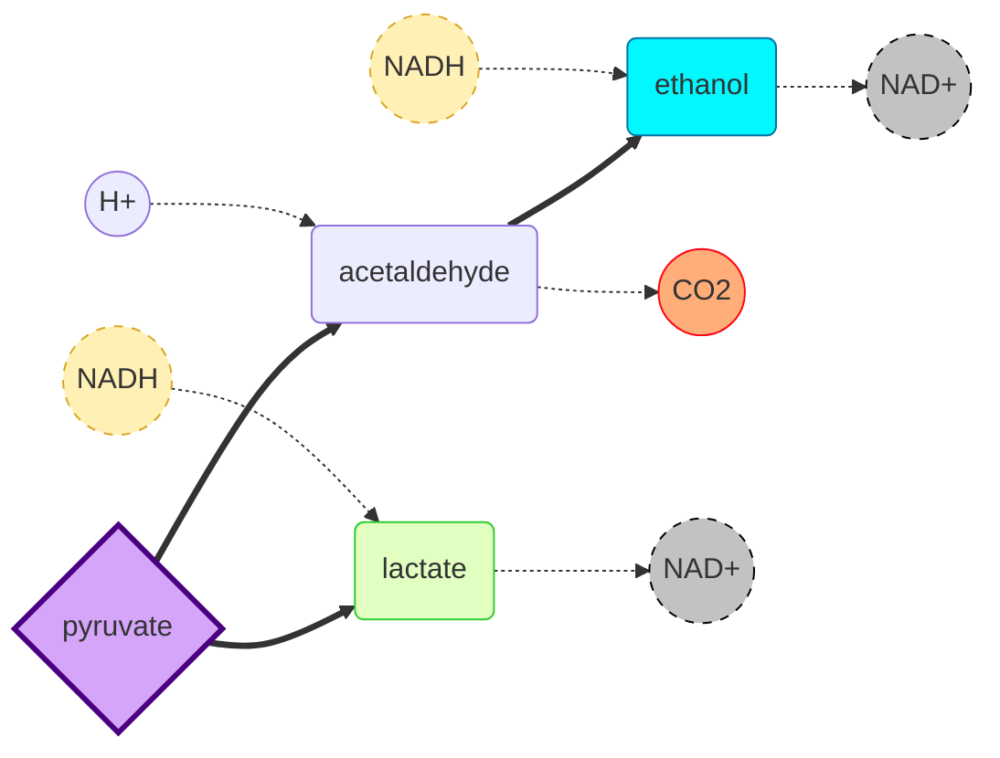
```mermaid
flowchart LR

   classDef NADH fill:#fff0b5,stroke:#daa520, stroke-dasharray: 5 5
   classDef NAD fill:#c2c2c2,stroke:#000, stroke-dasharray: 5 5

P{pyruvate}
P==>Ach(acetaldehyde)
P==>La(lactate)
Ach==>Eth(ethanol)

H((H+))-.->Ach
Ach-.->CO2((CO2))

NADH1((NADH))-.->La
La-.->NAD1((NAD+))

NADH2((NADH))-.->Eth
Eth-.->NAD2((NAD+))

  class NAD1 NAD;
  class NAD2 NAD
  class NADH1 NADH
  class NADH2 NADH
  
  style P fill:#d4a5f9,stroke:#4b0082,stroke-width:3px
  style La fill:#e0ffc0,stroke:#32cd32
  style Eth fill: #02f7ff, stroke: #0075a1
  style CO2 fill:#ffae7a,stroke:#ff0211
```
#### 能量跟電子平衡
- 底物水平磷酸化+發酵作用屬於一個 "非氧化過程"，期間並沒有碳的氧化態變化，電子不多也不少
- 整個糖解作用中，HK、PFK、PK這三個酶造成的反應，屬於非平衡反應，放能巨大，並且不可逆，也是糖解作用的調節位點
- 雖然糖解作用產生的ATP不多，但是其在身體裡面大量反應，產生ATP的速率因此提高 (氧化磷酸化的100倍)，屬於非常快速但效率低的能量使用方式
- 肌肉跟癌細胞就大量利用糖解作用活動跟生長

### Gluconeogenesis
- 身體需要讓血糖維持在一個level，糖質新生就是幫忙重生葡萄糖的好方法

#### 簡單來說
- 它用特定的酵素來取代糖解作用中的不可逆反應
- 基本上，在糖解作用中，不可逆反應都是屬於高放能反應，例如hexokinese、posphofructokinase、pyruvate kinase。而糖質新生就是用特定的其餘三個酶 "繞過" 原反應。這個過程需要大量能量

##### 1. 丙酮酸變成PEP
- 通常反應分為兩部分。第一部分是利用pyruvate carboxylase，把pyruvate變成oxaloacetate (草醯乙酸):

$$
\text{pyruvate}+HCO_3^{-}+ATP \rightleftharpoons OAA + ADP + Pi + 2H^{+}\quad \Delta G^\circ\text{'}=-2.1\ \text{kJ/mol}
$$

- 此時的OAA需要被轉到細胞質中，但是粒線體沒有專門運輸OAA的蛋白質，因此要經過轉換。轉換的重點就是malate dehydrogenase
- 這東西在粒線體跟細胞質裡面都有，而malate才能夠在粒線體跟細胞質間 "穿梭自如"。反應如下: 

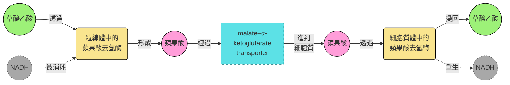
```mermaid
flowchart LR

OAA1((草醯乙酸))
OAA1-->|透過|mdhm(粒線體中的<br>蘋果酸去氫酶)
mdhm-->|形成|m1((蘋果酸))

NADH1((NADH))-.->|被消耗|mdhm
m1-->|經過|makt[malate–α-<br>ketoglutarate<br>transporter]
makt-->|進到<br>細胞質|m2((蘋果酸))

m2-->|透過|mdhc(細胞質體中的<br>蘋果酸去氫酶)
mdhc-->|變回|OAA2((草醯乙酸))
mdhc-.->|重生|NADH2((NADH))

%% 色彩調整中

style OAA1 fill: #9df178, stroke: #000
style OAA2 fill: #9df178, stroke: #000
style mdhm fill: #fae58f, stroke: #000
style mdhc fill: #fae58f, stroke: #000
style makt fill: #5ce1e6, stroke: #006e72, stroke-dasharray: 5 5
style m1 fill: #ff9dd9, stroke: #000
style m2 fill: #ff9dd9, stroke: #000

style NADH1 fill: #a8a8a8, stroke: #5b5b5b, stroke-dasharray: 3 3
style NADH2 fill: #a8a8a8, stroke: #5b5b5b, stroke-dasharray: 3 3

```
- 然後OAA再透過phosphoenolpyruvate carboxykinase (PEPCK) ，並且在GTP的情況下形成PEP:

$$OAA + GTP \rightleftharpoons PEP + CO_2 + GDP\quad \Delta G^\circ\text{'}=+2.9\ \text{kJ/mol}$$

- 當還有另外一種路徑可以參考，就是透過乳酸跟乳酸脫氫酶 (lactate dehydrogenase)
- 這個路徑跟糖解作用路徑完美循環，這個循環又被稱為**Cori cycle**

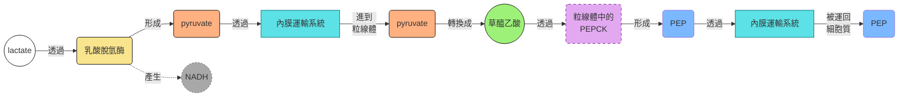
```mermaid
flowchart LR

L((lactate))
L-->|透過|LDH(乳酸脫氫酶)
LDH-->|形成|Py1(pyruvate)
LDH-.->|產生|NADH((NADH))
Py1-->|透過|Pt1[內膜運輸系統]
Pt1-->|進到<br>粒線體|Py2(pyruvate)
Py2-->|轉換成|OAA((草醯乙酸))
OAA-->|透過|PEPCK(粒線體中的<br>PEPCK)
PEPCK-->|形成|PEP1(PEP)
PEP1-->|透過|Pt2[內膜運輸系統]
Pt2-->|被運回<br>細胞質|PEP2(PEP)

style L fill: #ffffff, stroke: #000
style LDH fill: #fae58f, stroke: #000
style Py1 fill: #ffb181, stroke: #000
style Py2 fill: #ffb181, stroke: #000
style NADH fill: #a8a8a8, stroke: #5b5b5b, stroke-dasharray: 3 3
style Pt1 fill: #5ce1e6, stroke: #006e72, strke-dasharray: 5 5
style Pt2 fill: #5ce1e6, stroke: #006e72, strke-dasharray: 5 5
style OAA fill: #9df178, stroke: #000
style PEPCK fill: #e2a9f1, stroke: #750692, stroke-dasharray: 5 5 
style PEP1 fill: #7bb8ff, strole: #000
style PEP2 fill: #7bb8ff, strole: #000

```

##### 2. F-1,6-BP變成F6P
- 在 $Mg^{2+}$ 跟 fructose-1,6- bisphosphatase 作用下形成:

$$
\text{F-1,6-BP} + H_2O\rightarrow \text{F6P} + Pi\quad G^\circ\text{'}=-16.3\ \text{kJ/mol}
$$

##### 3. G6P變成葡萄糖
- 在 $Mg^{2+}$ 跟 glucose-6-phosphatase 作用下形成:

$$
\text{G6P} + H_2O\rightarrow \text{glucose} + Pi\quad G^\circ\text{'}=-13.8\ \text{kJ/mol}
$$

#### 總消耗

$$
\begin{align}
& 2\ \text{pyruvate} + 4ATP + 2GTP + 2NADH + 2H^{+} + 4H_2O\rightarrow \text{glucose} + 4ADP + 2GDP + 6Pi + 2NAD^{+}\\
& G^\circ\text{'}=-33\ \text{kJ/mol}
\end{align}
$$

> [!Important] 
> 要是我們全部換成高能磷酸鹽的形式來看， $1NADH=2.5\ ATP$ ，總體來說就是**使用11個ATP來把兩個丙酮酸變成一個葡萄糖**

#### 底物介紹
- 糖質新生的前驅物包含lactate、alanine、glycerol、propionate (丙酸)

##### amino acid
- 主要是用降解途徑，生成TCA cycle中間體，然後它們都可以透過循環變成OAA，進而進入我們剛才的反應鏈
- 能夠透過糖質新生產生葡萄糖的胺基酸被稱為glucogenic (leucine跟lysine例外)

##### glycerol
- 這東西難以進行糖質新生，因為脂肪酸主要透過 $\beta$ 氧化形成acetyl-CoA，而acetyl-CoA不能拿來做甚麼，無法形成任何糖質新生前體 🙂
- 唯一能做糖質新生的東西叫做甘油，甘油透過磷酸化形成甘油-3-磷酸，並且轉換成DHAP，而DHAP就可以進入糖質新生的路徑上

##### propinate
- 這東西在草食動物比較常見，咱們用一個公式帶過就好:

$$
\text{propionyl-CoA}\overset{CO_2}{\rightarrow} \text{methylmalonyl-CoA}\rightarrow \text{succinyl-CoA}\rightarrow \text{OAA}
$$

#### 酒精跟糖質新生
- 可能會導致低血糖 (hypoglycemia)，因為乙醇會把 $NAD^+$ 給用光:

$$C_2H_5OH + NAD^{+}\rightleftharpoons CH_3COH + NADH + H^{+}$$

#### 腎臟如何做酸鹼中和
- 人體代謝會產酸，這些多出來的氫離子 (通常跟 $HCO_3^-$ 結合)，會在腎臟透過跟氨來結合，形成 $NH_4^+$ 排入尿液
- 那氨怎麼產生的? 答案叫做glutamine (麩醯胺酸)。
- glutamine會在glutaminase and glutamate dehydrogenase的作用下，經過兩步，生成兩個氨:

$$
\begin{array}
\text{glutamine} + H_2O\rightarrow \text{glutamate} + NH_4^+\\
\text{glutamate} + NAD^+ + H_2O\rightarrow \alpha -\text{ketoglutarate} + NH_4^+ + NADH
\end{array}
$$

- $\alpha$ -ketoglutarate可以在TCA循環裡面變成OAA，後進入糖質新生

### 影響因素
- 糖質新生極大受到飲食的影響。在低碳的情況下，或是斷食的時後，這條路徑會被放大。這東西也受到激素影響，例如insulin跟glucagon 
- 基本上糖質新生跟糖解作用，我們只需要focus on各自的三個酵素: 糖解作用就是HK、PFK、PK。而糖質新生就是G6Pase、FBPase、以及pyruvate carboxylase + PEPCK
> [!Important]
> 再提醒一次，調控只能作用於遠離平衡的反應

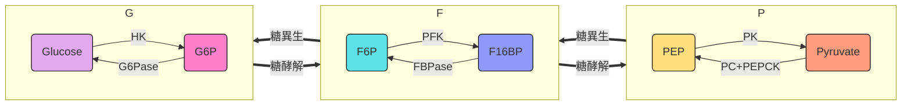
```mermaid
flowchart RL

subgraph G
  direction LR
  Glu(Glucose)-->|HK|G6P(G6P)
  G6P-->|G6Pase|Glu
end

subgraph F
  direction LR
  F6P(F6P)-->|PFK|FBP(F16BP)
  FBP-->|FBPase|F6P
end

subgraph P
  direction LR
  PEP(PEP)-->|PK|Pyr(Pyruvate)
  Pyr-->|PC+PEPCK|PEP
end

G==>|糖酵解|F==>|糖酵解|P
P==>|糖異生|F==>|糖異生|G

style Glu fill: #e2a9f1, stroke: #000
style G6P fill: #fd7fcc, stroke: #000
style F6P fill: #5ce1e6, stroke: #000
style FBP fill: #8e99fa, stroke: #000
style PEP fill: #ffdf7d, stroke: #000
style Pyr fill: #ff9c7d, stroke: #000
```
> [!Tip]
> 促進糖解作用的狀況通常會抑制糖質新生，反之

#### PFK and F16BPase
- PFK會被AMP跟ADP激活 (因為能量變少了)，而F16BPase相反，會被AMP跟ADP抑制 (能量都不夠了還跟你造糖?)
- PFK會被ATP跟檸檬酸抑制
- 同時還有一個特別的物質: **F-2,6-BP**，會促進糖解作用 (活化PFK)，同時會抑制糖質新生 (抑制F16BPase)
> [!Important]
> 最強的糖解作用促進劑，就是F-2,6-BP 🐱

##### PFK 跟 ATP 的愛恨情仇
- PFK在作用時需要ATP提供Pi好對F6P進行磷酸化。但是ATP本身的濃度會影響PFK的活性。我們一樣可以用R state跟T state來說明
- 當ATP作為底物
  - 在低ATP濃度時，ATP主要與活性位點結合，促進反應進行。此時PFK偏向R state，酵素活性高，糖解作用加速
- 當 ATP 作為抑制劑
  - 在高 ATP 濃度時，ATP除了結合活性位點，還會結合到同源異構位點 (allosteric site)。這會穩定酵素的T state，降低對F6P的親和力，抑制反應
- F26BP會強力促進R state，提高PFK對F6P的親和力，是糖解的主要激活因子
- Citrate在高濃度時促進T state，降低親和力

##### PFK-2/BFPase-2: 當一人包攬了兩個工作時
- F-2,6-BP的形成來自於一個特殊的酵素: PFK-2/BFPase-2
- 這是一個 "雙功能酵素"，同一條多肽上有兩個不同的催化域
  - PFK-2 活性: F6P → F2,6BP
  - FBPase-2 活性: F2,6BP → F6P
- 這個反應的 $\Delta G$ 相對較小，所以可以在生理條件下雙向進行
- 它的主要角色就是生成或是代謝F-2,6-BP 來控制PFK-1和FBPase-1的活性。而這個雙功能酵素的活性受激素調控:
  - insulin → 活化 PFK-2 → 增加 F2,6BP → 促進糖解
  - glucagon → 活化 FBPase-2 → 降低 F2,6BP → 促進糖質新生
- 一張圖讓你懂:
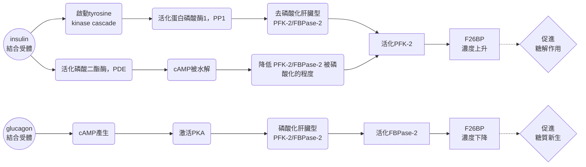
```mermaid
flowchart LR

in((insulin<br>結合受體))
in-->TKC(啟動tyrosine<br>kinase cascade)
TKC-->PP1(活化蛋白磷酸酶1，PP1)
PP1-->R1(去磷酸化肝臟型<br> PFK-2/FBPase-2)
R1-->PFK2[活化PFK-2]
PFK2-->F26BPU[F26BP<br>濃度上升]
F26BPU-.->Gy{促進<br>糖解作用}

in-->PDE(活化磷酸二酯酶，PDE)
PDE-->cAMPD(cAMP被水解)
cAMPD-->R2(降低 PFK-2/FBPase-2 被磷酸化的程度)
R2-->PFK2

ga((glucagon<br>結合受體))
ga-->cAMPU(cAMP產生)
cAMPU-->PKA(激活PKA)
PKA-->R3(磷酸化肝臟型<br> PFK-2/FBPase-2)
R3-->FBPase-2[活化FBPase-2]
FBPase-2-->F26BPD[F26BP<br>濃度下降]
F26BPD-.->Gng{促進<br>糖質新生}

```
 

- 心肌跟骨骼肌的PFK-2/BFPase-2，主要是透過別的方式來調控活性，而不是激素
- 🫀心肌的部分:
   - 主要調控因子: epinephrine
   - 腎上腺素透過 $\beta$ -adrenergic receptor → 活化 PKA → 磷酸化心肌型 PFK-2 → 增加 F26BP → 促進糖解作用
- 💪骨骼肌的部分: 
   - 主要調控因子: 肌肉的收縮訊號
   - AMP/ADP在肌肉收縮時累積，活化 AMPK → 促進 PFK-2 活性 → 增加 F26BP → 促進糖解作用

#### PK and PC+PEPCK
- 高ATP會降低PK跟PEP的親合度，除此之外，alanine (要用來被糖質新生)、acetyl-CoA、cAMP-介導的磷酸化也會降低該酵素的活性 (尤其是在肝臟)
- 相反，F-1,6-BP可以促進PK的活化 (因為它就是要被糖解的東西，促進PK活化可以避免受質累積)，這又被稱為 "前饋活化" (feedforward activation)
- PC主要受到Acetyl-CoA活化 (代表TCA cycle的能量多，剩下的可以糖質新生)
- 而PEPCK很特別，受到激素的調控，而且調控的是基因水平，是 "增加或是減少PEPCK的轉錄轉譯"。具體來說:
  - Glucagon: 透過 cAMP → PKA → 活化CREB，促進 PEPCK 基因的轉錄。
  - Cortisol: 透過 glucocorticoid receptor，結合到 PEPCK 基因的 promoter，增強轉錄
  - Insulin: 透過降低FOXO1等轉錄因子活性，抑制 PEPCK 的基因表現

##### 升糖素 and PK
- 升糖素的路徑對應，在**肝臟**中，其實可以用一張圖解釋:
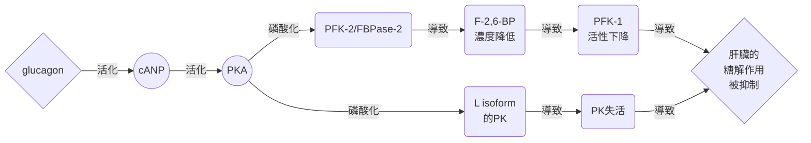
```mermaid
flowchart LR
Ga{glucagon}
Ga-->|活化|cAMP((cANP))
cAMP-->|活化|PKA((PKA))
PKA-->|磷酸化|PFK2(PFK-2/FBPase-2)
PFK2-->|導致|F26BP(F-2,6-BP<br>濃度降低)
F26BP-->|導致|PFK1(PFK-1<br>活性下降)
PFK1-->|導致|R{肝臟的<br>糖解作用<br>被抑制}

PKA-->|磷酸化|PK(L isoform<br>的PK)
PK-->|導致|Da(PK失活)
Da-->|導致|R
```
> [!Warning]
> 這個調控主要存在於肝臟 isoform，骨骼肌的 PK 不受同樣的激素調控。

#### HK 跟 G6Pase
- 它們同時受到一個東西影響: G6P。G6P增加，抑制糖解，促進糖質新生，反之
- G6Pase會因為反應物G6P增加而增加活性 (廢話)，而HK情形更為複雜: 通常，HK-I、II、III在組織中，G6P會反過來結合到HK，降低其活性。但是在肝臟的HK (HK-IV，葡萄糖激酶，Glucokinase) 不會受到G6P影響
- HK-IV受到葡萄醣激酶調節蛋白 (GKRP) 影響。GKRP會把HK-IV鎖起來，不讓它跟葡萄糖反應

##### 備註: GKRP受到誰控制?
- 通常，F6P促進GKRP鎖住HK-IV，F1P促進GKRP釋放HK-IV
- 假如說用F6P來思考邏輯:
  - 胰島素來臨 → 促進PFK-2活化 → F6P被消耗形成F26BP → 促進PFK-1活化 → F6P被消耗形成F16BP → 糖解加速中...
  - 同時: F6P大量減少 → HK-IV被解放 → 增加葡萄糖分解 → F6P補充 → 糖解持續...
  - 升糖素來臨 → 促進FBPase-2活化 → F26BP降低 → 糖解下降中...
  - 同時，由於F6P濃度並沒有下降，HK-IV被鎖住 → 糖解減弱
- 也就是說，胰島素可以透過導致F6P濃度的下降，促使HK-IV被解放

##### 不只如此
- HK-IV本來就可以跟去磷酸化的PFK-2/FBPase-2結合，形成複合物，這會影響HK-IV對葡萄糖的親和性，進一步促進糖解
- 也就是說，胰島素也可以透過PFK-2/FBPase-2，直接增加HK活性

---

### 別的物質進入糖解作用
#### 單醣代謝
- HK的不同isoform也可以代謝葡萄糖以外的單醣

##### galactose utilization
- 半乳糖主要透過**Leloir pathway**來變成葡萄糖，主要參與的酵素有四種:
   - **Galactokinase (半乳糖激酶)**， Gal → Gal-1-P，消耗1 ATP
   - **Galactose-1-phosphate uridylyltransferase (GALT)**，作用就是讓UDP-Glc跟Gal-1-P的 "基團交換"，產生UDP-Gal跟Glc-1-P
   - **UDP-galactose 4-epimerase (GALE)**，把UDP-Gal轉換成UDP-Glc，這樣就可以繼續跟另一個Gal-1-P反應
   - **Phosphoglucomutase (磷酸葡萄糖異構酶)**，把Glc-1-P變成G6P，進入glycolysis

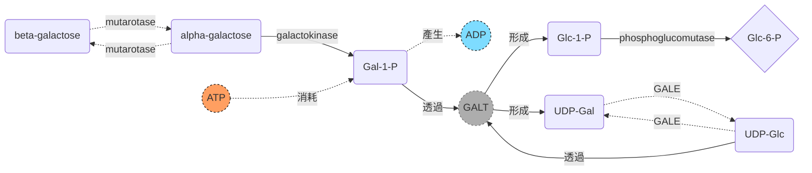
```mermaid
flowchart LR

bgal(beta-galactose)
bgal-.->|mutarotase|agal(alpha-galactose)
agal-.->|mutarotase|bgal

agal-->|galactokinase|gal1p(Gal-1-P)
ATP((ATP))-.->|消耗|gal1p
gal1p-.->|產生|ADP((ADP))

gal1p-->|透過|galt((GALT))
galt-->|形成|glc1p(Glc-1-P)

galt-->|形成|udpgal(UDP-Gal)

udpgal-.->|GALE|udpglc(UDP-Glc)
udpglc-.->|GALE|udpgal

udpglc-->|透過|galt

glc1p-->|phosphoglucomutase|G6P{Glc-6-P}


style galt fill: #adadad, stroke: #646464, stroke-dasharray: 3 3
style ATP fill: #ff9f61, stroke: #000, stroke-dasharray: 3 3
style ADP fill: #7edcff, stroke: #000, stroke-dasharray: 3 3
```
- 半乳糖血症 (galactosemia)，是因為GALP的缺陷或是缺乏，導致Gal-1-P的累積，導致黃疸跟白內障

##### fructose utilization
- 果糖在大部分組織中是以F6P存在 (這大家都還記得吧?)
- 有一種特殊的代謝方式，是用果糖激酶來把果糖變成F1P，然後被aldolase B水解，形成DHAP + 甘油醛。DHAP就可以直接進入糖解途徑
- 甘油醛在利用ATP的情況下，變成GAP
- 過多的DHAP會變成G3P，GsP可以轉化成甘油
> [!Note]
> 果糖厲害的地方，就是他的代謝基本上直接跑到DNAP + GAP這個下游路徑，沒有經過PFK-1的代謝調控，所以難以嚴格控制在熱量限制範圍內，這就是為啥他容易讓人變胖。同時F1P也有在肝臟內加快糖解代謝的效果 (釋放GK)

#### 雙糖代謝
- 目前我們已經知道:

$$
\begin{align}
maltose + H_2O\quad &\underrightarrow{maltase}\quad 2\ glucose\\
lactose + H_2O\quad &\underrightarrow{lactase}\quad galactose + glucose\\
sucrose + H_2O\quad &\underrightarrow{sucrase}\quad fructose + glucose
\end{align}
$$

- 大多數人在成年之後，乳糖酶會缺乏 (尤其是亞洲人)

#### 中性脂肪代謝
- 三酸甘油脂會被代謝成甘油，甘油可以透過以下路徑進入糖解作用

$$
\begin{align}
& glycerol + ATP\rightarrow G3P + ADP + H^+\\
& G3P + NAD^+\rightarrow DHAP + NADH + H^+
\end{align}
$$

- DHAP再進入糖解作用

#### 給個總結

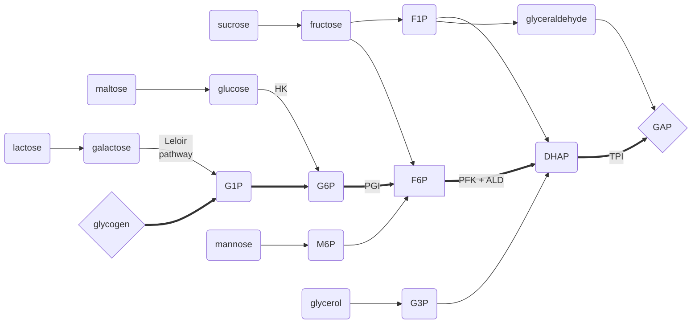
```mermaid
flowchart LR

lac(lactose)
mal(maltose)
suc(sucrose)

lac-->gal(galactose)
gal-->|Leloir<br>pathway|G1P(G1P)

mal-->Glc(glucose)
Glc-->|HK|G6P(G6P)


Gly{glycogen}
Gly==>G1P
G1P==>G6P
G6P==>|PGI|F6P
F6P==>|PFK + ALD|DHAP(DHAP)
DHAP==>|TPI|GAP{GAP}


suc-->fru(fructose)
fru-->f1p(F1P)
fru-->F6P

f1p-->DHAP
f1p-->ga(glyceraldehyde)
ga-->GAP

man(mannose)
man-->M6P(M6P)
M6P-->F6P

gly(glycerol)
gly-->G3P(G3P)
G3P-->DHAP
```
### 多糖代謝
- 多數的動物都是用肝糖的方式把葡萄糖儲存起來
- 而身體也會對攝取的多糖進行消化
- 動員肝糖利用的是 "磷酸解" (phosphorolysis，加上磷酸機分子斷開糖苷鍵)，分解澱粉的方式叫做 "水解" (hydrolysis，加上水分子斷開糖苷鍵)
> [!Tip]
> - 所以肝糖被動員時，單糖的形式就是G1P，能在不需要再額外使用ATP的情況下進入糖解代謝。G1P經過一些反應會變成G6P，如下:
> 
> $$
> \begin{align}
> & \text{enzyme-Ser-P}+G1P \rightleftharpoons \text{enzyme-ser}+G16BP\\
> & G16BP + \text{enzyme-Ser}\rightleftharpoons \text{enzyme-Ser-P}+G6P\\
> & G1P\rightleftharpoons G6P,\quad \Delta G^\circ\text{'}=-7.3\ KJ/mol
> \end{align}
> $$
> 
> - 磷酸解是由磷酸化酶 (phosphorylase) 作用形成

- 澱粉的消化大概在動物身上如下:
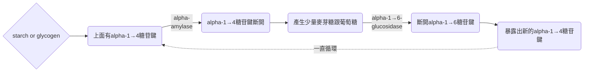
```mermaid
flowchart LR
S{starch or glycogen}
S-->A(上面有alpha-1→4糖苷鍵)
A-->|alpha-<br>amylase|B(alpha-1→4糖苷鍵斷開)
B-->R1(產生少量麥芽糖跟葡萄糖)
R1-->|alpha-1→6-<br>glucosidase|C(斷開alpha-1→6糖苷鍵)
C-->R2(暴露出新的alpha-1→4糖苷鍵)
R2-.->|一直循環|A
```
- $\alpha (1\rightarrow 6)$ 屬於支鏈澱粉會出現的鍵結
- 最後肝糖幾乎代謝完成，其中九成都是G1P (其餘是水解的葡萄糖)

#### 肝糖代謝跟合成
- 肝糖為骨骼肌的主要能源，肝糖作為血糖的調節器之一，肝臟相對來說有比較多的肝糖
- 每加上一個Pi，就磷酸解一個葡萄糖，由於在身體需要能量時，磷酸基相對較多，所以整體就會促進分解 (標準狀態下， $\Delta G^\circ\text{'}=+3.1\ kJ/mol$  )
- 肝糖合成會有UDP的幫助 (不是ATP喔)，如下:
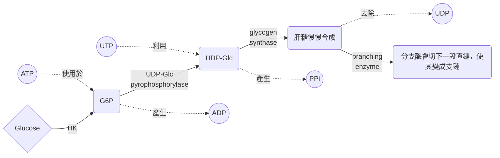
```mermaid
flowchart LR

Glu{Glucose}
Glu-->|HK|G6P(G6P)
ATP((ATP))-.->|使用於|G6P
G6P-->|UDP-Glc<br>pyrophosphorylase|UDPG(UDP-Glc)
G6P-.->|產生|ADP((ADP))

UTP((UTP))-.->|利用|UDPG
UDPG-->|glycogen<br>synthase|G(肝糖慢慢合成)
UDPG-.->|產生|PP((PPi))

G-.->|去除|UDP((UDP))
G-->|branching<br>enzyme|B(分支酶會切下一段直鏈，使其變成支鏈)
```
- glycogen synthase產生 $\alpha(1\rightarrow 4)$ 鍵結
- 過程中，需要消耗一個ATP (變成ADP)，也要消耗一個UTP (變成UDP)，所以**總共需要兩個高能磷酸鍵**
- 下一個鍵結的地方，就是肝糖的四號碳上的 $-OH$ 位點
- branching enzyme (amylo-(1,4→1,6)-transglycosylase) 產生的是 $\alpha(1\rightarrow 6)$ 鍵結。他會從某個單糖的1號碳上面切下來，然後把那一段 (大概5~9個單糖合成的短鏈) 接到某個葡萄糖的1,6 branching上面
- 這樣就會有兩個四號碳上的 $-OH$ 位點，然後分支就越來越多...

#### Phosphorylase 的調控
- 磷酸化酶會受到升糖素調控，因為細胞通路主要就是**cAMP/PKA**路徑，因此它受到cAMP。具體來說，cAMP磷酸化PKA，**PKA磷酸化Phosphorylase**，增加活性，促進肝糖的代謝
- btw，腎上腺素受體也是GPCR，所以也有類似升糖素的功能。cAMP在各個方面都增加了 "戰或逃" 反應 🐱

##### 備註: Phosphorylase b kinase
- 這東西同時可以被兩個東西活化: 一個是PKA，一個是 $Ca^{2+}$ 。
- 它一共有四個次單元: $\alpha$ 、 $\beta$ 、 $\gamma$ 、 $\delta$ ，前兩個亞基 $\alpha\beta$ 負責接受磷酸基 (受到PKA路徑影響) ，後面的亞基 $\delta$ 接受鈣離子 (它就是鈣調蛋白)
- 鈣離子在肌肉收縮的時候就會釋放，因此，**肌肉收縮本身就會促進肝糖的分解 !!**

#### glycogen synthase 的調控
- glycogen synthase在沒有磷酸化的時候屬於有活性的形式
- PKA會使glycogen synthase磷酸化，使其失活，抑制肝糖的合成
- 而 PPi (也就是生成UDP-Glc時的副產物)，反而會促進glycogen synthesis的活化
> [!Tip]
> - 還記得嗎? cAMP也會磷酸化PFK-2/FBPase-2，導致F26BP濃度下降，加強糖質新生，抑制糖解作用
> - 總之，這**四個反應 (肝糖分解 + 抑制肝糖合成 + 糖質新生 + 抑制糖解)** 總是透過升糖素一起出現 !!

---

## Citric Acid Cycle
### 宏觀角度下的TCA cycle
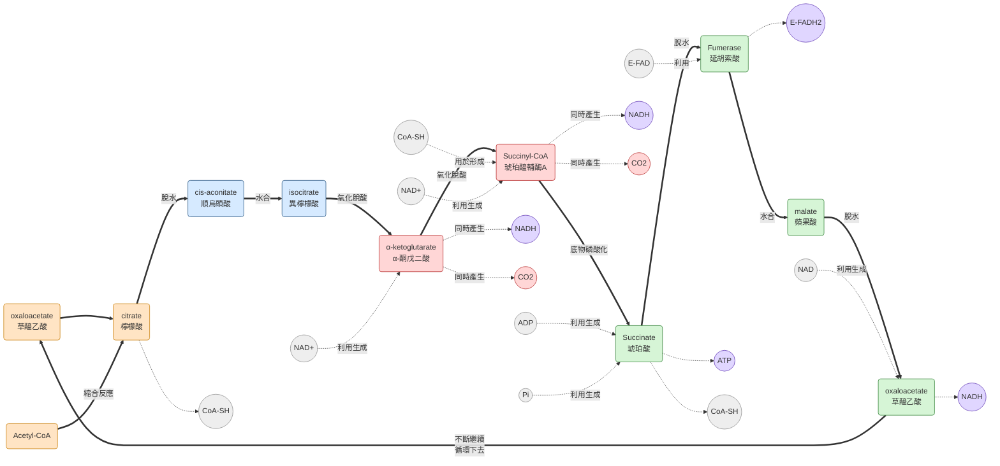
```mermaid
flowchart LR

OAA1(oxaloacetate<br>草醯乙酸)
OAA1==>Cit(citrate<br>檸檬酸)
AcoA(Acetyl-CoA)==>|縮合反應|Cit
Cit==>|脫水|cAco(cis-aconitate<br>順烏頭酸)
Cit-.->CoA1((CoA-SH))
cAco==>|水合|Icit(isocitrate<br>異檸檬酸)
Icit==>|氧化脫酸|aketo(α-ketoglutarate<br>α-酮戊二酸)

NAD1((NAD+))-.->|利用生成|aketo
aketo==>|氧化脫酸|ScoA(Succinyl-CoA<br>琥珀醯輔酶A)
aketo-.->|同時產生|NADH1((NADH))
aketo-.->|同時產生|CO21((CO2))

CoA2((CoA-SH))-.->|用於形成|ScoA
ScoA==>|底物磷酸化|Sc(Succinate<br>琥珀酸)
NAD2((NAD+))-.->|利用生成|ScoA
ScoA-.->|同時產生|NADH2((NADH))
ScoA-.->|同時產生|CO22((CO2))

ADP1((ADP))-.->|利用生成|Sc
P1((Pi))-.->|利用生成|Sc
Sc==>|脫水|Fu(Fumerase<br>延胡索酸)
Sc-.->ATP1((ATP))
Sc-.->CoA3((CoA-SH))

FAD1((E-FAD))-.->|利用|Fu
Fu-.->FADH2((E-FADH2))
Fu==>|水合|Ma(malate<br>蘋果酸)

Ma==>|脫水|OAA2(oxaloacetate<br>草醯乙酸)
NAD3((NAD))-.->|利用生成|OAA2
OAA2-.->NADH3((NADH))

OAA2==>|不斷繼續<br>循環下去|OAA1

%% ===== TCA styling (matched to your node names) =====

%% entry / citrate formation
style OAA1 fill:#ffe4c4,stroke:#c77b00
style Cit fill:#ffe4c4,stroke:#c77b00
style AcoA fill:#ffe4c4,stroke:#c77b00

%% early rearrangement
style cAco fill:#d6eaff,stroke:#1f4e79
style Icit fill:#d6eaff,stroke:#1f4e79

%% oxidative decarboxylation (🔥 core oxidation zone)
style aketo fill:#ffd6d6,stroke:#b22222
style ScoA fill:#ffd6d6,stroke:#b22222
style CO21 fill:#ffd6d6,stroke:#b22222
style CO22 fill:#ffd6d6,stroke:#b22222

%% energy harvest (ATP / NADH / FADH2)
style NADH1 fill:#e0d6ff,stroke:#5e35b1
style NADH2 fill:#e0d6ff,stroke:#5e35b1
style NADH3 fill:#e0d6ff,stroke:#5e35b1
style ATP1 fill:#e0d6ff,stroke:#5e35b1
style FADH2 fill:#e0d6ff,stroke:#5e35b1

%% regeneration phase (cycle closing 🌱)
style Sc fill:#d6f5d6,stroke:#2e7d32
style Fu fill:#d6f5d6,stroke:#2e7d32
style Ma fill:#d6f5d6,stroke:#2e7d32
style OAA2 fill:#d6f5d6,stroke:#2e7d32

%% cofactors / carriers (neutral background)
style NAD1 fill:#eeeeee,stroke:#888
style NAD2 fill:#eeeeee,stroke:#888
style NAD3 fill:#eeeeee,stroke:#888
style ADP1 fill:#eeeeee,stroke:#888
style P1 fill:#eeeeee,stroke:#888
style CoA1 fill:#eeeeee,stroke:#888
style CoA2 fill:#eeeeee,stroke:#888
style CoA3 fill:#eeeeee,stroke:#888
style FAD1 fill:#eeeeee,stroke:#888

```
#### 起源
- 由Hans krebs發現，並且跟Fritz Lipmann (發現Coenzyme的人) 一起得到諾貝爾獎
- 起初是它在慎在或是肝臟切片中，發現各種有機酸 (如citrate、succinate、fumerate、malate、acetate等) 大量消耗的狀況，並且在了解一些先前知識 (例如isocitrate、 $\alpha$ -glutarate、succinate可以互相轉換) 下，得到了這些物質的相互關係
- citric acid cycle又被稱為Krebs cycle或是tricarboxylic acid (TCA) cycle

### 丙酮酸的氧化
- 這個步驟需要PDC (pyruvate degydrogenase complex，它是一個由三種酵素: E1、E2、E3形成的複合體) ，以及五種coenzymes (TPP、lipoid acid、CoA、FAD、NAD+) 的幫忙
- 用來decorboxylation丙酮酸 (就是把 $COO^-$ 基團變成 $CO^2$ ，簡單吧)

- 步驟總體是:

$$pyruvate + NAD^+ + CoA-SH\rightarrow Acetyl-CoA + NADH + CO_2\quad \Delta G^\circ\text{'}=-33.5\ KJ/mol$$

- 這個步驟極度放能，因次屬於不可逆反應，在動物身體裡面，沒有任何酵素可以把acetyl-CoA重新變回pyruvate

#### 介紹各種coenzyme
##### thiamine pyrophoshpate (硫胺素焦磷酸酯，TPP)
- TPP是維生素B1的活化形式，位於E1，把pyruvate的 $COO^-$ 拔掉，形成一個二碳化合物 (羥二基，不穩定的活性醛)
- 這跟酒精發酵的機制是一樣的

##### 硫辛胺酸 (lipoid acid, lipoamide)
- 通常該輔酶以醯胺鍵和E2的lysine結合，因此又被稱為lipoamide
- 長相是一條長長的臂膀 (swinging arm)，這整個區域非常flexible，又被稱為E2區的lipoyl domain
- 由於其活動性，lipoamide基本上跟三個酵素都有互動
- 末端帶著雙硫鍵，在接收電子還原後，形成兩個 $-SH$ 末端
- 其中一個末端就是負責接收TPP的二碳化合物，讓其轉化成Acetyl的形式，並把其傳給CoA
- 砷中毒的原因，通常是因為砷化合物習慣跟-SH基反應，Arsenite ( $^{-}O-As-(OH)_2$ ) 的兩個羥基會跟-SH基脫水後結合，使其失去接住乙醯基的能力

##### coenzyme A (輔酶A，CoA)
- 其來自維生素B5，有一個硫醇基 $-SH$ ，幫忙接住lipoamide的乙醯，形成Acetyl-CoA

##### 核黃素腺嘌呤二核甘酸 (FAD)
- 來自維生素B2，位於E3。核黃素是由一條核糖醇，以及一個三個六元環串聯環 (叫做isoalloxazine ring) 組成的東西。
- 這個三環構造可以接收兩個電子 (對，就是把lipoamide的電子搶走，讓lipoamide恢復雙硫鍵)
- 接收電子後，其變成 $FADH_2$ 

##### (菸鹼醯胺腺嘌呤二核甘酸) NAD+ 
- 接收兩個 $FADH_2$ 的電子，使對方變回FAD，自己變成NADH，成為淨產出的一部份

##### 硫酯的威力
- 我們知道以氧為核心的酯類的結構是什麼( $RCOOR\text{'}$ )，然而，以硫為核心的酯類 ( $RCOSR\text{'}$ )，通常更不穩定，產生的能量也更高
- 主要是因為以氧為主的酯類，兩個O之間的電子有類似共振的感覺，穩定其結構，而硫酯缺乏這種東西
- 因此，乙醯輔酶A可以說是一種相對高能的物質，也讓乙醯基變得更容易從輔酶上脫去

#### 總結
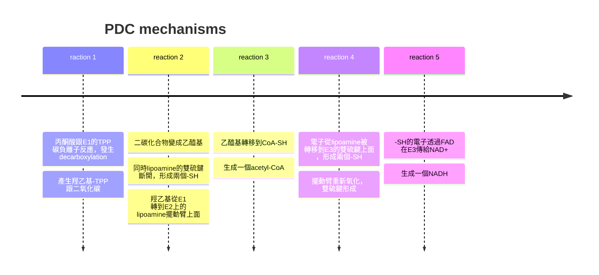
```mermaid
timeline 
title PDC mechanisms
raction 1: 丙酮酸跟E1的TPP<br>碳負離子反應，發生<br>decarboxylation : 產生羥乙基-TPP<br>跟二氧化碳
reaction 2: 二碳化合物變成乙醯基: 同時lipoamine的雙硫鍵<br>斷開，形成兩個-SH: 羥乙基從E1<br>轉到E2上的<br>lipoamine擺動臂上面
reaction 3: 乙醯基轉移到CoA-SH: 生成一個acetyl-CoA
reaction 4: 電子從lipoamine被<br>轉移到E3的雙硫鍵上面<br>，形成兩個-SH: 擺動臂重新氧化，<br>雙硫鍵形成
reaction 5: -SH的電子透過FAD<br>在E3傳給NAD+ : 生成一個NADH
```

> 大家可以點以下這個3D影片來看看喔 👀
> 
> 

---

### The citric acid cycle
#### 步驟介紹
##### 1. 二碳化合物的加入
- 透過citrate sythase利用Acetyl-CoA跟草醯乙酸，透過類似羥醛縮合反應的方式形成檸檬酸:

$$Acetyl-CoA + OAA + H_2O\rightarrow Citrate + CoSH + H^+\quad \Delta G^\circ\text{'}=-32.2\ KJ/mol$$

- 酵素結合位點的375-Asp奪走乙醯輔酶A的質子，274-His質子化乙醯輔酶A的羰，使乙醯輔酶A形成烯醇 (Enol)。它和OAA反應，生成citroyl-CoA
- citroyl-CoA非常不穩定，會自發水解成檸檬酸跟CoA-SH
- 屬於高度放能反應，平衡常數 $K_{eq}\approx 3\times 10^5$ ，OAA就算濃度很低也能照常反應，因此也屬於重要的調控位點

##### 2. 檸檬酸的異構化
- 檸檬酸屬於三級醇 (中間的碳已經接了一個 $-COO^-$ ，兩個 $-CH_2COO^-$ 跟一個羥基了)，碳上面根本沒有任何氫可以抓，難以被氧化
- aconitase (烏頭酸酶) 異構化檸檬酸，使其成為isocitrate
- 其中順烏頭酸，*cis*-aconitate，還是跟酵素連在一起，因此僅能算是中間產物:

$$\text{citrate} \overset{\text{脫水}}{\rightleftharpoons} \text{cis-aconitate} \overset{\text{水合}}{\rightleftharpoons} \text{isocitrate}\quad \Delta G^\circ\text{'}= +6.3\ kJ/mol$$

- 異檸檬酸屬於一個二級醇，接下來的酵素才能順利進行氧化反應
- 這些反應都是可逆的，而且標準狀態下還是個吸能反應，要依賴接下來反應的放能性質推動整個反應往右走
- 異檸檬酸屬於一個二級醇，接下來的酵素才能順利進行氧化反應
- 這些反應都是可逆的，而且標準狀態下還是個吸能反應，要依賴接下來反應的放能性質 (也就是第三步) 推動整個反應往右走
- fluoroacetate (氟乙酸) ，會走類似乙醯基的路線，在之後透過酵素跟CoA-SH形成氟乙醯輔酶A，以及和OAA形成氟檸檬酸。但是氟檸檬酸碰到烏頭酸酶會抑制該酵素的活性。這東西在以前當作滅鼠劑 👀

##### 3. 跟NAD+有關的脫氫酶催化
- 在isocitrate dehydrogenase的催化下形成，異檸檬酸有三個 $COO^-$ 基，在反應中脫去一個 $COO^-$ ，形成二氧化碳:

$$\text{isocitrate}+NAD^+ \rightarrow \text{(Oxalosuccinate)} \rightarrow \alpha\text{-ketoglutarate}+NADH+CO_2\quad \Delta G^\circ\text{'}=-11.6\ KJ/mol$$

- 由於其產生的NADH和電子傳遞鏈有關係，這個步驟也是反應的調控位點之一

##### 4. 再一次脫去COO-基團
- 該反應的酵素為 $\alpha$- ketoglutarate dehydrogenase  complex (組合跟PDC有點像，就連5種輔酶也完全一樣 👀)，輔酶A再次幫助，並且一樣產生 $CO_2$ ，至此兩個碳都被脫去: 

$$\alpha\text{-ketoglutarate}+NAD^+ + CoA-SH\rightarrow \text{succinyl-}CoA + CO_2 + NADH\quad \Delta G^\circ\text{'}=-33.5\ KJ/mol$$

- 產物已經再次變成四碳化合物，接下來的步驟就是把succinyl-CoA變回OAA

##### 5. 一次底物磷酸化
- succinyl-CoA是個高能的物質 (水解自由能為 $\Delta G^\circ\text{'}=-36\ KJ/mol$ ，遠高過形成三磷酸核甘酸的能量 $30.5\ KJ/mol$ )，因此在succinyl-CoA synthetase的幫助下，產生了一個ATP or GDP:

$$\text{succinyl-}CoA + Pi + ADP \rightleftharpoons \text{succinate} + ATP + CoA-SH$$

- 合成的是ATP還是GTP，取決於該酵素的 $\beta$ 次單元比較喜歡ADP還是GDP，例如，大部分需能量的組織中，酵素偏好ADP，而肝臟這種合成器官偏好GDP
> [!Note]
> 在肝臟中，標準情況下，GTP跟ATP的比例是類似的，接近1:1

##### 6. 核黃素依賴性的脫氫反應
- 利用succinate dehydrogenase催化
- succinate的結構如下: 兩個碳以單鍵結合，每一個碳的其餘三隻手臂分別接上一個carboxyl group跟兩個氫。酵素在的事情就是從兩個碳上面各拔掉一個氫，使其產生C=C雙鍵: 

$$\text{succinate} + Enz-FAD\rightarrow \text{fumarate}+Enz-FADH_2$$

- 也就是說，FAD其實是屬於這種酶上面的一個coenzyme，該酵素能夠重新利用的方法，其實就是把電子轉移出去 (具體是給輔酶Q)，重新變回Enz-FAD形式。因此整個反應式也可以變成:

$$\text{succinate} + Q\rightleftharpoons  \text{fumarate}+QH_2$$

> [!Tip]
> succinate dehydrogenase就是電子傳遞鏈中的複合體II

##### 7. C=C 雙鍵的水解
- 由fumarate hydratase (or fumarase) 催化形成

$$\text{fumarate} + H_2O\rightleftharpoons \text{malate}\quad \Delta G^\circ\text{'}=-3.8\ KJ/mol$$

##### 8. 脫氫再次產生OAA
- 由malate dehydrogenase作用

$$\text{malate} + NAD^+ \rightleftharpoons \text{oxaloacetate} + NADH + H^+\quad \Delta G^\circ\text{'}=+29.7\ KJ/mol$$

- 標準狀況為高度吸能反應，因此，在粒線體中，OAA的濃度會特別的低，以利反應向右進行

#### 來做個小總結

|reaction|enzyme|實際釋放的 $\Delta G$ |
|--------|------|--------------------|
|Acetyl-CoA + OAA + H2O → citrate + CoA + H+|citrate synthase|$-55$|
|citrate → *cis*-aconitate + H2O → isocitrate|aconitase|$\approx 0$|
|isocitrate + NAD+ $\alpha$-ketoglutarate + CO2 + NADH|isocitrate dehydrogenase|-20|
|$\alpha$-ketoglutarate + NAD+ + CoA → succinyl-CoA + CO2 + NADH|$\alpha$-ketoglutarate dehydrogenase complex|-40|
|succinyl-CoA + Pi + ADP → succinate + ATP + CoA|succinyl-CoA synthetase|$\approx 0$|
|succinate + Q → fumarate + QH2|succinate dehydrogenase|$\approx 0$|
|fumarate + H2O → malate|fumarase|$\approx 0$|
|malate + NAD+ → OAA + NADH + H+|malate dehydrogenase|$\approx 0$|

- 一個循環下來的總體反應為:

$$Acetyl-CoA + 2H_2O + 3NAD^+ + ADP + Pi + Q \rightarrow 2CO_2 + 3NADH + QH_2 + CoA-SH + ATP$$    

- 如果把剛才TCA cycle的東西跟前面的PDC、以及糖解作用的步驟全物加起來，整個總反應為:

$$\text{glucose} + 2H_2O + 10\ NAD^+ + 2Q + 4ADP + 4\ Pi\rightarrow 6\ CO_2 + 10\ NADH + 2QH_2 + 4ATP$$

> 大家可以點以下這個3D影片來看看喔 👀
> 
> 

---

### PDC 跟 TCA cycle 的調控
#### 丙酮酸氧化的控制
- acetyl-CoA來自pyruvate脫氫後的結果，或是脂肪酸 $\beta$ -氧化的結果
- E2受到Acetyl-CoA的濃度抑制、E3受到NADH的濃度抑制，也就是說，如果這些東西生成後消耗不完，pyruvate的脫氫就會先被抑制
- 最主要的調控位置其實是在E1 (也就是pyruvate degydrogenase, PD)，E1的Serine殘基 (R group為 $-CH_2OH$ ) 可以被磷酸化，當其被磷酸化時，酵素會失去活性
- E1由一種特殊的kinase (PDK，目前發現四種isozymes) 抑制。同時，也有一種磷酸酶 (PDP，目前發現兩種isozymes) 會水解PDC磷酸基，重新使PDC活化
- 比較一下兩個共同影響E1的酵素:

|enzyme|pyruvate dehydrogenase kinase|pyruvate dehydrogenase phosphatase|
|------|-----------------------------|----------------------------------|
|功能|活化後磷酸化PDC|活化後去磷酸化PDC|
|導致|PDC失活，丙酮酸脫氫抑制|PDC活化，丙酮酸脫氫啟動|
|誰會活化它|NADH、Acetyl-CoA、ATP|鈣離子、鎂離子、胰島素作用|
|誰會抑制它|ADP、pyruvate||

> [!Tip]
> 鈣離子在肌肉收縮時會大幅升高濃度，所以其增加代表能量需求增加 → 需活化PDP → PDC活化 → pyruvate脫氫增加。上一張也有提到它會透過活化Phosphorylase b kinase增加肝糖的分解 🐱

- 由於ATP跟鎂離子的結合力，比ADP更強，因此，當鎂離子濃度變高時，就代表ADP變多了 (that is， $Mg^{2+}$ 受到ATP/ADP的濃度比值影響)，能量可能不夠。PDP因此也受到 $Mg^{2+}$ 影響。

#### TCA cycle 的控制
- 主要受到三個酵素的活性來調控: citrate synthase (第一步)、isocitrate dehydrogenase (第三步)、以及 $\alpha$ -ketoglutarate dehydrogenase (第四步)
- 這幾步的共同點都一樣: 自由能釋放特別多 💪
- 控制TCA cycle的重點是NAD+/NADH的濃度比值

| 調控酵素 | 作用反應 | 誰幫忙活化 | 誰幫忙抑制 |
|----------|----------|----------|------|
| **Citrate synthase** | Acetyl-CoA + OAA → Citrate | |NADH、Succinyl-CoA|
| **Isocitrate dehydrogenase** | Isocitrate → $\alpha$ -Ketoglutarate + CO₂ + NADH | ADP、 $Ca^{2+}$ |ATP、NADH | 
| **$\alpha$ -Ketoglutarate dehydrogenase** | $\alpha$ -Ketoglutarate → Succinyl-CoA + CO2 + NADH | $Ca^{2+}$ |ATP、NADH、Succinyl-CoA| 

> 註: citrate synthase的活性其實接近平衡狀態，它被認為是調控點的主要因素，其實是OAA濃度 (反應物) 變化特別大所導致的

#### enzyme的型式組成
- 事實上，TCA cycle的酵素很有可能是以多種酵素的複合物組成，又被稱為代謝體 (melabolon)
- 這些代謝體可能就跟內膜 (matrix那一側) 有互相連結，甚至是錨定 (例如succinate dehydrogenase)

#### 疾病跟TCA cycle
- 在這個循環中的酵素缺陷可能不會導致致命，但是可能跟一些神經退化性疾病或是癌症有關係
- 例如，succinate dehydrogenase的缺陷可能導致副神經節瘤，fumarase的基因突變可能導致子宮頸癌或是Laigh syndrome、isocitrate dehydrogenase的基因突變可能跟惡性膠質瘤有關

---

### anaplerotic sequences
- TCA cycle的中間產物，跟其他有機物的合成也有關係
- 由於很多反應都會消耗循環裡面的中間體，因此 "補充" 就變得特別重要

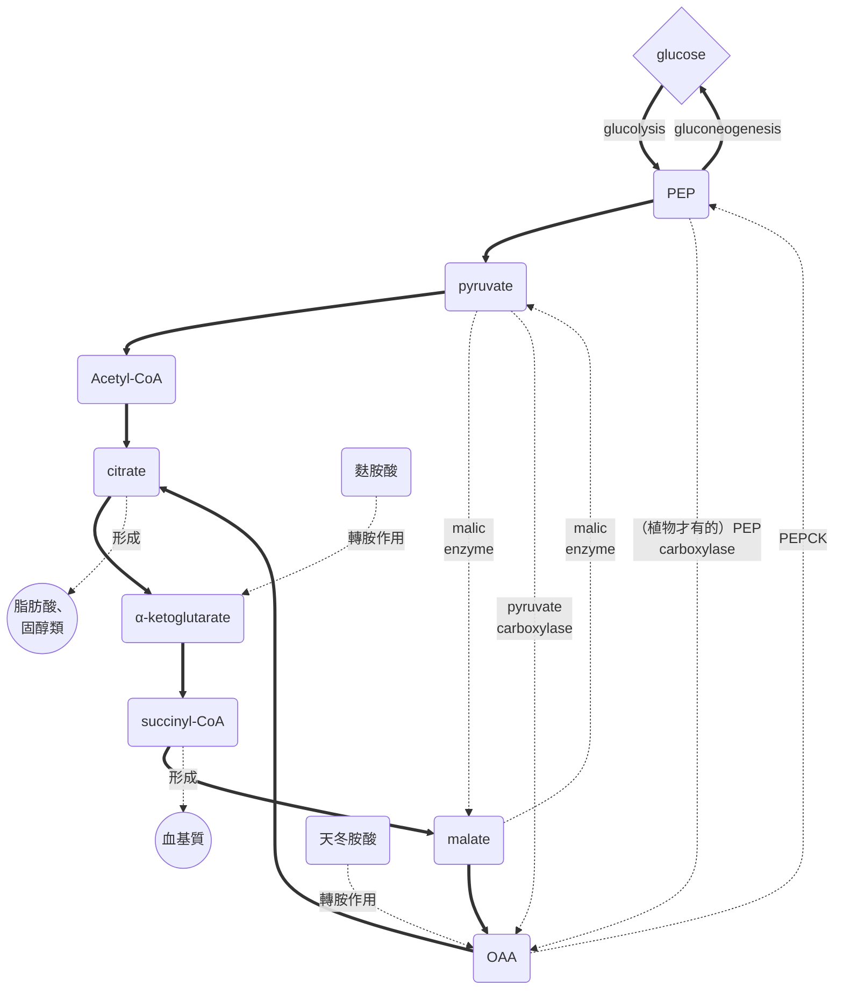
```mermaid
flowchart TB

G{glucose}
G==>|glucolysis|pep(PEP)
pep==>p(pyruvate)
p==>Acoa(Acetyl-CoA)
Acoa==>c(citrate)
c==>akg(α-ketoglutarate)
akg==>Scoa(succinyl-CoA)
Scoa==>M(malate)
M==>OAA(OAA)
OAA==>c

c-.->|形成|F((脂肪酸、<br>固醇類))
Glu(麩胺酸)-.->|轉胺作用|akg
Scoa-.->|形成|Heme((血基質))

M-.->|malic<br>enzyme|p
p-.->|malic<br>enzyme|M

p-.->|pyruvate<br>carboxylase|OAA

OAA-.->|PEPCK|pep
pep-.->|（植物才有的）PEP<br>carboxylase|OAA
Asp(天冬胺酸)-.->|轉胺作用|OAA

pep==>|gluconeogenesis|G

```
#### OAA, PEP and pyruvate
- pyruvate變成OAA，然後OAA透過PEPCK變成PEP，這是糖質新生的一部份
- pyruvate跟OAA之間的轉換由pyruvate carblxylase催化:

$$\text{pyruvate} + HCO_3^- + ATP \rightarrow OAA + ADP + Pi + 2H^+$$

- 該酵素由Acetyl-CoA活化。因此，**Acetyl-CoA可以透過pyruvate carboxylase增加OAA，OAA的增加能夠促進其跟Acetyl-CoA結合形成citrate。**

#### the malic enzyme
- 該反應雙向調控pyruvate變成malate:

$$pyruvate + HCO_3^- + NADPH + H^+ \rightleftharpoons malate + NADP^+ + H_2O$$

- NADPH主要功能是作為脂肪合成時的重要角色

#### 和胺基酸有關的反應
- 利用轉胺作用的幫忙，形成循環的中間產物 (雖然不是這麼常見)。機制就是某個胺基酸把自己的胺基接到其他胺基酸殘基上面
- 這剛剛好發生在Asparate、glutamate、 $\alpha$ -ketoglutarate、OAA之間 (俗稱: 有我就沒有你，有你就沒有我 🙂)

$$\text{aspartate} + \alpha\text{-ketoglutarate}\leftrightharpoons \text{glutarate}+\text{oxaloacetate}$$

---

## lipid metabolism
### 脂肪的儲備跟相關疾病
- 三酸甘油脂 (triacylglycerol, TAG) 的還原程度比多數醣類還要高，這代表脂肪的代謝氧畫比醣類消耗更多的氧氣，並相應的會產生更多能量，由於其無極性的特質，動物可以在不用儲存大量水分的情況下 (肝糖需要大量的水分)，利用脂肪儲存能量。鳥類就是一個例子
- 脂肪再小腸重新和成三酸甘油脂，並與載脂蛋白結合形成乳糜微粒。膽酸 (cholic acid) 為疏水的四元環上面有幾處親水端 (如 $-OH$ 或是 $-COOH$ 基團)，它們朝外，然後好幾個膽酸圍繞著TAG，四元環面向TAG

#### 運輸方式
- 通常用的是lipoprotein來運輸脂肪，這種蛋白質的多肽區域，又被稱為apoproteins
- AopB 基因由29個exons組成，在肝臟中，該mRNA轉譯出的apoprotein為B-100 (後來近一步變成低密度脂蛋白)，而在腸道中，由於腸道內的酵素，轉化了一個核甘酸的變化: CAA → UAA (stop)，轉譯出來的apoprotein就變成了B48 (後來近一步變成乳糜微粒)
- 脂蛋白密度越高，含有的脂質越少，所以就包含VLDL、LDL、IDL、HDL等，由一層磷脂質組成，磷脂質層上面還有一些蛋白質 (蛋白質帶電或是親水的氨基酸面向外面，疏水胺基酸面向裡面) 、膽固醇等，內層的輸水層就是被運輸的脂質
- 有些apoprotein也有其他的生化特性，例如apoC-II (也常常在乳糜微粒或是VLDL出現) 可活化lipoprotein lipase (位於血管內皮細胞表面，由多糖連接細胞膜) 來水解TAG
- 有些apoprotein會跟特定受體結合，apoE的基因變異跟阿茲海默症風險增加呈現相關聯
- 脂防備水解之後，脂蛋白的殘餘物會被肝臟細胞吸收，被溶體降解並回收apoprotein
- 肝臟功能障礙的一個主要狀況是無法合成apoprotein，因此導致無法把脂肪從肝臟運出去
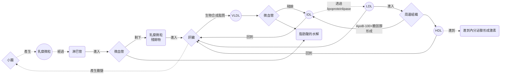
```mermaid
flowchart LR
in{小腸}
li{肝臟}
ti{周邊組織}

li-.->|產生膽鹽|in
in-.->|產生|chy((乳糜微粒))-.->|經過|ly(淋巴管)
ly-->|進入|ca1{微血管}
ca1-->|剩下|rchy(乳糜微粒<br>殘餘物)
rchy-->|進入|li

li-->|生物合成脂質|VLDL((VLDL))
VLDL-->ca2{微血管}-->|殘餘|IDL((IDL))

IDL-->|回到|li
IDL-.->|透過<br>lipoprotein<be>lipase|LDL((LDL))

LDL-->li

LDL-->|進入|ti
ti-->|ApoB-100+膽固醇<br>形成|IDL
ti-->HDL((HDL))-->|回到|li
HDL-.->|進到|endo(進到內分泌腺形成激素)

ca1-->hy(脂肪酸的水解)
ca2-->hy
```
- 膽固醇長期累積在血液中會在動脈內壁積累，吸引巨噬細胞。這些巨噬細胞的殘骸會跟脂肪沉積物形成斑塊
- 這是導致動脈硬化 (atherosclerotis) 的主要原因之一

#### 高膽固醇血症的研究和脂蛋白的吸收
- hypercholesterolemia (FH) 是由於基因的缺陷導致，患者的纖維母細胞會以異常高的速率合成膽固醇
- 正常細胞的HMG-CoA還原酶 (負責調控膽固醇的生成) 在LDL的增加時，活性會迅速降低，也就是說，一般情況下，膽固醇會被吞噬轉運到細胞內部，並透過抑制酵素的活性來降低生成，而FH的患者酵素活性沒有因為LDL濃度改變而改變
- 細胞上的受體會透過辨識出脂蛋白的apoprotein，把整個脂蛋白吞噬進細胞內部 (這叫做受體介導的胞吞作用)，這些吞進來的膽固醇會進到平滑內質網用於細胞膜合成，有三種調節作用:
  - HMG-CoA還原酶抑制 (降低內源性膽固醇的合成)
  - 活化ACAT，合成膽固醇酯 (膽固醇以液滴的型式儲存)
  - 降低合成跟apoprotein結合的受體
- 因此，HMG-CoA還原酶抑制劑，就是一種降膽固醇藥，促進細胞吸收血液中的膽固醇 
- PUFAs (多元不飽和脂肪酸) 似乎有降低血清中膽固醇跟TAG的水平 (雖然還不知道為甚麼 🙂)

#### 再進一部探討動脈硬化
- LDL被氧化的時候，被稱為oxidized LDL (oxLDL)，這些LDL會被巨噬細胞的 "清道夫受體" (scarvengern receptor) 辨識，並被巨噬細胞吞下肚
- 但是清道夫受體並不會因為吞噬了oxLDL而表現下調，因此這些巨噬細胞長期吞噬大量的oxLDL，會變成泡沫細胞，這些泡沫細胞才會堆積在血管壁。同時其會產生趨化作用，吸引更多的免疫細胞，導致它們累積更多膽固醇

### 脂肪的第一步水解
- 脂肪水解會變成甘油和游離脂肪酸 (FFA)，這些脂肪酸的羰股價最終都會以雙碳的型式分解 (aka Acetyl-CoA)
- 共有三種酶參與水解TAG: hormone-sensitive lipase (HSL)、adipose triglyceride lipase (ATGL)、monoacylglycerol lipase (MGL)。通常來說:

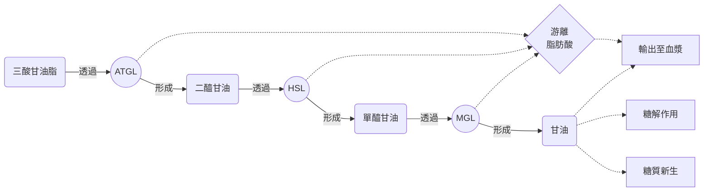
```mermaid
flowchart LR
TAG(三酸甘油脂)-->|透過|ATGL((ATGL))-->|形成|DAG(二醯甘油)-->|透過|HSL((HSL))-->|形成|MAG(單醯甘油)-->|透過|MGL((MGL))-->|形成|G(甘油)

FFA{游離<br>脂肪酸}

ATGL-.->FFA
HSL-.->FFA
MGL-.->FFA

FFA-.->export[輸出至血漿]
G-.->export
G-.->Gly[糖解作用]
G-.->Glu[糖質新生]
```
- 其中，HSL酵素其實可以同時對TAG、DAG、MAG做反應，只是其活性最高時是跟DAG做反應
- 游離脂肪酸被釋放到血液中，並跟白蛋白 (albumin) 結合
> [!Tip]
> 簡單來說，一個酵素斷一個酯鍵 🐱

- HSL受到cAMP活化 (沒錯又是它)， $\beta$ -腎上腺素受體能透過活化腺苷酸環化酶來產生cAMP

> [!Note]
> 可以結合 $\beta$ -receptor的激素有很多種，包含: 升糖素、腎上腺素、副甲狀腺素、促甲狀腺素、促腎上腺皮質激素等等

- cAMP活化PKA，PKA除了會促進HSL的活性，還能夠在脂肪滴表面的蛋白 (又稱為脂肪滴蛋白，perilipin，PL) 上面作用，使PL磷酸化，便能促進已經被磷酸化的HSL招募到脂肪滴附近，促進脂肪水解
- 同時，一種脂肪滴上的表面蛋白叫做CGI-58，它會脫離脂肪滴表面，並且跟ATGL結合。該複合物也可以受到PL的招募

### 脂肪的氧化
#### 早期實驗
- Knoop 早期在做實驗時，嘗試給動物餵食脂肪酸。他讓脂肪酸末端的甲基被苯基取代，如下:

$$Ph-CH_2-CH_2-\cdots-CH_2-COO^-$$

- 他發現，如果碳鏈的碳數為偶數，產生的代謝物為苯乙酸: $Ph-CH_2-COO^-$ ，而如果是奇數，產生的代謝物為苯甲酸 $Ph-COO^-$
- 因此，脂肪酸的氧化，其實是一片段一片段逐步進行的，該過程不斷重複，直到剩餘的酸無法進一步被代謝，並且被排泄掉

#### 基本輪廓

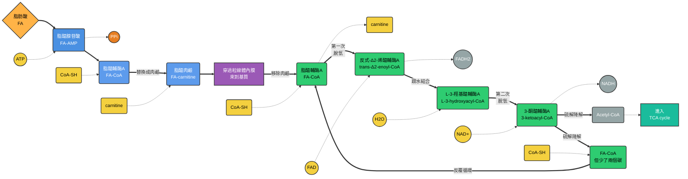
```mermaid
flowchart LR
    FA{脂肪酸<br>FA}:::start
    FA==>faa(脂醯腺苷酸<br>FA-AMP):::activation

    ATP((ATP)):::cofactor-.->faa
    faa-.->PPi((PPi)):::byproduct

    faa==>FaCoA1(脂醯輔酶A<br>FA-CoA):::transport
    CoA1(CoA-SH):::cofactor-.->FaCoA1

    FaCoA1==>|替換成肉鹼|FAC(脂醯肉鹼<br>FA-carnitine):::transport
    Ca1(carnitine):::cofactor-.->FAC

    FAC==>imm[穿過粒線體內膜<br>來到基質]:::membrane

    imm==>|移除肉鹼|FaCoA2(脂醯輔酶A<br>FA-CoA):::betaoxidation
    CoA(CoA-SH):::cofactor-.->FaCoA2
    FaCoA2-.->Ca2(carnitine):::cofactor

    FaCoA2==>|第一次<br>脫氫|A(反式-Δ2-烯醯輔酶A<br>trans-Δ2-enoyl-CoA):::betaoxidation
    FAD((FAD)):::cofactor-.->A
    A-.->FADH2((FADH2)):::product

    A==>|跟水結合|B(L-3-羥基醯輔酶A<br>L-3-hydroxyacyl-CoA):::betaoxidation
    H2O((H2O)):::cofactor-.->B

    B==>|第二次<br>脫氫|C(3-酮醯輔酶A<br>3-ketoacyl-CoA):::betaoxidation
    NAD((NAD+)):::cofactor-.->C
    C-.->NADH((NADH)):::product

    C==>|硫解降解|D(Acetyl-CoA):::product
    C==>|硫解降解|E(FA-CoA<br>但少了兩個碳):::betaoxidation

    CoA2(CoA-SH):::cofactor-.->E

    D-.->TCA[進入<br>TCA cycle]:::tca
    E==>|反覆循環|FaCoA2

    classDef start fill:#FFB347,stroke:#333,stroke-width:2px,color:#000
    classDef activation fill:#4A90E2,stroke:#333,stroke-width:2px,color:#fff
    classDef transport fill:#5D9BEC,stroke:#333,stroke-width:2px,color:#fff
    classDef membrane fill:#9B59B6,stroke:#333,stroke-width:2px,color:#fff
    classDef betaoxidation fill:#2ECC71,stroke:#333,stroke-width:2px,color:#000
    classDef cofactor fill:#F4D03F,stroke:#333,stroke-width:2px,color:#000
    classDef product fill:#95A5A6,stroke:#333,stroke-width:2px,color:#fff
    classDef byproduct fill:#E67E22,stroke:#333,stroke-width:2px,color:#fff
    classDef tca fill:#1ABC9C,stroke:#333,stroke-width:2px,color:#fff
```

- 脂肪酸的氧化包含carboxyl group的活化、粒線體基質的轉運、以及從 $-COO^-$ 開始，一次氧化兩個碳原子，逐步氧化碳鏈
- 粒線體內膜對於游離的長鏈脂肪酸跟醯基輔酶A不通透，它們需要特定的轉運系統
- acyl-CoA synthetases根據不同的種類，會跟不同長度的脂肪酸反應，形成以下反應:

$$R-COO^- + ATP + CoA-SH \leftrightharpoons R-COS-CoA + AMP + PPi\quad \Delta G^\circ\text{'}=-15\ KJ/mol$$

