# biochem 2nd midterm
## electron transport, oxidative phosphorylation, oxygen metabolism
### what is mitochondrion
- glycolysis發生在cytoplasm，而pyruvate的氧化、脂肪酸的 $\beta$ -oxydation、胺基酸氧化、檸檬酸循環
- 亞區域包含outer membrane、innermembrane、intermembrane space、matrix，內膜形成cristae
- 這需內膜有嵌入非常多的蛋白質 (內膜7成就是這些蛋白質，3成為脂質)
- 內膜中的蛋白質一半參與電子傳遞鏈跟氧化磷酸化，外膜的蛋白質則是完全度一樣的系統
- 其中電子傳遞鏈一共有五個複合體，以及兩個輔酶

### 氧化跟能量生成
#### 標準還原電位
- 標準還原電位 ( $E_0 \text{'}$ ) 數值愈正代表愈容易被還原，愈負則代表愈容易失去電子被氧化: 

$$\Delta G^\circ\text{'}=-nF\Delta E_0 \text{'}=-nF(E^0\text{'}_{acceptor}-E^0\text{'}_{donor})$$

- $n$ 是半反應中轉移的電子數， $F$ 為法拉第常數 ( $96485\ J/mol\cdot V$ )
- 電子由低 $E_0 \text{'}$ 往高 $E_0 \text{'}$ 自發性流動
- 當然，這還要取決於反應物濃度，畢竟濃度差別很大的話，依然能自發性反應。假如說 $A$ 是電子受體， $B$ 是電子供體: 

$$
\begin{align}
& A_{ox} + B_{red}\rightarrow A_{red} + B_{ox}\\
& \Delta G=\Delta G^\circ\text{'}+ RT\ln (\frac{[A_{red}][B_{ox}]}{[A_{ox}][B_{red}]})
\end{align}
$$

#### 生物體內的自由能變化
- 以最基礎的氧化還原反應來當例子: 

$$NADH + H^+ + 0.5\ O_2\rightleftharpoons  NAD^+ + H_2O$$

- 在標準條件下，此反應為強放能反應: 

$$\Delta G^\circ\text{'}=-nF\Delta E_0 \text{'} = -2\times 96485\times (0.82 V - (-0.32 V))=-220\ kJ/mol$$

- 而這個反應在身體裡面，約為 $\Delta G = -381\ kJ/mol\ O_2$ ，也就是一對電子-190 kJ: 

$$
\begin{align}
& 50\times 2.5\ ATP=125 kJ\\
& 125/190 = 0.66
\end{align}
$$

> [!Tip]
> 氧化磷酸化在 *in vivo* 狀況下的效率可以到6~7成 🐱

### 電子傳輸
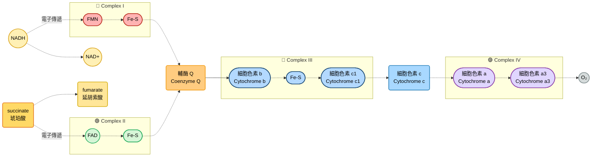

#### 電子載體
##### 黃素蛋白
- flavoprotein，例如FMN (黃素單核苷酸) 與FAD (黃素腺嘌呤二核苷酸) 都是由維生素B2 (核黃素，riboflavin) 衍生而來的輔酶
- 結構特色在於共同擁有異咯嗪環 (isoalloxazine ring) 作為氧化還原核心

##### 鐵硫蛋白
- 是一類含有鐵–硫簇（Fe–S cluster）的金屬蛋白
- 鐵–硫簇 (Fe–S cluster) 由鐵離子與硫化物組成，常見形式有: 
  - 2Fe–2S: 菱形結構，常見於鐵氧還蛋白 (ferredoxin)
  - 4Fe–4S: 立方體結構，常見於電子傳遞鏈的複合體 I、II
- 配位基: 大部分由蛋白質中的半胱氨酸硫醇基提供，也可能有組氨酸或天冬氨酸參與

##### 輔酶Q
- 也被稱為ubiquinone (因為太常見了，所以用了 *ubi* 為開頭)，或是被稱為Q10 (其含有10個異戊二烯單元的Q型式)
- 原本quinone分子中有兩個羰基 (C=O)，電子局限在羰基上，整個芳香環的共振被 "打斷"
- 當其接收兩個電子 + 2質子後，羰基被還原成羥基 (–OH)，羥基不再強烈拉電子，芳香環的 $\pi$ 電子可以重新分布，這讓芳香環恢復共振，變成quinol

##### 細胞色素
- 含有**血紅素 (heme) 輔基**: 由**卟啉環 + 鐵原子**組成，鐵原子可在還原態( $Fe^{2+}$ )與氧化態( $Fe^{3+}$ )間切換，吸光能力強

> [!Note]
> 可透過偵測吸收光譜，從圖形去猜測可能的型式。不同的cytochromes有不同的吸收光譜

- 大部分細胞色素的血紅素與蛋白質非共價結合，細胞色素c是例外 (血紅素透過半胱氨酸的硫醇基與蛋白質共價結合)
- 常見的細胞色素如下:

|類型|輔基|特徵|常見位置|
|----|----|----|----|
|Cyt a|血紅素 a|卟啉環有甲酰基修飾|複合體 IV (細胞色素c氧化酶)|
|Cyt b|血紅素 b|非共價結合，跨膜蛋白|複合體 III、光合電子鏈|
|Cyt c|血紅素 c|共價結合，水溶性球狀蛋白|粒線體膜外側，電子傳遞鏈中可溶載體|

#### 確定電子載體順序
- 把 "NADH被 $O_2$ 氧化" 視為一個一個小步驟來看。但是科學家們是如何確定電子載體的順序的? 🤔

##### 透過吸光光譜
- 無論是NADH、FADH2還是什麼cytochrome，其氧化態跟還原態的吸收光譜都不一樣
- 例如還原態細胞色素c在550nm附近有明顯正吸光值、NADH於340nm處有明顯正吸光值，黃素蛋白在460nm處有明顯負吸光值
- 透過在適當時機給粒線體氧氣，並且觀察吸收光譜的變化，誰變高誰變低，就可以確定不同載體從完全氧化態到部分有還原的 "時間順序"

##### 透過抑制劑以及人工的電子受體
- 有些物質的作用靶點就是載電子傳遞鏈上面，例如: 
  - 魚藤酮 (**rotenone**) 跟異戊巴比妥 (**amytal**): 阻斷鐵硫簇蛋白把電子傳給Q10
  - **antimycin A** (抗黴素A): 抑制細胞色素b傳電子給細胞色素c
  - **cyanide**: 跟氧化態的細胞色素a3反應，阻止其接收電子
  - **一氧化碳**: 跟還原型的細胞色素a3反應，阻止其把辮子傳給氧氣
- 這些抑制位點又被稱為**crossover point** 

#### respiratory complex
##### NADH 脫氫酶，complex I
- NADH跟FMN可以可逆的交換電子
- 這種可逆的脫氫反應跟電子透過氫負離子的方式從底物轉移到目標分子

$$\text{reduced substrate}+NAD^+ \leftrightharpoons \text{oxidezed substrate} + NADH + H^+$$

- 整個複合物包含一個FMN + 八個鐵硫簇，然後電子最後會透過complex I轉手給Q10
- 基本上結構在整個進化過程中高度保守，沒啥變化

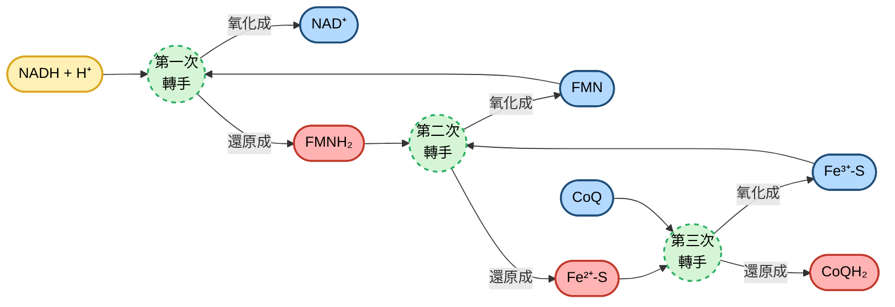
- 雖然鐵硫簇只能攜帶單一電子，但是FMN有兩種還原型式: 兩個電子的完全還原 $FMNH_2$ 以及單一電子的半還原 $FMNH\cdot$ ，因此能穩定的提供一個一個電子給鐵硫簇
- 電子在複合體I內部的傳遞，會造成蛋白質結構的局部能量釋放。這些能量透過蛋白質的 "構象改變" 傳遞到跨膜區域
- 膜區域有四個質子通道模組，當電子流動時，這些通道的氨基酸側鏈發生酸鹼性改變，推動質子跨膜

> [!Important]
> 每傳遞一對電子 (NADH → CoQ)，就會把4個質子從基質側打到膜間腔 🐱

##### 琥珀酸-輔酶Q還原酶，complex II
- Q10也會從琥珀酸獲取電子，這東西就是之前上TCA cycle時提到的succinate dehydrogenase
- 包含兩個跨膜亞基，兩個親水亞基，FAD-結合亞基，以及三個鐵硫簇
- 不泵出質子

$$succinate + Q\leftrightharpoons fumarate + QH_2$$

- 除此之外，脂肪酸做 $\beta$ -氧化的時候產生的反應裡面也有一個酵素跟輔酶Q有關係，就是**ETF-QO** (把fatty acyl-CoA變成fatty enoyl-CoA) 。脂肪醯氧化的電子透過該酵素傳遞給Q10
- **G3P dehydrogenase**催化G3P變成DHAP，這個反應產生的電子最終也會丟給Q10

##### 輔酶Q:細胞色素c氧化還原酶，complex III
- 將ubiquinol的電子轉移給cytochrome c
- 以二聚體的形式存在，每個單體有10或是11個亞基
##### 備註: **Q-cycle**
- 把ubiquinol 的 "兩電子" 分拆成兩條 "單電子路徑"，最後交給只能接收一電子的cytochrome c
  - $QH_2$ 進入 $Q_0$ 位點
  - $QH_2$ 帶著 $2e^- + 2H^+$
  - 兩個質子直接釋放到膜間腔 (intermembrane space)
- 電子分流
  - 第一電子: 傳給**Rieske Fe–S center → cytochrome c1 → cytochrome c (單電子受體)**
  - 第二電子: 傳給**cytochrome bL → cytochrome bH → $Q_i$ 位點的 ubiquinone (Q)**
- 半醌形成
  - Qi位點的ubiquinone先接受一電子，形成 semiquinone ( $Q\cdot ^-$ )
- 第二個 $QH_2$ 進入 $Q_o$ 位點
  - 再次釋放 $2H^+$ 到膜間腔
  - 第一電子再傳給另一個cytochrome c
  - 第二電子再傳給 $Q_i$ 位點的 semiquinone，使它完全還原成 $QH_2$ ，並吸收 $2H^+$ 來自基質側
> [!Note]
> 結果: 每2個 $QH_2$ 在 $Q_o$ 位點被氧化...
> - 釋放 $4H^+$ 到膜間腔
> - 還原 2 個 cytochrome c (各帶走 $1e^-$ )
> - $Q_i$ 位點的 ubiquinone被還原成 $QH_2$ ，完成循環 🐱

$$QH_2 + 2\ cyt\ c_{ox}+2H^+_\text{matrix}\rightarrow Q + 2\ cyt\ c_{red} + 4H^+_\text{intermembrane space}$$

- 細胞色素c位於內膜靠膜間腔的那一側，也是內在途徑細胞凋亡的核心成員
- 在內原性凋亡途徑中，粒線體外膜的通透性增加，細胞色素e流到細胞質中，和其他蛋白質形成凋亡體，促進級聯反應，導致apoptosis

##### 細胞色素c氧化酶，complex IV
- 13個亞基組成，包含主要三個功能性亞基: I、II、III
- 亞基I包含兩個heme: $a$ 和 $a_3$ ，以及兩個以銅為主的center: $Cu_A$ 跟 $Cu_B$
- 起點: 細胞色素 c
  - 還原態的cytochrome c (攜帶 $1e^-$) 將電子交給Complex IV
  - 每次需要4個cytochrome c，才能完成一次完整的氧還原
- $Cu_A$ 中心
  - 第一個電子先傳到 $Cu_A$ 雙核銅中心， $Cu_A$ 是cytochrome c的主要接受者
- heme $a$
  - 電子再傳到heme $a$ ，作為中繼站
- heme $a_3–Cu_B$ 反應中心
  - 電子最後到達 heme $a_3$ 與 $Cu_B$ 組成的雙金屬中心，這裡是氧分子結合的位點
- 氧還原
  - 需要4電子 + 4質子，才能把一個 $O_2$ 分子完全還原成 $2\ H_2O$
  - **電子來自cytochrome c，質子來自粒線體基質** 

$$4\ cyt\ c_{red}(Fe^{2+}) + O_2 + 8H^+_\text{matrix}\leftrightharpoons 4\ cyt\ c_{ox}(Fe^{3+}) + 2\ H_2O + 4H^+_\text{intermembrane space}$$

##### supercomplex 
- 複合體I、III、IV，可以以1:2:1的比例結合成 "超複合體" ，這種呼吸鏈複合體傳遞電子的樣子，有時候就像一條微型導線似的

### oxidative phosphorylation
#### P/O ratio
- P/O ratio (ATP synthesized/ $O_2$ consumed): **一對電子經過electron transport chain可產生的ATP數目**
- 由於後來進一步發現，P/O ratio的實際值並非整數。例如NADH氧化的P/O ratio為2.5，succinate氧化的P/O ratio為1.5: 

$$NADH + H^+ + \frac{1}{2}O_2 + 2.5\ ADP + 2.5\ Pi \leftrightharpoons NAD^+ + H_2O + 2.5\ ATP$$

- 再次提醒一次，在標準條件下，合成2.5個ATP需要76kJ的能量，而NADH被 $O_2$ 氧化的 $\Delta G$ 為-220kJ，氧化磷酸化效率大概只有35%
- 但是由於身體中的ATP水解 $\Delta G$ 更高一點 (-50kJ/mol)，所以實際上的效率可以到60%到70%

> [!Tip]
> 什麼樣的時候反應能夠允許 "1個NADH產生2.5個ATP" ? 就是電子傳遞鏈跟ATP 合成並沒有直接的化學反應關係，也就是說，**沒有任何所謂的中間體反應物跟ATP的合成偶聯** !! 🐱

#### 驅動ATP合成的氧化反應
- 即使氧化磷酸化跟電子傳遞鏈並沒有完全直接的關係，我們依然可以把電子傳遞鏈弄成三大反應: 
  - $Q$ 搶走NADH的電子
  - 細胞色素c搶走 $QH_2$ 的電子
  - $O_2$ 搶走細胞色素c的電子
- 透過抑制劑跟底物的使用，最終可確定複合體I、III、IV可以形成ATP，但是複合體II不行: 
  - Antimycin A: **阻斷Complex III → cytochrome b還原態累積 → ATP 合成停止 → 證明Complex III是耦合位點**
  - Cyanide: **阻斷Complex IV → cytochrome $a_3$ 還原態累積 → ATP 合成停止 → 證明 Complex IV 是耦合位點**
  - Succinate + Rotenone: **電子只能走Complex II → CoQ → III → IV → ATP合成量比NADH低 → Complex II不泵質子**

#### mechanism of oxidative phosphorylation
- 利用的叫做 "化學滲透偶聯" (chemiosmotic coupling)，基本概念就是:
  - 電子傳遞鏈產生的自由能驅動主動運輸系統
  - 質子從基質泵入膜間腔，產生質子電化學梯度
  - 質子因為熱力學的所傾向的情形，沿著梯度流回基質，促進ATP合成
- 這個過程涉及ATP合成酶 (也就是complex IV)，每四個質子經過，就產生1 ATP

#### 實驗證據
##### 膜建立質子梯度
- 如果你測量膜電位差，內膜兩側的膜電位大概是150~200 mV

> [!Important]
> - 電壓梯度 = 電場強度/距離，由於細胞膜最多5nm厚，所以: 
> 
> $$\frac{0.2V}{5\times 10^-9}=4000000\ V/m$$
>
> - 這跟閃電的電壓是差不多的，慢走不送 🙂

- 根據以前算的電化學梯度公式... 

$$\Delta G=RT\ \ln (\frac{C_2}{C_1}) + ZF\Delta\psi$$

- 我們把pH (質子濃度的對數函數) 丟進去，簡化方程式為: 

$$\Delta G=2.3\ RT\ \Delta pH + F\Delta\psi$$

- 然後我們知道，內膜兩側的pH值差了0.75，在體溫下 (T=310 K)，pH的梯度貢獻大概是: 

$$2.3\times 8.314\times 310\times 0.75 = +4.45\ kJ/mol$$

- 而膜電位的部分貢獻為: 

$$F\cdot \Delta\psi = 96485\times 0.2V = 19.3\ kJ/mol$$

- 整體大概就是 $+23.75\ kJ/mol$ ，這是形成質子梯度時的反應，屬於吸能。所以梯度的釋放就是放能反應，這個放能產生的自由能就用來產生ATP 😏

##### 氧化磷酸化需要完整的內膜
- 當內膜不是連續的 (例如你用超音波震碎了一點，漏電)，電子傳遞依然可以進行，但是無法產生ATP

##### 跨膜蛋白
- 泵質子的蛋白必須是跨膜蛋白，並且接觸膜間腔還有基質。同時，為了確保單向的泵出，蛋白質的結構應該內外不對稱 (例如標記蛋白質的時候只能標記一側)

##### 解偶劑的 "神奇" 之處
- DNP跟FCCP添加到粒線體中時，可以允許質子流入基質，但是不用產生ATP。它可以當質子在膜內外的 "運輸機" 

- **Vanilomycin**
  - 一種 "陽離子載體"，特別是 $K^+/Na^+$ 交換載體
  - 把膜電位 $\Delta\psi$ 消耗掉，因為帶電的陽離子跨膜流動會中和電壓差
> [!Note]
> 結果: 雖然 $\Delta pH$ 可能還在，但 $\Delta\psi$ 被破壞 → PMF 減弱，ATP 合成受阻 🐱

- **Nigericin**
  - 是一種 " $H^+/K^+$ 交換載體"
  - 把質子梯度 $\Delta pH$ 消耗掉，因為 $H^+$ 與 $K^+$ 交換使得pH差消失。
> [!Note]
> 結果: $\Delta pH$ 被破壞，但 $\Delta\psi$ 仍可能存在 → PMF 減弱，ATP 合成受阻 🐱

##### 質子梯度就能夠產生ATP
- 就算沒有電子傳遞鏈，只要有pH的差異，ATP合成酶就能進行
- 將葉綠體在pH=4的地方孕育幾個小時，然後迅速轉移到pH=8的緩衝液，在葉綠體裡面添加ADP跟Pi，ATP就能迅速合成，同時pH梯度消失

#### complex V的結構
- 可以分為: 
- $F_0$ 部分 (膜內馬達)
  - 位於粒線體內膜，形成一個質子通道
  - c-ring: 由10~12個c亞基組成的環狀結構，質子進入後推動它旋轉
  - $a$ 亞基: 質子入口，導引質子進入 c-ring
  - 功能: 把PMF轉換成機械旋轉能
- $F_1$ 部分 (基質側催化頭)
  - 位於基質側，呈球狀
  - $\alpha_3 \beta_3$ 六聚體：三個 $\alpha$ 與三個 $\beta$ 交替排列，每個 $\alpha\beta$ 單體中間都可以塞一個腺嘌呤核甘酸，但 $\beta$ 亞基才是ATP合成的活性位點
  - $\gamma$ 軸：連接 $F_0$ 的旋轉部分與 $F_1$，像 "曲軸" 一樣插入 $\alpha_3 \beta_3$ 中心。中間的stalk除了 $\gamma$ ，還有其他subunits，形成 $\gamma\delta\varepsilon$
  - 功能: 隨著 $\gamma$ 軸旋轉， $\beta$ 亞基依序經歷三種構象 (Open → Loose → Tight)，完成ADP + Pi → ATP的合成

- 由於 $\gamma$ 亞基在三個 $\alpha\beta$ 二聚體內部相互作用，讓這三個二聚體每次都呈現出不同構型
##### 運作原理
- 質子流入 $F_0$ → 推動c-ring旋轉
- 旋轉傳到 $\gamma$ 軸 → $\gamma$ 軸在 $\alpha_3 \beta_3$ 中轉動
- $\beta$ 亞基構象改變: 
  - Open: 釋放ATP
  - Loose: 結合ADP + Pi
  - Tight: 催化生成ATP
- 每轉一圈，合成3個ATP

##### 天然狀態下的方向性
- ATP合成酶在沒有運作時，對ATP的親和力非常高
- 如果沒有質子動力勢 (PMF) 驅動，ATP合成酶會牢牢抓住ATP，甚至傾向於水解ATP
- 這就是為什麼它在 "沒有馬達旋轉" 時，ATP 幾乎不會釋放

##### 能量 "逼迫" 釋放ATP
- 在 $F_1$ 部分的 $\beta$ 亞基裡，ATP的結合位點親和力極高
- $\gamma$ 軸旋轉帶來的構象改變 (Open → Loose → Tight) 才是讓ATP被釋放的關鍵
- that is，ATP合成酶不是自發合成ATP，而是利用質子動力勢來 "強制降低對ATP的親和性" 

- 一實驗中，人們將 $\beta$ 亞基固定在蓋玻片上面，並將螢光標記的actin固定在 $\gamma$ 蛋白上面，之後加入 $\alpha$ 亞基，使玻片上形成 $F_1$ complex
- 觀察時可以發現，要是加入了ATP，可以刺激這個actin旋轉，而且旋轉方向為逆時針，而在人體中，合成ATP的 $\gamma$ 是順時針旋轉

> [!Important]
> ATP合成酶的 "高ATP親和力" ，代表它本質上是一個**ATP水解酶**，而不是天然的ATP合成器 !! 👀

##### c-ring跟質子
- 每個c亞基上都有一個保守的Asp或Glu側鏈。當質子從膜間腔進入a亞基的通道時，它會質子化這個Asp/Glu殘基
- 質子化的c亞基會隨著c-ring的旋轉移動，直到到達另一側。當Asp/Glu殘基回到基質側的出口通道時，質子被釋放，殘基恢復帶負電狀態，準備再接受下一個質子
- 由於質子只能 "**膜間腔 → 基質側**" 流動，因為 a 亞基的通道設計了 "入口" 與 "出口" 的分工

### resporatory control
#### 底物影響
- 底物會影響ATP合成，包含ADP、Pi、氧氣，以及可以形成NADH或是FADH2的代謝物
- 大部分的時候，ATP的量普遍比ADP的量多4~10倍，當消耗ATP時，ADP會累積，促進呼吸作用並再合成ATP。相反，能量充足的時候，累積很多ATP相當於ADP的量少，底物不足，限制電子傳遞以及產生ATP的速率
- 例如，如果我加上可氧化的底物 (例如glutamate或是malate)，對呼吸作用的影響較小 (氧氣消耗慢)，但當我另外加入ADP，氧氣消耗速率就會大幅增加，直到所有ADP都變成ATP
- 相反，要是我的可氧化底物少，但是ADP很多，我一樣無法產生大量ATP
> [!Note]
> 雖然電子傳遞鏈跟ATP合成在化學反應上是兩碼子事，但是它們會因為底物的消耗情況而互相影響，除非粒線體漏電 (解偶) 🐱

#### 質子動力勢的耦合關係
> 我們能很好理解為什麼電子傳遞鏈抑制，會抑制ATPase (因為他媽沒有質子梯度)，那反過來呢? ATPase可以影響電子傳遞鏈嗎? 🤔🤔

- **oligomycin**屬於氧化磷酸化的抑制劑，直接抑制酵素生成ATP
- 讓我們來做個思想實驗... 通常來說，正常情況下: 
  - ETC把電子傳下去，同時把質子打到膜間腔
  - ATP合成酶讓質子回流，消耗PMF，並合成 ATP，形成一個 "動態平衡": 

$$\text{質子泵出} \leftrightarrow \text{質子回流}$$

- 加入oligomycin
  - ATP合成酶的c-ring被鎖住，質子無法回流
  - 結果: 膜間腔的質子越積越多，PMF ( $\Delta\psi + \Delta pH$ ) 急速上升
- 對 ETC 的影響
  - ETC的質子泵是 "逆壓工作" 當膜電位太高，泵質子需要更多能量
  - 當PMF達到極限，電子傳遞就會被 "反壓" 阻塞。所以ETC的速率下降，氧消耗減少

> [!Tip]
> 這也是為什麼Oligomycin常被用來測試耦合性: **如果ETC和ATP合成酶是耦合的，抑制ATP 合成就會連帶抑制呼吸 !!** 🐱

#### 消耗ATP導致的熱力學效果
- 當我開始消耗ATP時，粒線體基質中的ATP下降，使 $\Delta G$ 更有利於磷酸化ADP。此時ATP合成持續進行，質子也會繼續流過 $F_0$ : 

$$\Delta G_\text{ATP合成} + \Delta G_{H^+ \text{重新進入基質}} < 0$$

- 同時，質子重新流入，也會降低電子傳遞在熱力學上的阻礙，反過來又增加電子傳遞，提高呼吸效率: 

$$\Delta G_{e^-\text{的運輸}} + \Delta G_{H^+ \text{的泵入}} < 0$$

#### ATP的水解
- 如果粒線體呼吸受到干擾，PMF低於某個值，且細胞質中還有ATP的存在，**adenine nucleotide translocase** (腺嘌呤核甘酸轉位酶，ANT) 會把ATP帶到粒線體基質裡面，被水解後反向讓ATP合成酶泵入質子，維持PMF

- 但是如果要避免細胞因為缺乏ATP而死給你看 (🙂)，我們有時要想辦法鎖住ATPase反向運行
- $IF_1$ ( $F_1$ **inhibitor protein**) 主要結合在 $F_1$ 的 $\beta$ 亞基附近，阻止 $\gamma$ 軸旋轉所帶來的構象改變。這樣 $\beta$ 亞基就不能進行ATP水解循環
- 這相當於是一種 "安全閥"，確保粒線體在能量危機時不會把ATP反向消耗掉

#### brown adipose tissue
- 棕色脂肪的粒線體富含解偶聯蛋白 (**uncoupling protein, UCP**)，允許解偶聯的發生，脂肪氧化的能量以熱的形式釋放出來。目前哺乳動物至少表達了5種解偶聯蛋白
- 有些植物也有辦法解偶聯，尤其是那些在早春就要萌發的植物

### 粒線體的運輸系統
- 我們知道粒線體內膜有多挑剔，通透受到嚴格限制 (畢竟要避免漏電)，上面就以非常多的蛋白質管控這項系統，這些蛋白多數歸類為粒線體載體家族 (**mitochondrial carrier family, MCF**)

#### 部分MCF介紹
##### adenine nucleotide translocase, ANT
- 等量的交換ATP/ADP: 輸入一個ADP到基質，就輸出一個ATP到細胞質
- 由於ATP帶-4電荷，ADP帶-3電荷，又因為膜間腔電荷較正，因此這個交換不需要能量額外參與

##### phosphate translocase
- 磷酸轉位酶共分為兩種: 同向轉運 (**symport**) 跟反向轉運 (**antiport**)
- 這兩種傳遞方式都是維持電中性，而動力來源是pH值梯度的部分

| 種類 | 運輸方式 | 消耗的PMF成分 | 生物學意義 |
| --- | --- | --- | --- |
| **Symport** | 傳送 $HPO_4^{2-} + 2H^+$ 一起進入基質 | 消耗 $\Delta pH$ (質子梯度) | 直接利用質子 動力勢帶入Pi |
| **Antiport** | 傳送 $H_2PO_4^-$ 進入 ↔ $OH^-$ 出去 | 消耗 $\Delta pH$ $OH^-$ 出去相當於 $H^+$ 進來） | 另一種方式維持 Pi輸入與電荷平衡 |

- 缺乏這些載體的人，通常都會有運動不耐受、肌肉張力問題、肥厚型心肌病變、乳酸性酸中毒等問題

##### 氧化的底物受體
- pyruvate由**pyruvate transport system**移入基質，跟磷酸根一樣，透過和 $OH^-$ 交換來完成
- 一些兩個 $COOH^-$ 的有機酸底物 (如succinate、fumarate、malate) 可以透過**dicarboxylate transport system**互相換來換去
- 三個 $COOH^-$ 的有機酸底物 (如citrate、isocitrate)，也可以透過**tricarboxylate transport system**互相交換，或是利用兩個 $COOH^-$ 的有機酸、PEP來交換citrate跟isocitrate

#### 如何確保細胞質中的代謝能繼續?
- 粒線體需要能夠將細胞質還原當量轉運到基質。NADH需要能夠成功氧化，剩下的NAD+才能給糖解作用使用，但是NADH無法直接轉進基質，所以需要特殊的穿梭系統
- 這些穿梭系統並非利用蛋白質直接傳輸NADH，而是用 "交換" 的方式以及酵素的轉換達成

#### DHAP/G3P shuttle
##### 細胞質側
- 由cytosolic glycerol-3-phosphate dehydrogenase催化，把 NADH 的電子轉移到 DHAP，生成 G3P
- G3P可以順利穿過外膜，進入膜間腔

$$NADH + DHAP \rightarrow NAD^+ + G3P$$

##### 粒線體內膜上的反應
- G3P進入靠近內膜的mitochondrial glycerol-3-phosphate dehydrogenase
- 這個酵素含有FAD，會把G3P氧化回DHAP，同時把電子交給 FAD，產生 $FADH_2$
- 然後DHAP穿過外膜，回到細胞質
##### 電子進入ETC
- $FADH_2$ 將電子傳給ubiquinone，形成ubiquinol，進入電子傳遞鏈
##### 特點 
- 電子是以 $FADH_2$ 的形式進入ETC，跳過complex I，所以每個細胞質NADH最多只能產生約1.5 ATP，而不是2.5 ATP
- 這個shuttle系統反應迅速，適合需要快速能量供應的組織，例如大腦和骨骼肌
- 電子一旦進入粒線體，就不會再回到細胞質，不可逆

#### Malate–Aspartate shuttle
##### 細胞質側
- NADH 將OAA透過cytosolic malate dehydrogenase還原成malate
- malate 可以穿過粒線體內膜的轉運蛋白

##### 粒線體基質側
- malate 進入基質後，再被mitochondrial malate dehydrogenase氧化回OAA，並在粒線體內部生成NADH
- 這樣就把細胞質NADH的還原力 "轉移" 到粒線體內的NADH

##### 天冬氨酸迴路
- OAA在基質中不能直接穿膜，所以會先透過轉胺酶 (transaminase) 轉換成aspartate
- aspartate可以穿過膜，回到細胞質後再轉換回OAA，完成循環

##### 特點
- 效率較高，電子是以NADH的形式進入粒線體，能從complex I 開始，完整泵出10個質子，每個NADH約產生2.5 ATP
- 不同於DHAP/G3P shuttle，這個shuttle是可逆的，能根據代謝需要調整方向
- 常見於心臟、肝臟等需要高效率能量轉換的組織

| Shuttle 系統 | 電子進入ETC的位置 | 每個NADH產生 | 常見組織 | 特點 |
| --- | --- | --- | --- | --- |
| **Malate–Aspartate** | Complex I | 2.5 ATP | 心臟、肝臟 | 高效率、可逆 |
| **DHAP/G3P** | Complex II (FAD → Q) | 1.5 ATP | 腦、骨骼肌 | 速度快、不可逆 |

### 有氧呼吸的代謝總結 🐱
- 先來做總反應式的相加大集合...

#### glycolysis

$$\text{glucose} + 2\ ADP + 2\ Pi + 2\ NAD^+\rightarrow 2\ \text{pyruvate} + 2\ ATP + 2\ NADH + 2\ H_2O + 2\ H^+$$

#### pyruvate dehydrogenase complex (PDC)

$$2\ \text{pyruvate} + 2\ NAD^+ + 2\ \text{CoA-SH}\rightarrow 2\ \text{acetyl-CoA} + 2\ NADH + 2\ CO_2$$

#### citric acid cycle (TCA cycle)

$$2\ \text{acetyl-CoA} + 4\ H_2O + 6\ NAD^+ + 2\ FAD + 2\ ADP + 2\ Pi\rightarrow 4\ CO_2 + 6\ NADH + 2\ FADH_2 + 2\ \text{CoA-SH} + 2\ ATP + 4H^+$$

#### net: 

$$\text{glucose} + 10\ NAD^+ + 2\ FAD + 2\ H_2O + 4\ ADP + 4\ Pi\rightarrow 6\ CO_2 + 10\ NADH + 6H^+ + 2\ FADH_2 + 4\ ATP$$

- 假設P/O ratio如同預期，每莫耳葡萄糖氧化，就會產生: 

$$4 + (2.5\times 10) + (1.5\times 2)=\boxed{32\ ATP}$$

- 標準狀況下，跟據ATP的水解自由能 ( $\Delta G = -30.5\ kJ/mol$ ) 以及葡萄糖的氧化自由能 ( $\Delta G = -2870\ kJ/mol$ )，運行效率為: 

$$\boxed{\frac{32 \times 30.5}{2870}=34\text{%}}$$

### 補充一下 🧠
#### mitochondrial genome
- 粒線體內部的DNA屬於雙股環狀genome，包含37個基因，編碼13種蛋白質
- 這些蛋白質都屬於電子傳遞鏈複合體的亞基，無論是I、III、IV、V裡面都有mtDNA參一咖
- 當然，大部分的粒腺體蛋白質是由細胞核幫忙編碼的，只是轉錄轉譯後再轉運至粒線體
- mtDNA的突變就會導致電子傳遞鏈方面的缺陷問題，這些缺陷容易影響腦部跟肌肉，因此又被稱為**mitochondrial encephalomyopathies**
- 有些子細胞會同時遺傳突變的mtDNA跟正常的mtDNA，這被稱為**異質性 (heteroplasmic)**
- 而且特定器官往往要有一定數量的突變mtDNA才會發病，這又被稱為**閾值效應 (threshold effect)**

#### reactive oxygen species
##### 🔬 superoxide 的來源
- 電子傳遞鏈中，semiquinone偶爾會把電子 "漏" 給氧氣，生成superoxide ( $O_2\cdot^-$ )
- 其他酵素 (如NADPH oxidase) 也能直接把電子傳給 $O_2$ ，產生superoxide
- 如果想要起到抗氧化的作用，就是想方設法找人去接電子，例如**peroxiredoxins**: 

$$ROOH + 2H_2O\rightarrow ROH + H_2O$$

##### 後續命運
- **歧化反應**
  - $2O_2\cdot^- + 2H^+ \rightarrow H_2O_2 + O_2$
  - $2H_2O_2\rightarrow 2H_2O + O_2$
  - 此反應由SOD (**superoxide dismutase**) 執行，迅速轉化成過氧化氫
- **Fenton反應** (dangerous 😱)
  - $H_2O_2 + Fe^{2+} \rightarrow OH\cdot + OH^- + Fe^{3+}$
  - 生成羥基自由基 (**hydroxyl radical**)，屬於最具破壞性的ROS
- **peroxynitrite產生** 
  - $O_2\cdot^- + NO\cdot \rightarrow ONOO^-$

---

## Photosynthesis
- 重點可以寫成以下簡單的形式: 

$$CO_2 + H_2O\xrightarrow[]{light\ energy} [CH_2O] + O_2$$

- 由於有些細菌使用的是不同還原劑 (不一定是水)，所以反應是也可以改寫成: 

$$CO_2 + 2H_2A \xrightarrow[]{light\ energy} [CH_2O] + H_2O + 2A$$

- 分為兩個子過程: 
  - 光反應，水分子進行光化學氧化後，還原NADP變成NADPH，並釋放出氧氣。而且能量將ADP磷酸化成ATP
  - 固碳反應，又稱為碳同化反應 (carbon assimilation reaction)，將二氧化碳跟水透過光反應產生的ATP和NADPH，形成碳水化合物

### Chloroplast: photosynthetic organelle
- 有三層膜，外膜 (**outer membrane**) 、內膜 (**inner membrane**)、類囊體膜 (**thylakoids**)，多個類囊體疊起來形成**granum**，空腔內為**lumen**，基質為**stroma**，葉綠餅中間的連絲被稱為**lamella**

> 這邊我們就音速帶過囉~ 🙂

### 光反應簡介

```mermaid
graph LR
  H2O((2 H2O)):::water
  H2O-.->|透過|OEC(水分解酶複合體<br>Oxygen Evolving Complex):::water_splitting
  P1((photon)):::photon-.->|激發|P680
  OEC-.->|產生|oxygen((O2)):::oxygen
  OEC-.->|釋放|H1((4H+)):::proton
 
subgraph PSII [PSII, 光系統II]
  direction TB
  OEC-.->|透過|Yz(tyrosine殘基<br>作為電子中介):::electron_carrier
  Yz-->P680[P680 → P680*<br>電子激發]:::psii
  P680-->ph(pheophytin<br>脫鎂葉綠素a):::psii_carrier
  ph-->Qa((質體醌A)):::psii_carrier
  Qa-->Qb((質體醌B)):::psii_carrier
end

  Qb==>QH2([游離的<br>plastoquinone])
  QH2==>cytb6f[紅藻素複合體<br>Cyt b₆f complex]:::cytochromes
  cytb6f-.->|釋放|H2((8H+)):::proton
  cytb6f==>PC(plastocyanin<br>質體藍素):::plastocyanin
  PC==>P700[P700 → P700*<br>電子激發]:::psi
  P2((photon)):::photon-.->|激發|P700

subgraph PSI [PSI, 光系統I]
  direction TB
  P700-->A0(A0，初級電子受體<br>葉黃素or葉綠素):::psi_carrier
  A0-->A1(A1，次級電子受體<br>葉綠醌為主):::psi_carrier
  A1-->Fx([Fx, Fe-S cluster]):::fe_s
  Fx-->Fa_Fb([Fa/Fb, <br>Fe-S cluster]):::fe_s
end

  Fa_Fb==>Fd(ferredoxin<br>鐵氧還蛋白)
  Fd==>FNR[ferredoxin-NADP⁺<br>reductase]:::fnr
  Fd==>|循環電子<br>路徑|cytb6f
  NADP([2 NADP+]):::nadp-.->|透過|FNR
  FNR-.->|形成|NADPH([2 NADPH]):::nadph


classDef water fill:#a8d8ff,stroke:#2980b9,stroke-width:2px,color:#000
classDef water_splitting fill:#d6eaff,stroke:#3498db,stroke-width:2px,color:#000
classDef oxygen fill:#7fb3d5,stroke:#1f4e79,stroke-width:2px,color:#000
classDef proton fill:#99ccff,stroke:#2471a3,stroke-width:2px,stroke-dasharray:3 3,color:#000
classDef photon fill:#fff0b5,stroke:#daa520,stroke-width:2px,color:#000, stroke-dasharray:3 3
classDef psii fill:#ffb3b3,stroke:#c0392b,stroke-width:2.5px,color:#000
classDef psii_carrier fill:#ffcccc,stroke:#e74c3c,stroke-width:2px,color:#000
classDef electron_carrier fill:#ffd6d6,stroke:#e74c3c,stroke-width:2px,color:#000
classDef cytochromes fill:#d6f5d6,stroke:#27ae60,stroke-width:2px,color:#000
classDef plastocyanin fill:#a9dfbf,stroke:#1e8449,stroke-width:2px,color:#000
classDef psi fill:#e0d6ff,stroke:#8e44ad,stroke-width:2.5px,color:#000
classDef psi_carrier fill:#e8daef,stroke:#7d3c98,stroke-width:2px,color:#000
classDef fe_s fill:#d2b4de,stroke:#6c3483,stroke-width:2px,color:#000
classDef fnr fill:#ffd966,stroke:#e67e22,stroke-width:2px,color:#000
classDef nadp fill:#ffe0b3,stroke:#f39c12,stroke-width:2px,color:#000
classDef nadph fill:#ffcc80,stroke:#d35400,stroke-width:2px,color:#000
  
```

### 光捕獲系統
#### 光的能量
- 我們已經知道光有波動性跟粒子性 (波粒二象性，wave-particle duality)，我們可以用波長 ( $\lambda$ ) 跟頻率 ( $\nu$ ) 形容特定類型的輻射
- 根據普郎克定律，光子的能量跟其光的頻率成正比 ( $h$ 為普郎克常數)

$$E=h\nu =\frac{hc}{\lambda}$$

- 因此，就等量的光子來看，要能破壞共價鍵，你勢必要有波長較短，頻率較高的光線才辦得到，如果你只是遠紅外線，那頂多分子震動 (產生熱)，無法產生化學反應

#### 色素種類
- 有些色素是負責吸收光的，他們又被稱為**chromophores**
- 不同色素有不同的吸收光譜，這些chromophores幾乎都覆蓋了整個可見光譜的範圍

- 🌱 **chlorophylls**
  - 結構: 卟啉環 (**porphyrin ring**) 為核心，中央配位一個 $Mg^{2+}$ ，並帶有一條長的phytol脂肪鏈
  - 主要吸收藍光與紅光，反射綠光，因此呈現綠色；是光合作用的主要能量捕捉分子
  - 結構類似血紅素 (heme)，但中心金屬是鎂而非鐵
- 🥕 $\beta$ **-carotene**
  - 結構: 由 **40 個碳**組成的長鏈多烯烴，含有**共軛雙鍵系統**，兩端各有一個 $\beta$ -環 (cyclohexenyl ring)
  - 主要吸收藍光與綠光，呈現橙紅色；在動物體內可轉化為**維生素 A**
  - 屬於類胡蘿蔔素 (carotenoids)，在植物中常與葉綠素共存，幫助光能捕捉並保護葉綠素免受光氧化
- 🔵 **phycocyanin**
  - 結構: 屬於藻膽蛋白 (**phycobiliproteins**)，是一種蛋白質，結合開鏈四吡咯色素 (**phycocyanobilin**) 作為發色團
  - 常常存在於藍綠菌 (cyanobacteria) 與紅藻
  - 主要吸收橙紅光，呈現鮮藍色；在光合作用中作為輔助色素，將能量傳遞給葉綠素

- 光合作用的第一步是LHC，每一個LHC都是一個多亞基的蛋白複合體，裡面包含多個天線色素 (antenna pigment) 以及一對作為反應中心的葉綠素分子
- 這些色素捕獲能量之後的反應，可分為共振能量傳遞以及電子傳遞
#### resonance transfer
- 沒有電子真正移動，只是激發態能量在分子之間 "傳遞"
- 供體分子的激發態電子傳遞能量，回到基態，受體電子反而變成激發態
> [!Important]
> ##### 條件：
> - 供體分子處於激發態
> - 受體分子的吸收光譜與供體的發射光譜有重疊
> - 分子距離通常在 1–10 nm 之間

#### electron transfer
  - 電子真的從供體傳遞給受體，這屬於氧化還原反應

| 特徵 | Resonance Transfer | Electron Transfer |
| --- | --- | --- |
| **是否有電子移動** | ❌ 沒有，只有能量傳遞 | ✅ 有，電子跨分子移動 |
| **化學本質** | 激發態能量共振 | 氧化還原反應 |
| **距離範圍** | 1–10 nm，靠偶極耦合 | 分子接觸或共價連接 |
| **光合作用角色** | **天線色素 → 反應中心** | **反應中心 → 電子傳遞鏈** |

- 通常在反應之後的極短時間內 ( $<10^{-10}$ ) ，能量就會從天線色素傳到反應中心的葉綠素分子
- 至於為何反應中心的葉綠素接收到能量不是變成激發態，而是成為釋放電子的還原劑，是因為: 
  - 反應中心的葉綠素並不是孤立存在，而是嵌在蛋白質複合體裡
  - 蛋白質環境改變了葉綠素的 氧化還原電位，讓它在激發態時成為一個 "超強還原劑" 
  - 這種設計使得它的激發電子更容易被鄰近的電子受體接走

>[!Important]
> 記得，**大部分的葉綠素分子並不直接參與化學過程，而是做為天線分子行resonance transfer** !! 👀

#### 光系統的原理
- Hill reaction揭示了葉綠體在光照下能夠釋放氧氣，即使沒有完整的碳固定循環
- 研究人員把分離的葉綠體懸浮液暴露在光下，並加入一個人工電子受體 (如ferricyanide)，在光照下，葉綠體能把水分解，釋放 $O_2$ ，並把電子交給人工受體
- 這證明了光合作用的 "光反應本身" 就能驅動水的氧化與氧氣釋放，不需要碳固定: 

$$4\ Fe(CN)_6^{3-} + 2H_2O \xrightarrow[]{light\ energy} 4\ Fe(CN)_6^{4-} + 4H^+ + O_2$$

- 量子效率 (Q，quantum efficiency) 是指釋放的氧氣分子數根吸收的光子數的比，研究發現當光的波長逐漸超過680nm之後，Q值大幅下降，但是700nm附近的波長範圍內還是有很強的吸收，因此認為有兩種光系統
- 吸收波長達到700nm的光系統被稱為PSI (葉綠素被稱為P700)，而吸收波長在680nm以下的光系統叫做PSII (葉綠素被稱為P680)
- 在兩個光系統中，第一步是將激發態的電子從反應中心傳遞到電子傳遞鏈
- 電子的最主要來源是水分子，而終點是NADP分子。而電子傳遞的過程中，質子會被釋放到類囊腔，其中，質子一部份來自於水，一部份來自於基質
- 電子的傳遞跟其所含的能量在光系統中呈現出**Z-scheme**的形式

### 光反應前半段
#### PSII
- 光合作用的第一步是 "光捕獲系統吸收光子" ，傳遞時天線色素回到基態釋放的光子，這個光子會促進P680釋放電子
- 釋放完電子之後，P680形成強氧化劑，促進 $H_2O$ 的裂解

##### OEC
- 放氧複合體 (**oxygen evolving complex**)，屬於PSII的一個亞基，含有 $Mn_4CaO_5$ 簇，以及酪胺酸殘基 (Yz，把OEC電子給P680+)
- 共有四種氧化態: $S_1$ 、 $S_2$ 、 $S_3$ 、 $S_4$ ，每一次都是Yz被抽走一個電子，累積其還原力，同時在其重新還原回 $S_0$ 時，裂解兩分子水
- 同時，裂解水產生的質子會被釋放到類囊體腔。這整個過程被稱為**S-state cycle**

#### quinone的差別
- 在電子傳遞鏈上，氧化磷酸化用的是ubiquinone (泛醌，Q10)，光合磷酸化用的是plastoquinone (質體醌)，當然植物有不同的質體醌 (包含光系統內的 $Q_A$ 跟 $Q_B$ )
- 同樣，ubiquinone還原後會變成ubiquinol，plastoquinone還原後會變成plastoquinol

#### cytochrome $b_6 f$ complex
- 包含細胞色素 $f$ (含有c-type血基質)、細胞色素 $b_6$ (含有兩個b-type血基質)、跟Rieske鐵硫簇蛋白
- 該複合物類似於粒線體中的complex III，也會催化類似的Q-cycle

### 光反應後半段
#### PSI
- 一樣包含天線色素跟反應中心的葉綠素P700，電子激發後會經過一系列的傳遞鏈，包含: $A_0$ (特殊的葉黃素或是葉綠素)、 $A_1$ (葉綠醌，也就是維生素K)、三個鐵硫簇分子 ( $F_X$ 、 $F_B$ 、 $F_A$ )

#### ferredoxin and FNR
- 鐵氧還蛋白存在於葉綠體基質中，透過ferredoxin: $NADP^+$ oxidoreductase反應，把電子給 $NADP^+$ :

$$2\ Fd_{red} + H^+ + NADP^+ \xrightarrow[Fd-NADP^+\ reductase]{} 2\ Fd_{ox} + NADPH$$

### 小總結
#### ATP synthesis
- 光系統II的總反應如下: 

$$2\ H_2O\xrightarrow[]{+4h\nu} 4H^+ + 4e^- + O_2$$
 
- 光系統II的總反應如下: 

$$4e^- + 2H^+ + 2\ NADP^+ \xrightarrow[]{+4h\nu} 2\ NADPH$$

- 所以總反應就變成: 

$$2\ H_2O + 2\ NADP^+ \xrightarrow[]{+8h\nu} 2H^+ + O_2 + 2\ NADPH$$

- 與粒線體內膜不同的是，葉綠體的類囊膜可以對其它離子有通透性 (如 $Mg^{2+}$ 和 $Cl^-$ )，因此大部分的膜電位都會被中和掉，唯一能決定質子動力勢的東西主要就是質子的濃度梯度。通常，類囊體膜兩側產生的pH差可以非常大 
- 與粒線體中的ATP生成類似，這些質子只能透過ATP合成酶複合體穿過類囊膜，這複合體被稱為 $CF_0-CF_1$ (粒線體的ATPase被稱為 $F_0-F_1$ )
- 每三個質子經過 $CF_0-CF_1$ ，就會生成1ATP ( $F_0-F_1$ 產生一個ATP需要4個質子)，這樣來看，根據產生一個 $O_2$ 會得到12個 $H^+$ ，這樣會產生4個ATP

#### 蛋白質的不均勻分布
- PSII主要位於疊片的內側 (grana stacks)，而PSI主要位於基質片 (stroma lamellae) 或是類囊體外側
- ATPase由於同時要和基質和類囊腔接觸，所以一律在類囊腔外側

#### 循環電子途徑
- 當鐵氧還蛋白接收到電子之後，可以選擇不去和FNR反應，而是把電子轉給cytochrome $b_6 f$ complex，這樣子就有辦法再泵出一次質子。而該複合體的電子後來會被質體藍素接收，再去補充PCI的電子，如此往復
- 這種狀況在NADPH很多，沒有還原劑可以接電子時，依然有辦法讓葉綠體產生ATP
- 在此過程中，沒有氧氣被釋放，也沒有NADPH的產生

### 固碳反應簡介

```mermaid
flowchart LR

CO2((6 CO2)):::co2
CO2==>|透過|rubisco(RuBisCo<br>二磷酸核酮醣羧化酶):::rubisco
RuBP([6個 RuBP<br>1,5-二磷酸核酮醣]):::rubp==>|透過|rubisco
rubisco==>|形成|C6[6個<br>6碳化合物]:::c6
C6==>|裂解成|3PGA([12個 3-PGA<br>3-磷酸甘油酸]):::pga
3PGA==>|形成|13BPG([12個 1,3-BPG<br>1,3-二磷酸甘油酸]):::bpg
12ATP((12 ATP)):::atp-.->|加入|13BPG
13BPG==>G3P([12個GAP +<br>12個DHAP]):::g3p
13BPG-.->|剩下|12ADP((12 ADP)):::adp
NADPH([12 NADPH]):::nadph-.->|加入|G3P
G3P-.->|水解|Pi((12 Pi)):::pi
G3P==>|拉出|1G3P([3個GAP +<br>3個DHAP]):::g3p_out
G3P-.->|剩餘|NADP([12 NADP+]):::nadp
1G3P==>|形成|FBP([3個 F16BP]):::fbp
FBP==>3F6P([3個 F6P]):::f6p
3F6P==>|拉出|1F6P:::f6p_out
3F6P==>|其餘重生RuBP|2F6P([2個 F6P]):::f6p
FBP-.->|水解|3Pi((3 Pi)):::pi

1F6P([1個 F6P]):::f6p_out==>G6P([1個 G6P]):::g6p

G6P==>G1P([1個 G1P]):::g1p
G1P==>result{產生<br>直鏈澱粉}:::starch
1ATP((1 ATP)):::atp-.->|被水解|result
result-.->|剩餘|1Pi((1 Pi)):::pi
result-.->|剩餘|1ADP((1 ADP)):::adp

2F6P==>|形成|RuP

G3P==>|其餘重生RuBP|5G3P([4個GAP +<br>2個DHAP]):::g3p_regen
5G3P==>|形成|RuP([6個 Ru5P<br>5-磷酸核酮糖]):::ru5p
RuP==>|形成|RuBP
3ATP((3 ATP)):::atp-.->|加入|RuBP
RuBP-.->|剩下|3ADP((3 ADP)):::adp

classDef co2 fill:#d6f5d6,stroke:#27ae60,stroke-width:2px,color:#000
classDef rubisco fill:#a9dfbf,stroke:#1e8449,stroke-width:2px,color:#000
classDef rubp fill:#c8e6c9,stroke:#2e7d32,stroke-width:2px,color:#000
classDef c6 fill:#b9f6ca,stroke:#00c853,stroke-width:2px,color:#000
classDef pga fill:#a5d6a7,stroke:#2e7d32,stroke-width:2px,color:#000
classDef atp fill:#ffb3b3,stroke:#c0392b,stroke-width:2px,color:#000
classDef adp fill:#ffcccc,stroke:#e74c3c,stroke-width:2px,color:#000
classDef nadph fill:#ffd6d6,stroke:#e74c3c,stroke-width:2px,color:#000
classDef nadp fill:#ffe0e0,stroke:#e74c3c,stroke-width:2px,color:#000
classDef pi fill:#f5c6c6,stroke:#c0392b,stroke-width:1.5px,stroke-dasharray:3 3,color:#000
classDef bpg fill:#b3d9ff,stroke:#1f4e79,stroke-width:2px,color:#000
classDef g3p fill:#99ccff,stroke:#2980b9,stroke-width:2px,color:#000
classDef fbp fill:#7fb3d5,stroke:#1f4e79,stroke-width:2px,color:#000
classDef f6p fill:#a8d8ff,stroke:#2980b9,stroke-width:2px,color:#000
classDef g6p fill:#85c1e9,stroke:#2471a3,stroke-width:2px,color:#000
classDef g1p fill:#5dade2,stroke:#1a5276,stroke-width:2px,color:#000
classDef g3p_out fill:#d6eaff,stroke:#3498db,stroke-width:2px,color:#000
classDef f6p_out fill:#d6eaff,stroke:#3498db,stroke-width:2px,color:#000
classDef g3p_regen fill:#e0d6ff,stroke:#8e44ad,stroke-width:2px,color:#000
classDef ru5p fill:#d2b4de,stroke:#7d3c98,stroke-width:2px,color:#000
classDef starch fill:#fff0b5,stroke:#daa520,stroke-width:2.5px,color:#000

```

- 通常發生在葉綠體基質中，或是光合細菌的細胞質中，功能就是將大氣中的二氧化碳固定為碳水化合物
- 卡爾文等人利用小球藻 (*Chlorella*) 跟柵藻 (*Scenedesmus*) 培養於 $^{14}C$ 標記的二氧化碳裡面幾秒鐘後，殺死細胞，用二維紙層析技術分析萃取物，並把色譜圖曝光於X-ray膠片，檢測放射性化合物
- 以此獲得循環的第一個產物3-PGA，逐一找出整個循環圖徑
#### 二氧化碳固定跟糖生成
##### RuBisCo
- 二氧化碳的接收分子為1,5-二磷酸核酮醣 (**ribulose-1,5-bisphosphate, RuBP**)，二氧化擴散到葉綠體基質後，添加到RuBP的羰基碳上
- 該反應由二磷酸核酮醣羧化酶 (ribulose-1,5-bisphosphate carboxylase, **RuBisCo**) 催化，可謂是生物圈中最豐富的酵素之一 (真的很多)

- 此反應基本上是不可逆的 ( $\Delta G^\circ\text{'}= -35.1\ kJ/mol$ )，酵素作用結束後，二氧化碳已被固定成碳水化合物了

##### GAP生成
- 3-PG透過兩個酵素變成GAP，這個反應跟糖質新生的一部份反應幾乎一模一樣，只是糖質新生中使用的NADH變成NADPH而已，其餘酵素反應機制基本一模一樣，很簡單吧 🐱

$$\text{3-phosphoglycerate}\xrightarrow[phosphoglycerate\ kinase]{+ATP} \text{1,3-bisphosphoglycerate}\xrightarrow[GAP\ dehydrogenase]{+NADPH} \text{glyceraldehyde-3-phosphate}$$

##### 己糖生成
- 基本上非常類似糖質新生途徑。假如說我是固定六個碳，在最終生成的物質裡面 (12 GAP + 12 DHAP)，會有三個GAP + DHAP形成三個F6P，而只有其中一個F6P會繼續走糖質新生途徑，而另外兩個會用別的酵素再次回到重生RuBP的路徑。F6P異構化成G1P後，會去合成澱粉。只是不同於肝糖生成使用UTP，植物使用ATP: 

$$
\begin{align}
& \text{glucose-1-phosphate} + ATP \rightarrow ADP\text{-glucose} + PP_i\\
& ADP\text{-glucose} + \text{(glucose)}_n \rightarrow \text{(glucose)}_{n+1} + ADP
\end{align}
$$

- 如果是改合成蔗糖，反應式有所不同: 

$$
\begin{align}
& UTP + \text{glucose-1-P}\rightarrow UDP\text{-glucose} + PP_i\\
& UDP\text{-glucose} + \text{frcutose-6-P}\rightarrow UDP + \text{sucrose-6-P}\\
& \text{sucrose-6-P} + H_2O\rightarrow \text{sucrose} + P_i
\end{align}
$$

#### 再合成受質
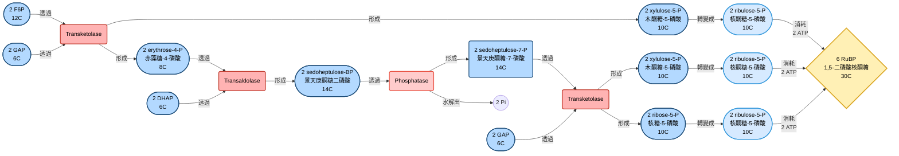

- 要記得反應的分子種類相對來說更加複雜: 
  - 轉移到再生途徑的6個GAP中，是以 "**2 DHAP + 4 GAP**" 的形式反應的
  - 其中還有兩個F6P分子反應，F6P來自 "**1 DHAP + 1 GAP**"
  - 這些分子在反應時，經過多次的重排反應
- 再生反應的最後一步驟是將R5P變成RuBP，每再生成一個RuBP，就要消耗一分子ATP

### 來做個大總結
- 我們知道12個NADPH才能生成一個六碳的糖，我們將ATP的反應一塊記下，光反應反應如下: 

$$
\begin{align}
& 12\ H_2O + 12\ NADP^+\rightarrow 12\ H^+ + 12\ NADPH + 6\ O_2\\
& 18\ ADP + 18\ Pi + 18\ H^+\rightarrow 18\ ATP + 18\ H_2O\\
\Rightarrow & 12\ NADP^+ + 18\ ADP + 18\ P_i + 6\ H^+ \rightarrow 18\ ATP + 6H_2O + 12\ NADPH + 6O_2
\end{align}
$$

- 而暗反應的部分，根據剛才在卡爾文循環的反應式，如下:

$$
\begin{align}
& 6\ CO_2 + 12\ NADPH + 12\ H^+ \rightarrow C_6 H_{12} O_6 + 12\ NADP^+ + 6\ H_2O\\
& 18\ ATP + 18\ H_2O \rightarrow 18\ ADP + 18\ P_i + 18\ H^+\\
\Rightarrow & 6\ CO_2 + 18\ ATP + 12\ NADPH + 12\ H_2O\rightarrow C_6 H_{12} O_6 + 18\ ADP + 18\ P_i + 12\ NADP^+ + 6\ H^+
\end{align}
$$

- 兩個反應式加在一起，得到: 

$$6\ H_2O +6\ CO_2 \xrightarrow[]{+48h\nu} C_6 H_{12} O_6 + 6\ O_2\quad \Delta G^\circ \text{'} = +2870\ kJ/mol$$

- 假如說我們使用了650nm的光線，那麼48莫耳的光子相當於有: 

$$\frac{hc}{\lambda}\times N_A = \frac{(6.63\times 10^{-34})(3\times 10^8)}{650\times 10^{-9}} \times (6.03\times 10^{23})\times 48 \approx 8857\ kJ/mol$$

- 那光系統的效率在標準狀況下大概是: 

$$\frac{2870}{8857} = \boxed{32\text{%}}$$

#### 光合作用的調控
- Rubisco對多種糖類化合物敏感，這些化合物可以做為長細抑制劑，例如xylulose-1,5-biphosphate、2-carboxy-D-arabinitol-1-phosphate (CA1P)、以及底物RuBP本身
- CA1P是最有效的Rubisco抑制劑之一，在黑暗中於葉綠體合成，導致Rubisco活性在黑暗中下降
- 同時，Rubisco也受Rubisco activase 調控。activase需要ATP，並且受光反應產生的能量影響
- 當光照充足時，activase會因為來自光反應的電子，以及一系列的電子傳遞被活化，從而導致Rubisco的活化

| 分子 | 全名 | 功能 | 狀態 |
| --- | --- | --- | --- |
| **CA1P** | 2-carboxy-D-arabinitol-1-phosphate | 抑制 RuBisCO 活性 | 夜間或光照不足時存在 |
| **RuBisCO activase** | RuBisCO 活化酶 | 移除 CA1P，恢復 RuBisCO 活性 | 白天光照充足時作用 |

### photorespiration and $C_4$ cycle
- 光呼吸是植物在光照下進行的一種副反應，它跟Calvin cycle緊密相關，但會導致能量和碳的浪費

#### Rubisco的雙重活性
- Rubisco不只會固定 $CO_2$，還能錯誤地結合 $O_2$
- 當Rubisco把 $O_2$ 加到RuBP上時，產生的是3-phosphoglycerate (3-PGA) 和 2-phosphoglycolate (2-PG)，2-PG無法直接進入Calvin cycle，必須經過一系列 "回收途徑" 
- 這會導致碳的損失 (因為釋放了 $CO_2$ ，只有四分之三的二氧化碳回到了葉綠體)，而且需要ATP與還原力來回收副產物，而且期間會釋放 $NH_3$ ，需要再同化
- 途徑簡介如下: 
  - 葉綠體: Rubisco產生2-PG → 轉成glycolate (乙醇酸)
  - 過氧化體: glycolate → glyoxylate (乙醛酸) → 轉胺作用 → glycine (甘胺酸)
  - 粒線體: 兩個glycine → serine (絲胺酸) + $CO_2$ + $NH_3$
  - 回到葉綠體: serine → hydroxypyruvate → glycerate → 消耗ATP → 3-PGA，重新進入Calvin cycle

- 光呼吸雖然 "浪費" ，但也有保護作用，在高光、低 $CO_2$ 的情況下，Rubisco更容易結合 $O_2$ ，也能能避免電子過度積累，減少ROS生成，幫助植物維持代謝平衡

#### $C_4$ 循環
- 為了盡量減少光呼吸， $C_4$ 植物會在葉肉細胞 (mesophyll) 先把 $CO_2$ 固定成四碳化合物，再運送到維管束鞘細胞 (bundle sheath)，讓Rubisco在高濃度 $CO_2$ 環境下工作，減少光呼吸
- 將碳固定成 $C_4$ 化合物的循環中，每一個循環就需要額外消耗2ATP，但是減少碳被浪費的機率
- 由於維管束鞘細胞裡面的氧含量不能太多，因此通常該細胞裡面缺乏能裂解氧氣的OEC
- 通常來說，固定 $CO_2$ 的酵素 (PEP carboxylase) 作用底物為 $HCO_3^-$ ( $CO_2$ 的水溶形式)，PEP carboxylase對 $HCO_3^-$ 的**親和力非常高 (Km值低)**，比Rubisco對 $CO_2$ 的親和力強得多

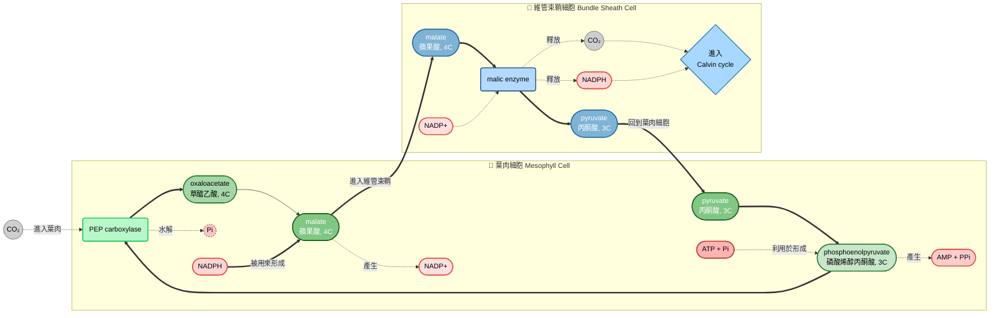

---

## fatty acid biosynthesis and metabolism of glycerophospholipids
- 我們目前知道，植物跟微生物能夠透過乙醛酸循環來將將乙醯輔酶A變成糖質新生前體，但是動物無法做這件事情，因此，動物的碳水化合物變成脂肪屬於單向的反應

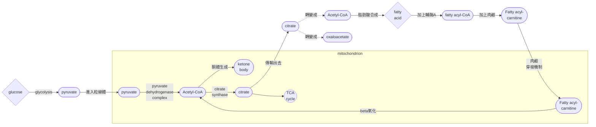

### biosynthesis of palmitate from acetyl-CoA
#### malonyl-CoA的合成
- 從acetyl-CoA加入碳酸氫根，在ATP跟acetyl-CoA carboxylase (ACC) 的幫助下生成malonyl-CoA ( $^-OCC-CH_2-C=O-S-CoA$ ):

$$\text{acetyl-CoA} + ATP +  HCO_3^- \xrightarrow[ACC]{} \text{malonyl-CoA} + ADP + P_i + H^+$$

- 此反應高度放能，幾乎不可逆，ACC基本上也有生物素 (biotin) 輔因子
- ACC 在細胞裡可以以二聚體 (inactive form，非活化狀態) 或聚合體 (active filament form，活化的絲狀結構) 存在，因此，酵素的活性高低取決於它是否聚合成長鏈狀結構
- citrate能和ACC結合，促進 ACC 聚合成活性纖維狀的結構，這樣ACC的活性就會大幅提升，能更有效地合成malonyl-CoA

#### biotin的作用意義
- carboxylase就是 "在底物上面多加一個 $COO^-$ 基團的酵素"
- biotin (aka 維生素B7) 在酵素裡面就像是一隻 "手"，專門負責抓住並搬運 $CO_2$ (或更準確地說是 bicarbonate, $HCO_3^-$ )，讓它能夠被加到底物上
- biotin的結構裡有一個**ureido ring**，能和 $CO_2$ 形成一個活化的 "羧基中間體"。這樣 $CO_2$ 就會被穩定地 "綁住"
- **swinging arm**: biotin通常透過一個長的**lysine side chai**n附著在酵素上，這個 "分子手臂" 能在酵素的不同活性位點之間擺動，把 $CO_2$ 從 "活化位點" 搬到 "加到底物的位點"

> [!Note]
> 這種擺動手臂設計在**pyruvate carboxylase**、**acetyl-CoA carboxylase、propionyl-CoA carboxylase**等酵素裡都能看到 🐱

- 由於 $CO_2$ 的活化需要ATP，biotin幫忙先把 $CO_2$ 和ATP的能量結合起來，形成biotin- $CO_2$ 中間體，再把它交給底物: 

$$
\begin{align}
\text{E-biotin} + ATP + HCO_3^- & \rightarrow \text{E-N-carboxybiotin} + ADP + P_i\\
\text{E-N-carboxybiotin} + \text{acetyl-CoA} & \rightarrow \text{malonyl-CoA} + \text{E-biotin}
\end{align}
$$

### malonyl-CoA變成棕梠酸

#### fatty acid synthase
- 脂肪酸合成不是靠一堆分散的酵素，而是由一個大型複合體**FAS** (fatty acid synthase)完成。裡面有好幾個domain，各自負責不同步驟

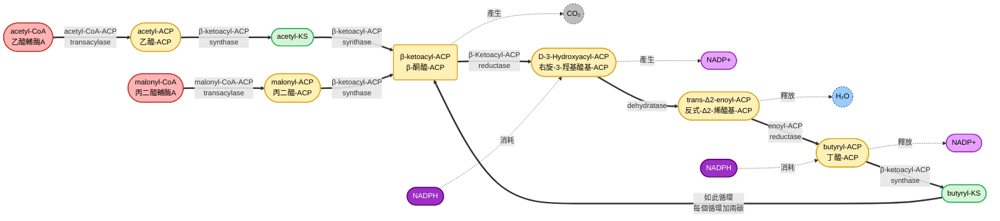

| 酵素/功能區域 | 作用 | 
| --- | --- |
| **MAT (Malonyl/acetyl-CoA-ACP transacylase)** | 把acetyl-CoA或malonyl-CoA的acyl基團轉移到 ACP | 
| **KS ( $\beta$ -ketoacyl-ACP synthase)** | 把acetyl基團和malonyl基團拼接，同時釋放 $CO_2$ | 
| **KR ( $\beta$ -ketoacyl-ACP reductase)** | 把 $\beta$ -酮基還原成羥基，用 NADPH | 
| **DH (Dehydratase)** | 去掉水分子，形成雙鍵 |
| **ER (Enoyl-ACP reductase)** | 把雙鍵還原成單鍵，用 NADPH | 
| **TE (Thioesterase)** | 當碳鏈長到16C，切斷並釋放脂肪酸，形成palmitate | 

- 其中，ACP (acyl carrier protein) 是一個小蛋白，它的作用就是抓住acyl基團，在FAS的不同活性位點之間搬運，結構上長得非常像是coenzyme A
- 在脂肪酸合成的循環裡面，是由ACP代替coenzyme A的位置進行的。無論是acetyl-CoA還是malonyl-CoA，在合成時都會先透過MAT把coenzyme A替換成ACP
- 接下來，acetyl-ACP會接到KS酵素上面，該酵素再去抓malonyl-ACP，並且釋放一個碳，形成 $\beta$ -ketoacyl-ACP

#### 酵素結構分析
- 哺乳類的FAS是由兩個相同的多功能多肽鏈組成，每條鏈大約有2500個氨基酸。這兩條鏈並排在一起，形成一個 "雙臂工廠"，ACP也在裡面，像一隻靈活的手臂，能在不同活性位點之間擺動，把中間產物搬來搬去

#### 氧化跟合成的區別
- 其實脂肪酸氧化跟脂肪酸合成在結構跟化學鍵節的改變方式極度類似 (只是兩個各走相反方向而已)，只是使用的輔因子以及反應未至以所不同:

|選項|脂肪酸合成|脂肪酸氧化|
|---|---|---|
|**誰負責跟醯基結合**| ACP | CoA |
|**甚麼酵素**|fatty acid synthase complex| $\beta$ -oxidation enzymes|
|**作用位置**|細胞質|粒線體|
|**電子攜帶輔因子**| $NADPH$ |$NADH/FADH_2$|

- palmitate合成需要跑完7個cycle，整體來說如下: 

$$\text{acetyl-CoA} + 7\ \text{malonyl-CoA} + 14\ NADPH + 14\ H^+\rightarrow \text{palmitate} + 7\ CO_2 + 14\ NADP^+ + 8\ \text{CoA-SH} + 6H_2O$$

- 當然，為了考慮合成malonyl-CoA時需要的ATP: 

$$8\ \text{acetyl-CoA} + 7\ CO_2 + 7ATP\rightarrow 7\ \text{malonyl-CoA} + 7ADP + 7P_i + 7H^+$$

- 整體的反應式應該要為:

$$8\ \text{acetyl-CoA} + 7ATP + 14\ NADPH + 7\ H^+\rightarrow \text{palmitate} + 14\ NADP^+ + 8\ \text{CoA-SH} + 7ADP + 7P_i + 6H_2O$$

### 其他生物或是胞器的脂肪酸合成
#### mitochondria
- 粒線體裡有一套 mtFAS (mitochondrial fatty acid synthesis)，它不是像細胞質那樣的大型FAS 複合體，而是由分散的單一酵素組成
- mtFAS的主要產物不是長鏈脂肪酸，而是 octanoyl-ACP (C8)
- 這個C8中間體會用來合成lipoic acid (硫辛胺酸)，參與粒線體裡的多種酵素複合體，例如pyruvate dehydrogenase complex、 $\alpha$ -ketoglutarate dehydrogenase complex
#### bacteria
- triclosan專門結合在 **FabI (enoyl-acyl carrier protein reductase)** 上
- 這個酵素負責脂肪酸合成循環中的最後還原步驟: 把enoyl-ACP (含有雙鍵的中間體) 還原成 飽和acyl-ACP
- 它會跟 $NAD^+$ 共同形成一個穩定的三元複合體，阻止酵素進行還原反應
- 這導致脂肪酸合成鏈無法延長，細菌失去合成膜脂的能力，進而抑制生長
- 過去triclosan廣泛用於抗菌肥皂、牙膏、化妝品、清潔用品，因為它能抑制細菌膜脂合成，達到抗菌效果
- 細菌的fabI基因突變 (例如改變結合位點)，會降低triclosan 的抑制效果，可能導致抗藥性菌株出現

### citrate轉運、脂肪酸延長跟去飽和
#### citrate shuttle
- acetyl-CoA不能直接穿過粒線體膜，而是透過citrate shuttle的間接方式

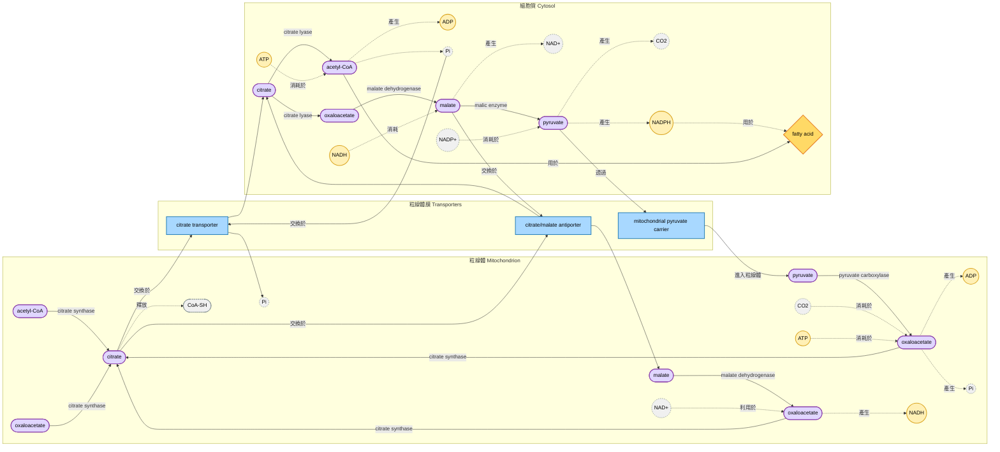

- citrate synthase可以將OAA跟acetyl-CoA變成citrate，但其屬於不可逆反應
- 逆反應需要有ATP的參與，並且需要利用另一個酵素: citrate lyase:

$$\text{citrate} + ATP + \text{CoA-SH}\rightarrow \text{acetyl-CoA} + ADP + Pi + \text{oxaloacetate}$$
- malate dehydrogenase可以讓oxaloacetate跟malate之間進行可逆交換: 

$$\text{oxaloacetste} + NADH + H^+\leftrightharpoons \text{malate}+NAD^+$$ 

- 同時，malic enzyme可以把malate變成pyruvate，此也是可逆反應
- 產生的NADPH用來合成脂肪酸:

$$\text{malate} + NADP^+ + H_2O\leftrightharpoons \text{pyruvate} + HCO_3^- + NADPH + H^+$$

- pyruvate在透過mitochondrial pyruvate carrier (MPC) 回到粒線體裡面後，可以透過pyruvate carboxylase變回OAA，該反應需要ATP水解的能量

$$\text{pyruvate} + HCO_3^- + ATP\rightarrow \text{oxaloacetate} + ADP + P_i + 2H^+$$

- 每一次的transport循環，轉移檸檬酸，都會產生以下的淨反應:

$$NADP^+ + NADH + ATP + H_2O\rightarrow NADPH + NAD^+ + ADP + P_i + 2H^+$$

#### elongation of fatty acid
- 脂肪酸的延長主要在內質網膜上面進行，這個系統又稱為 "微粒體" (microsomal)
- 這一系列酵素又稱為elongase system，延長反應很類似在FAS裡面的效果，只是其抓住醯基的物質是coenzyme A，而非ACP

####  desaturation of fatty acid
- 去飽和 (desaturation) 主要是在內質網的膜上進行，其重點酵素為脂肪酸去飽和酶 (fatty acyl-CoA desaturases)
- 最常見的是 $\Delta$ 9-desaturase (stearoyl-CoA desaturase, SCD)，能把飽和脂肪酸 (stearoyl-CoA, $18:0$ ) 轉換成單不飽和脂肪酸 (oleoyl-CoA, $18:1c\Delta 9$ )
- 需要cytochrome $b_5$ 和 NADH-cytochrome $b_5$ reductase，把電子傳遞給去飽和酶，才能在脂肪酸上插入雙鍵

- 植物可以合成亞油酸 (linoleic, $18:2c\Delta 9, 12$ ，aka $\omega$ -6 ) 以及次亞麻酸 (linolenic, $18:2c\Delta 9, 12, 15$ ，aka $\omega$ -3)
- 動物細胞雖然能在內質網進行去飽和，但只能在 $\Delta 9$ 位點插入雙鍵，而無法在 $\Delta 12$ 或是 $\Delta 15$ 位點插入雙鍵，動物無法自行合成亞油酸跟次亞馬麻酸
- 亞油酸在動物身體裡面會變成花生四烯酸 (prostaglandins、leukotrienes的前驅物)，次亞麻酸在動物身體裡面會變成EPA和DHA (參與腦部、視網膜功能，以及抗發炎反應)

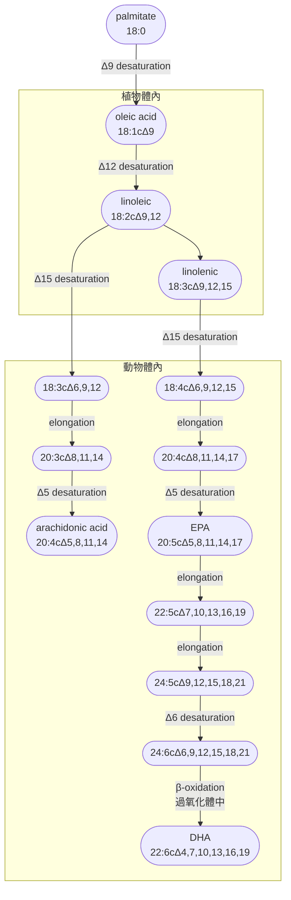

### 四大調控因子
#### acetyl-CoA的活性
- AMPK: 在能量不足時活化，磷酸化ACC → **抑制脂肪酸合成**
- PKA：在glucagon/epinephrine訊號下活化，磷酸化ACC → **抑制脂肪酸合成**
- citrate促進ACC 聚合成活性纖維 → **活化脂肪酸合成**

#### insulin
- 促進citrate lyase → 增加細胞質內的acetyl-CoA
- 促進PDH phosphatase → 活化 PDH，增加粒線體內的acetyl-CoA

> [!Note]
> 整體會提供更多 acetyl-CoA作為脂肪酸合成原料 🐱

#### NADPH 的量
- 脂肪酸合成需要大量NADPH，來源通常為: 
  - pentose phosphate pathway (PPP)
  - malic enzyme (malate → pyruvate + NADPH)
- 只有NADPH充足時，脂肪酸合成才能持續

#### AMP/ATP ratio
- 高AMP → AMPK活化 → **抑制ACC**
- 高 ATP + 高 citrate → 活化ACC → 推動脂肪酸合成

### 補充資料
#### parabiosis
- 共血實驗 (parabiosis) 用來研究肥胖和糖尿病的基因調控
- 研究人員把兩隻小鼠的血液循環連在一起，讓它們共享血液中的激素，實驗設計是這樣的: 

|基因型態|leptin|leptin受體|
|---|----|---|
|**Wild type**|能分泌 leptin|有功能性的 leptin receptor|
|**Ob/Ob 小鼠**|缺乏 leptin|有功能性的 leptin receptor|
|**Db/Db 小鼠**|能分泌 leptin|缺乏 leptin receptor，無法感知 leptin 訊號|

##### Ob/Ob + Wild type
- Wild type提供leptin → Ob/Ob接收到leptin → Ob/Ob體重減輕
- 這證明Ob/Ob缺的是leptin本身

##### Db/Db + Wild type
- Db/Db分泌 leptin，但自己沒有 receptor
- Wild type 接收到 leptin，其食慾下降、體重減輕。而Db/Db自己仍然肥胖
- 這證明Db/Db缺的是leptin receptor

##### Ob/Ob + Db/Db
- Db/Db分泌leptin → Ob/Ob接收到leptin → Ob/Ob體重減輕
- 然而Db/Db自己仍然肥胖，再次確認Ob缺leptin，Db缺receptor

#### erythromycin synthesis
- 紅黴素的前驅物為，由DEBS (6-deoxyerythronolide B synthase) 合成。該系統由三個大型多肽鏈組成: DEBS1、DEBS2、DEBS3
- 每個多肽鏈上有多個模組 (modules)，每個模組負責一次 "兩碳延長" 延長反應。每個模組上也都有ACP、KS、KR、DH、ER等跟脂肪酸合成酶一膜一樣的亞基
- 最終產物是6-Deoxyerythronolide B，一種環化的分子

### 三酸甘油脂的合成
- 主要的三縮甘油脂前體就是actl-CoA跟G3P (glycerol-3-phosphate)
- 起始骨架G3P在肝臟中，透過glycerol kinase，在ATP的幫助下把glycerol磷酸化。而在肝臟中，G3P來自於DHAP的還原，而DHAP來自於糖質新生 
- 三酸甘油脂分解跟合成形成的循環，又稱為**glycerolipid/free fatty acid cycle (GL/FFA cycle)**

> [!Tip]
> ##### AMPK 到底在幹嘛
> - AMPK (AMP-activated protein kinase) 是一個能量感測路徑
> - 它的核心邏輯就是 **"細胞能量不足 (AMP↑, ATP↓)"**，就要關掉耗能的合成路徑，打開產能的分解路徑
> - 但是AMPK相對來說是屬於 "省電模式" (不像是cAMP/PKA 是燒錢... 喔不，燒能量派 🤣)，所以簡單來說，暫時不要合成，同時也確保未來有能源可用
> - 這對比到的，就是在促進脂肪酸氧化的時候，也避免TAG被大量分解釋放fatty acid → **HSL被抑制**

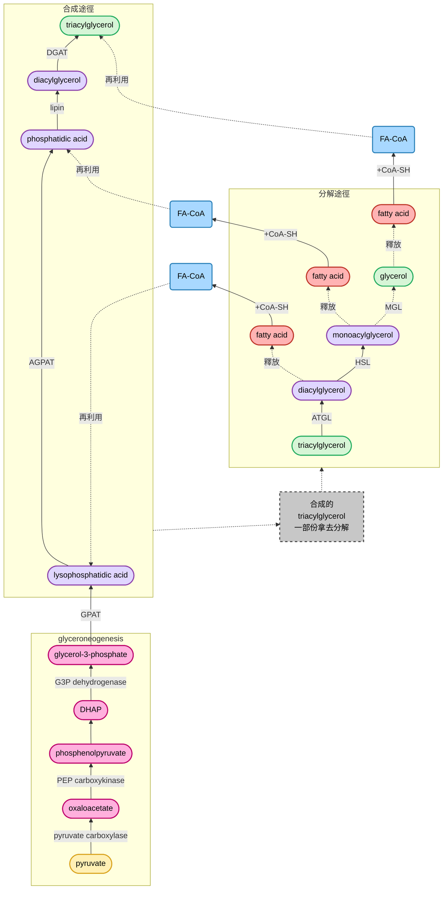

| 步驟 | 中間產物 | 酵素 |
| --- | --- | --- |
| 起始 | Glycerol-3-phosphate | glycerol kinase/G3P dehydrogenase |
| 1st 酯化 | Lysophosphatidic acid (LPA) | GPAT |
| 2nd 酯化 | Phosphatidic acid (PA) | AGPAT |
| 去磷酸化 | Diacylglycerol (DAG) | Lipin |
| 3rd 酯化 | Triacylglycerol (TAG) | DGAT |

### metabolism of glycerophospholipids
#### short introduction
- 三酸甘油脂合成的過程中產生的**phosphatidic acid (PA = G3P + 2FA + Pi)**，可以往TAG合成有，或是往磷脂合成走
##### 真核/原核共通的合成路徑
- **PA變成CDP-DAG**: 由CTP活化 (...三磷酸胞甘? 🤔)
  - **CDP-DAG變成phosphatidyl-serine (PS)**: 加上serine，PS脫羧之後會產生**phosphatidyl-ethanolamine (PE)**
  - **CDP-DAG變成phosphatidyl-glycerol (PG)**: 再加上一個G3P形成。PG聚合後會形成cardiolipin (CL)，可以用於粒線體

##### 真核專屬路線
- **ethanolamine形成PE**: 需要ATP + CTP活化，再和DAG結合
- **choline形成PC (phosphatidyl-choline)**: 一樣需要ATP + CTP活化，再和DAG結合
- **PE形成PC**: 三次甲基化 (S-adenosylmethionine)
- **DHAP → Ether phospholipids → PI (Phosphatidyl-inositol)**: PI是訊號傳遞的重要磷脂 

| 分子 | 主要位置 | 功能 | 特殊意義 |
| --- | --- | --- | --- |
| **Phosphatidyl-choline (PC)** | 細胞膜外層 | 維持膜結構、流動性 | 最常見的膜脂，和膽固醇互動穩定膜 |
| **Phosphatidyl-ethanolamine (PE)** | 細胞膜內層 | 調整膜曲率、幫助膜融合 | 在囊泡運輸、線粒體膜特別重要 |
| **Phosphatidyl-serine (PS)** | 細胞膜內層 | 訊號分子、凋亡標記 | 外翻到膜外層時是apoptosis信號 |
| **Phosphatidyl-inositol (PI)** | 細胞膜 | 訊號傳遞 (PIP2, PIP3) | 調控 GPCR、RTK 等訊號路徑 |
| **Phosphatidyl-glycerol (PG)** | 粒線體膜 | 形成Cardiolipin | 在能量代謝中扮演中間角色 |
| **Cardiolipin (CL)** | 粒線體內膜 | 穩定電子傳遞鏈複合體 | 對ATP合成至關重要 |

ru

### steroid metabolism
-  isoprenoids (又叫 terpenes, 類異戊二烯化合物) 是一類超級大的分子家族，該家族包含膽酸、脂溶性維生素、肝臟合成的多萜醇 (dolichol)、長鏈植物醇、吉貝素 (gibberellins)、有isoprenoid tail的醌類 (包含PQ跟CoQ) 等等都是。也包含主角: 固醇類
- steroid是屬於飽和的perhydrocyclopentanophenanthrene (全氫環勿並菲，反正就是個飽和四元環 🙂) 的衍伸物，其多個環己烷都是呈現出椅式構象 (忘記的請洽詢有機化學老師，感謝)，所以彈性較低
- 膽固醇在細胞膜流動上呈現出buffer的效果，**高溫時避免流動太快，低溫時避免流動太慢**

#### 合成路徑介紹

##### 起始
- 合成開頭為acetyl-CoA (2C) + acetoacetyl-CoA (4C) ，該步驟可以想像成三個Acetyl-CoA，兩個加在一起形成 6C 的 HMG-CoA
- HMG-CoA透過HMG-CoA reductase (HMGCR) 形成mevalonate (甲羥戊酸，6C) 需要用到兩個NADPH: 

$$
\begin{align}
& \text{acetyl-CoA} + \text{acetoacetyl-CoA}\rightarrow \text{HMG-CoA}\\
& \text{HMG-CoA} + 2NADPH + 2H^+\xrightarrow[]{\text{HMG-CoA  reductase}} \text{mevalonate} + 2 NADP + \text{CoA-SH}
\end{align}
$$

>[!Note]
> 這一步是速率限制步驟，也是statin藥物的靶點 (這就是個降血脂藥) 👀

##### 活化
- mevalonate經ATP消耗，形成isopentenyl-PP (IPP，異戊烯基焦磷酸酯) ，PP = pyrophosphate，焦磷酸鹽
- IPP 跟 dimethylallyl-PP (DMAPP) 這兩個五碳化合物可以互相轉換

$$
\begin{align}
& \text{mevalonate} + 3ATP\rightarrow \text{isopentenyl-PP} + 3ADP + P_i + CO_2\\
& \text{isopentenyl-PP}\leftrightharpoons \text{dimethylallyl-PP}
\end{align}
$$

##### 聚合: 5C → 10C → 15C → 30C
- IPP + DMAPP = GPP (geranyl-PP, 10C)，期間丟掉一個PPi
- GPP + IPP = FPP (farnesyl-PP, 15C)，期間丟掉一個PPi
- FPP + FPP = squalene (角鯊烯，30C)
  - squalene synthase在ER membrane上面
  - 屬於頭對頭 (head-to-head) 的縮合反應。兩個FPP的 "頭端"(C1) 互相連接，形成一個 30C 的直鏈分子
  - 需要NADPH作為還原力

$$2\ \text{farnesyl-PP} + NADPH\xrightarrow[]{squalene\ synthase} \text{squalene} + NADP^+  + 2PP_i + H^+$$

##### 環化
- squalene先透過位於ER membrane上的squalene epoxidase產生環氧化物squalene-2,3-epoxide，該反應需要氧氣跟NADPH: 

$$\text{squalene} + O_2+ NADPH + H^+\xrightarrow[]{squalene\ epoxidase} \text{squalene-2,3-epoxide} + H_2O + NADP^+$$

- 接下來透過oxidosqualene cyclase (OSC) 環化: 
  - 先讓epoxide開環 (斷鍵產生的電子會跑到酵素上面去)，這會形成碳陽離子 (carbocation)
  - 這個正電荷沿著碳鏈滾動 (cascade)，觸發一連串的環化反應
  - 最後折疊成四環骨架，也就是所謂的lanosterol
  - 之後再透過去甲基化、還原、雙鍵移動等等，將lanosterol變成膽固醇 (cholesterol)

- 膽固醇透過其他酵素的修飾，可以產生各種不同的類固醇激素

### terpenoid
- terpenes代表純粹由isoprene ( $C_5H_8$ ) 單元組合而成的碳氫化合物，而terpenoid (類萜) 代表在terpenes的基礎下做修飾後的化合物

> [!Tip]
> terpenoid = terpene + 功能化修飾 🐱

- 例子包含薄荷醇 (menthol) 、視黃醛 (retinal)、泛醌 (ubiquinone)、質體醌 (plastoquinone)、茄紅素 (lycopene)、吉貝素 (gibberellic acid) 等等

---

## metabolism of nitrogenous compounds
### 氮循環的利用
- 所有生物都能將氨 ( $NH_3$ ) 變成有機氮化合物 (有 $C_N$ 鍵的物質)，但是不是所有生物都能將氮氣變成氨
- 多數生物固氮 ( $N_2\rightarrow NH_3$ ) 屬於異常超能力，只有固氮細菌做得到。多數細菌跟微生物最多能做的其實是 $NO_3^- \rightarrow NH_3$ 反應
- 氮循環就是氮跑到生物圈裡面跟跑到生物圈外面的過程，兩者保持平衡，通常: 
  -  無機氮變成有機氮: 固氮作用、硝酸鹽還原
  -  有機氮變成無機氮: 腐爛跟反硝化作用 (denitrification)

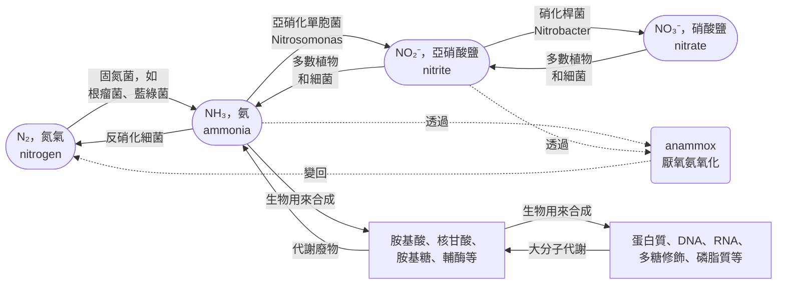

> [!Note]
> **annomox反應:**  $NH_4^+ + NO_2^-\rightarrow N_2 + 2H_2O$ 🐱

### 固氮作用
- 氮氣有三鍵，鍵能很高 (940 kJ/mol)，所以難以還原。在工業上，是利用Haber-Bosch process來形成氨: 

$$N_2 + 3H_2 \xrightarrow[450^\circ C,\ 270\ atm]{catalyst}2NH_3$$

- 從形式上來看，光合作用的二氧化碳鍵能也很高，所以固氮其實也是一樣的，甚至酵素上面也對氧氣非常敏感 (還記得RuBisCo嗎? 😏)，固氮的酵素需要在無氧狀態下才能有效進行
- 因此一些固氮菌會透過形成一個厭氧環境，專門用來固氮 (如藍綠菌的**heterocyst**)
- 固氮作用是個非常耗能的過程...

$$N_2 + 8H^+ + 16\ MgATP + 8e^- \rightarrow 2NH_3 + H_2 + 16\ MgADP + 16P_i$$

- 由固氮酶 (nitrogenase) 催化，最常見的且研究最廣泛的就是鉬依賴性的固氮酶，molybdenum (Mo)-dependent enzyme

#### 根瘤菌跟豆科植物
- leghemoglobin (根瘤血紅蛋白) 作為在根瘤中運送氧氣的角色，和肌紅蛋白 (myoglobin) 在肌肉裡的功能有點類似
- leghemoglobin可以像血紅蛋白一樣能抓住氧氣，避免自由擴散，同時將氧氣有效率地拿去做ATP合成時需要地電子接收，既保護固氮酶，又讓呼吸作用能進行

#### 固氮酶的機制
- 通常固氮酶複合體分為兩個部分: 鐵蛋白跟鉬鐵蛋白

##### Fe protein cycle
- 鐵蛋白含有一個鐵硫簇 [4Fe-4S] ，可以接收電子 (這些電子可能來自於鐵氧還蛋白或是黃素依賴蛋白)
- 整個蛋白屬於一個同源二聚體 (hemodimer)，由兩個 $\alpha$ subunits組成
- 該蛋白通常上頭也結合ATP或是ADP 
  - 氧化的鐵蛋白接收電子，鐵蛋白還原
  - 鐵蛋白丟電子，ATP水解成ADP，促進電子丟給鉬鐵蛋白的P cluster
  - 氧化鐵蛋白的ADP替換成ATP
  - 如此循環...

> [!Tip]
> 傳一顆電子，水解一個ATP 🐱

##### MoFe protein cycle
- 鉬鐵蛋含有P cluster (也是鐵硫簇)，以及一個負責還原氮氣的反應中心: FeMo-cofactor (也被稱為cofactor of component I)
- 整個蛋白屬於一個異源四聚體 (heterotetramer)，由兩個 $\alpha$ subunits 以及兩個 $\beta$ subunits 組成
  - FeMo-co由1個鉬，7個鐵，9個硫，1個碳 (此為中心碳原子)，以及一個同檸檬酸 (homocitrate)，與Mo配位
  - 由P cluster將電子傳給FeMo-co

- 該蛋白質一共有八種氧化態 ( $E_0$ ~ $E_8$ )，因此一個cycle，就是一次逐步接收8顆電子的過程
- 打斷 N≡N 三鍵需要大量能量，FeMo-co 的多金屬簇提供了 "電子緩衝池" 來完成這件事
- 當電子接收到一個狀態後，就能促進 $N_2$ 的還原
- $N_2$ 進入FeMo-cofactor的活性位點後，依序接收電子跟質子，最終生成氨氣，並釋放副產物 $H_2$

### 硝酸鹽跟亞硝酸鹽的的還原
-  幾乎所有植物、真菌跟細菌都有還原硝酸鹽，形成氨的能力
#### nitrate reductase
- 將硝酸鹽變成亞硝酸鹽，該反應由nitrate reductase催化
- 該酵素在不同生物上都不太一樣，真核生物的nitrate reductase包含FAD輔因子、鉬、以及細胞色素 $b_5$ 
- molybdopterin (鉬蝶呤) 是一種特殊的cofactor，含有pterin骨架，帶有硫醇基團
- 基本上，除了固氮酶，其他酵素的鉬固定方式都是透過這種輔因子。很多鉬酵素 (如硝酸還原酶、亞硫酸鹽氧化酶) 都需要 molybdopterin

- 反應如下: 

$$NO_3^- + NADH + H^+ \rightarrow NO_2^- + NAD^+ + H_2O$$

> [!Tip]
> 該還原反應的電子來自於**NADH or NADPH**，真菌的nitrate reductase使用的多數為NADPH 🐱

#### nitrite reductase
- 該反應需要六個電子的參與，將亞硝酸鹽變成氨，由nitrite reductase催化，酵素裡面也有輔因子molybdopterin
- 除此之外，它也包含鐵硫簇，和特殊的血紅素衍生物: siroheme

$$NO_2^-\rightarrow NO^-\rightarrow NH_2OH\rightarrow NH_3$$

    

> [!Tip]
> 該還原反應的電子來自於**ferredoxin** 🐱

### 氨的利用方式
> 由於這個是上一次考試的內容，這次也要考，所以我就快速帶過... 詳情請洽詢[biochemistry_1st midterm](https://hackmd.io/Nu-hPqjPSvOZo78JoJfoUA) 或是自己在[生化筆記repo](https://github.com/Jacklyn301/biochem_note_1142)裡面找，謝謝 🙂

#### 固氮化合物的最終結局
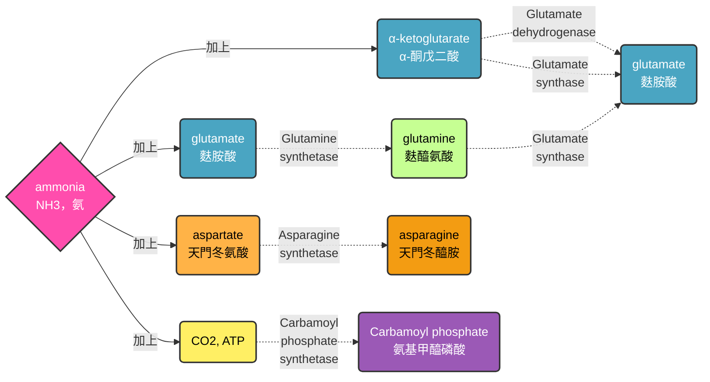

#### glutamate dehydrogenase, GDH

$$\alpha -ketoglutarate + NH_3 + NADH + 2H^2\rightleftharpoons glutamate + H_2O + NAD^+$$

> [!Tip]
> 在細菌身上，該酵素負責產生谷氨酸；在動物身上，該酵素透過逆反應補足 $\alpha$ -ketoglutarate

#### glutamate synthase, GOGAT (不用ATP)

$$\alpha -ketoglutarate + glutamine + \text{還原劑}\rightarrow 2\ glutamate + \text{氧化過後的還原劑}$$

#### glutamine synthetase, GS (需要ATP)

$$glutamate\xrightarrow[]{+ATP} \gamma- glutamyl\ phosphate + ADP\xrightarrow[]{+NH_3}glutamine + P_i$$

#### $NH_4^+$ 水平高時: GDH + GS

$$
\begin{align}
NH_3 + \alpha -ketoglutarate + NADH & \xrightarrow[]{GDH} glutamate + NAD^+ + H_2O\\
NH_3 + glutamate + ATP & \xrightarrow[]{GS} glutamine + ADP + P_i\\
\Rightarrow\quad 2NH_3 + \alpha -ketoglutarate + NADH + ATP & \rightarrow glutamine + ADP + P_i + NAD^+ + H_2O
\end{align}
$$

> [!Tip]
> 使用能量較少，**處理兩分子氨僅需要1個ATP** 🐱

#### $NH_4^+$ 水平低時: GS + GOGAT

$$
\begin{align}
2NH_3 + 2\ glutamate + 2ATP & \xrightarrow[]{GS} 2\ glutamine + 2ADP + 2P_i\\
\alpha -ketoglutarate + glutamine + \text{還原劑} & \xrightarrow[]{GOGAT} 2\ glutamate + \text{氧化過後的還原劑}\\
\Rightarrow 2NH_3 + \alpha -ketoglutarate + \text{還原劑} + 2ATP & \rightarrow glutamine + 2ADP + 2P_i + \text{氧化過後的還原劑}
\end{align}
$$

> [!Tip]
> 使用能量較多，**處理兩分子氨需要2個ATP** 🐱

#### 備註: GS的共價修飾
##### adenylation
- GS的調控方式被稱為腺苷酸化 (adenylation)
  - 沒黏 AMP (deadenylated)，活性最強。🔥
  - 黏了 AMP (adenylated)，活性被抑制。❄️

> [!Note]
> 通常會腺苷酸化GS的酪胺酸殘基 (AMP的磷酸基直接接在酪胺酸的苯環上面)，導致其對於異位調節的抑制劑更加 "敏感" 🐱
 
- adenyltransferase (AT) 控制腺苷酸化。 $P_{II}$ 控制AT
  -  $P_{II}$ 被尿苷酸化 (變成 $P_{II}-UMP$ )，它會叫AT把GS上的AMP拔掉 → **GS活化**
  - 如果 $P_{II}$ 沒有 UMP，它會叫AT把AMP黏到GS上 → **GS 失活**

> [!Note]
> 尿甘酸磷酸基一樣是接在 $P_{II}$ 的酪胺酸殘基上面，接法跟腺苷酸化一模一樣 🐱

- 尿苷轉移酶 (uridylyltransferase (UT)/uridylyl-removing enzyme (UR)，UT/UR，屬於**雙功能酵素**) 負責管 $P_{II}$ :
  - **活化GS**： 當細胞內 $\alpha$ -ketoglutarate 很多 (代表需要處理氮源)，會刺激UT/UR的**UT活性**，把UMP裝到 $P_{II}$ 上
  - **抑制GS**： 當glutamine太多 (產物過剩)，會刺激UT/UR的**UR活性**，把 $P_{II}$ 上的UMP拔掉

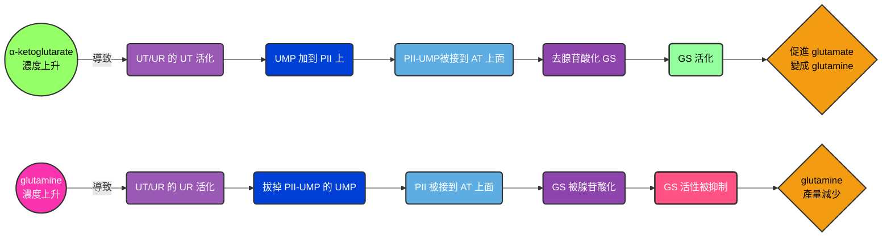

#### 轉氨作用
- 一個 $\alpha$ -amino acid，就會配對上一個 $\alpha$ -keto acid。這種反應由轉氨酶transaminases (又被稱為aminotransferases) 催化
- 多數轉氨酶用的一對一物質為glutamate/ $\alpha$ -ketoglutarate

$$glutamate + \alpha -keto\ acid\rightleftharpoons \alpha -ketoglutarate + \alpha -amino\ acid$$

|人體的必需胺基酸|人體的非必需胺基酸|
|-------------|---------------|
|Arg (僅能少量合成), His, Ile, Leu, Lys, Met (僅能少量合成), Phe, Thr, Trp, Val|Ala, Asn, Asp, Cys, Glu, Gln, Gly, Pro, Ser, Tyr|

#### 胺基酸骨架去處

| 類別 | 代表胺基酸 |
| --- | --- |
| **生糖** | Ala, Gly, Ser, Cys, Thr, Gln, Glu, Pro, Arg, His, Met, Val, Asp, Asn |
| **生酮** | Leu, Lys, Thr |
| **都有** | Ile, Phe, Tyr, Trp, Thr |

    

### 胺基酸的合成

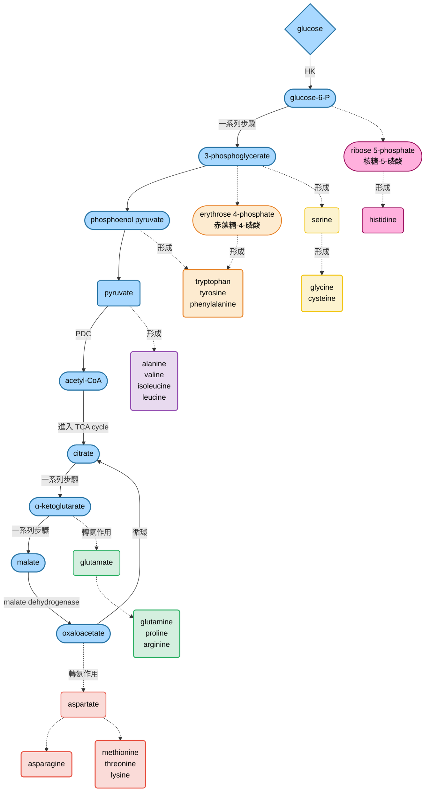

#### Gln, Glu, Asp, Asn, Ala的合成
- **PLP-dependent transamination**指透過吡哆醛磷酸 (**PLP, pyridoxal phosphate**) 作為輔酶，催化胺基酸和 $\alpha$ -keto acid 之間胺基轉移的反應
- PLP屬於維生素 $B_6$ 的衍伸物，胺基可以從其中一個 $\alpha$ -amino acid轉移至PLP上面，形成PMP
- 然後PMP再把氨基傳給 $\alpha$ -amino acid，形成新的氨基酸
  - alanine的底物是pyruvate
  - Glu、Gln的底物為 $\alpha$ -ketoglutarate
  - Asp、Asn的底物為oxaloacetate

#### 從aspartate生成Met, Thr, Lys
- aspartate通常再動物身上除了用於arginine跟urea的生成，也會用來合成胞嘧啶
- 然而，在植物跟細菌中，aspartate還可以用來生成三個胺基酸，這個轉換通常會利用到ATP以及NADPH
  - 該反應主要由aspartate kinase催化，該酵素會透過水解ATP在aspartate的R group $COO^-$ 基團上面加入磷酸基，形成aspartyl- $\beta$ -phosphate
  - 之後該 $COO^-$ 變成醛基，形成aspartate- $\beta$ -semialdehyde (...半醛? 🙂)，該產物可以進一步形成lysine
  - 第三步由homoserine dehydrogenase催化，形成homoserine (...阿這產物是跟serine有啥不一樣? 🤣) ，之後進一步變成methionine跟threonine

#### 芳香族類胺基酸的合成
- shikimic acid pathwa (莽草酸途徑) 完成芳香族氨基酸的合成。這條路徑只存在於 植物、真菌、細菌，而動物沒有，所以我們必須從飲食中獲得這些胺基酸

##### 糖代謝產物的起頭
- 由PEP跟erythrose-4-phosphate 赤藻糖-4-磷酸) 結合，進入途徑，這兩個東西其實是糖解作用與磷酸戊糖途徑 (PPP) 的中間產物

> [!Note]
> ##### 這裡我們來小小澄清一下
> - 我知道大家沒學過PPP，這裡有張圖給大家分析，其第一步為氧化階段，第二步為非氧化階段，如下: 
> 
> |階段|反應|主要產物|意義|
> |---|---|---|---|
> |氧化階段 (不可逆)|G6P → Ru5P + 二氧化碳 |	**2 NADPH + Ru5P**| 提供還原力 (NADPH) 與五碳糖前驅物|
> |非氧化階段 (可逆)|Ru5P ↔ 各種糖磷酸酯|R5P、F6P、GAP、E4P|碳骨架重排，連接糖解作用|

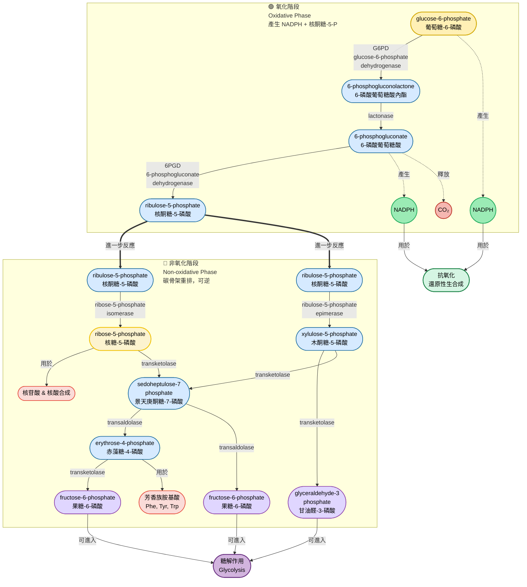
- 這兩個物質經過一系列酵素反應，生成shikimate，屬於這條路徑的 "中心中間體"
- shikimate經過磷酸化、氧化，期間再與PEP結合，還水解了ADP，形成chorismate，後續可以走向不同芳香族胺基酸

> [!Tip]
> - EPSP synthase (5-enolpyruvylshikimate-3-phosphate synthase) 作用於上圖第六步驟 (對就是S3P + PEP + ATP = EPSP 那一步) 
> - 它是除草劑glyphosate (草甘膦) 的作用靶點，一旦被抑制，植物無法合成芳香族胺基酸 → 生長停滯 → 最終死亡 😵

