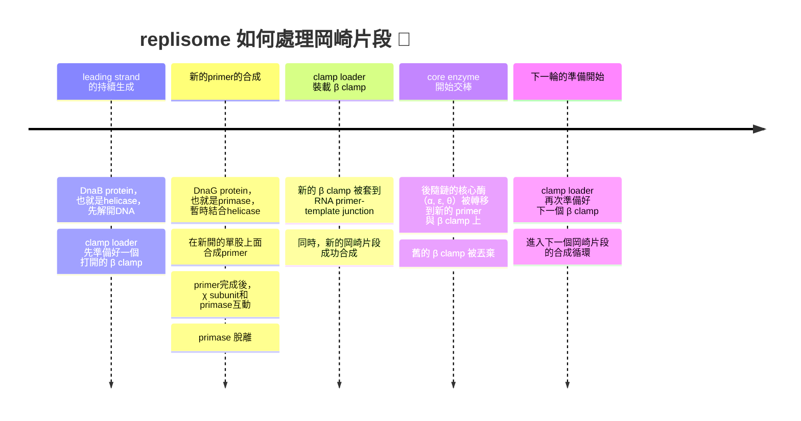
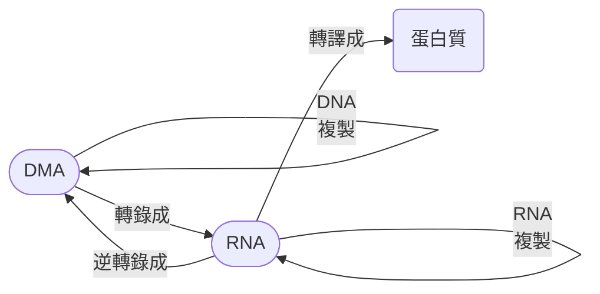
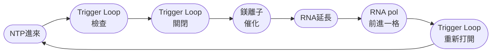
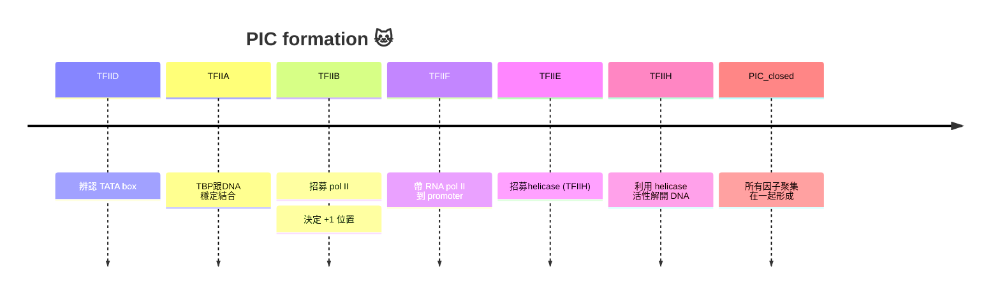

# biochem 3rd midterm
### before we start the class...
#### what is metabolism?
- 代謝跟能量、生物質 (biomass) 有關係
- 身體的能量來源是來自於NTP、FADH2、NADH、NADPH等
- 而生物質就包含醣類、胺基酸、核甘酸等等
- 通常是用這些能量分子，讓這些生物質單體一個一個連在一起
- 例如，肝醣的形成要透過UTP的水解磷酸基形成。UDP-Glc是一個高能分子，可以斷鍵跟其他葡萄醣分子結合
- 至於核酸，本身就是UTP水解焦磷酸鹽後連接在一起的，這反應需要靠聚合酶幫忙

|unit|polymer|
|----|-------|
|glucose|glycogen、starch|
|nucleotides|DNA、RNA|
|amino acid|polypeptide、protein|

#### 規則說明
- DNA可以被複製，也可以被轉錄成RNA
- mRNA會被轉譯成多肽

##### replisome
- 又稱為DNA複製機器 (媽的這好中二 🤣)，裡面的最重要主角之一就是DNA polymerase

##### transcription and translation
- transcription用的是RNA聚合酶。根據你做的RNA不同，會用不同的聚合酶

| RNA 種類 | 功能 | 負責的 RNA pol | 備註 |
| --- | --- | --- | --- |
| **mRNA** | 攜帶基因資訊，作為蛋白質合成模板 | **RNA pol II** | 轉錄大部分的 snRNA、miRNA 等 |
| **tRNA** | 將胺基酸帶到核糖體，對應 mRNA 密碼子 | **RNA pol III** | 同時也轉錄 5S rRNA 與一些小 RNA |
| **rRNA** | 構成核糖體的主要結構與催化成分 | **RNA pol I** | 專門轉錄 28S、18S、5.8S rRNA |

#### 核酸到底是什麼
- 核酸由含氮鹼基、五碳糖以及磷酸基組成
- 一共有兩種形式: DNA 跟 RNA
- 含氮鹼基跟五碳糖由糖甘鍵連在一起
- 沒有磷酸基叫做nucleoside，有的話叫做nucleotide 🙋‍♀️


#### 分子生物學超概覽
- 每個生物體都至少有一套完整的遺傳訊息，這整個遺傳訊息又稱為基因組
- 多數基因組都是DNA，但是有些病毒屬於RNA
- 最小的病毒可能基因組只有幾千個鹼基，而植物的基因組可以高達160 billion base pairs[^1]的數量 (如*Tmesipteris oblanceolata*，叉蕨) ，人類只有3 billion 🙂

## ch25

> 由於我實在是有點寫不下了，所以這一次我直接以課本的slide為主，至於我的心事，兄弟們不需要知道太多，不過我還是會另外發一篇寫下來 👀

### 基本特性
#### DNA 的變性
- DNA變性受到以下原因促進: 
  - 鍵間靜電排斥 (磷酸基團帶負電荷，部分電荷會被陽離子中和)
  - 因此，高離子強度可以穩定雙股結構
  - 跟雙股比起來，單股DNA可以增加entropy，所以DNA熱力學上面偏向單股
  - 鹼性環境跟加熱也會促進變性
- 互補鹼基之間的氫鍵以及van der waals interaction是穩定雙股的力量
- DNA變性不像是蛋白質變性，其只是雙股螺旋間的分開，緩慢冷卻即可恢復正常

> [!Note]
> 不可迅速冷卻，不然會產生大量單股的，未配對的捲曲的DNA !! 👀


#### DNA的吸光值變化
- DNA變性後，鹼基堆疊與氫鍵被破壞，鹼基暴露在溶液中，能更自由地吸收紫外光
- 吸光值會在260 nm區域顯著上升，這就是所謂的 "超色效應"  (hyperchromic effect)

> [!Note]
> - 熔解溫度 (Tm) = 吸光值達到最大與最小之間的 50% 時的溫度
> - GC 含量高 → 熔解溫度高 → 變性較難 🐱

### 複製前介紹
- DNA變成兩個單股後，兩股都可以做成模板，當複製完成後，會產生兩個子DNA，每一個都跟母DNA序列一樣

#### helicases
- Helicases是一種多聚體蛋白質，會先結合其中一條單鍊，並且利用ATP水解產生的能量主動解開雙股

##### 主動滾動模型
- 解旋酶像是一個 "滾輪"，主動推開 DNA 雙股。它利用 ATP 水解驅動，直接破壞鹼基間的氫鍵
- 常見於一些病毒或細菌的解旋酶研究

##### 被動模型
- 解旋酶並不直接破壞氫鍵，而是等待 DNA 自然熱擾動造成局部打開。當出現小的 "氣泡" 或鬆動區域時，解旋酶就繼續推進
- 效率較低，但能量消耗少

##### 尺蠖模型
- 解旋酶像尺蠖一樣，一端固定在 DNA 上，另一端向前移動，再把後端拉過來
- 這種模式強調解旋酶的結構域交替伸縮，推動 DNA 解開

##### 旋轉楔入模型
- 解旋酶像一個楔子插入 DNA 雙股之間，並伴隨旋轉運動
- 這種模型解釋了某些環狀解旋酶如何 "像馬達一樣" 旋轉分開 DNA


### 早期研究跟酵素介紹
- Watson and Crick在論文中提出三個假說: 
  - DNA屬於半保留複製 (semiconservative)
  - 複製發生在複製叉處，此處親代解旋，子代鏈進行延伸
  - 複製起點從Ori開始，Ori可以是一個或是多個
- DNA聚合酶催化多核甘酸鏈的延伸
  - 其複製符合半保留複製的價說
  - 沿著5' 到 3' 方向進行，可以以半間斷的方式複製
  - 需要引子跟模板 

> [!Tip]
> ##### DNA der 延伸化學哲學
> DNA的合成跟以下化學特性有關: 
> - Nucleotide triphosphates (dNTP) 是延伸鏈的底物，產生焦磷酸鹽後變成NMP接上去
> - 生長鏈或是引子 3' 的羥基跟核甘酸的 $\alpha$ -磷原子形成鍵結
> - 焦磷酸鹽 (pyrophosphate) 比你想像中的還要容易脫落

#### DNA的聚合
- 當dNTP 的 $\alpha$ -磷酸靠近引子 3'-OH，引子 3'-OH 的氧原子作為親核劑，攻擊 $\alpha$ -磷酸

> [!Note]
> 這一步需二價金屬離子 ( $Mg^{2+}$ ) 幫助穩定負電荷，並降低反應能障 🐱

- 這一反應會形成形成新的磷酸二酯鍵 (phosphodiester bond)，延長 DNA 鏈
- 同時，dNTP 的 $\beta$ -和 $\gamma$ -磷酸以焦磷酸的形式釋放

##### Exonuclease (外切核酸酶)
- 從 DNA 或 RNA 的**末端開始**，一個一個移除核苷酸，常見於 DNA 聚合酶的校正功能，可以是 5' → 3' 或 3' → 5' 方向
- 當 DNA 聚合酶在延伸時，若新加入的核苷酸與模板不匹配，會造成局部結構不穩定
- 聚合酶偵測到這種 "錯誤配對" 後，DNA 3' 端會被移到外切酶活性位點
- 外切酶活性從 新合成鏈的 3' 末端開始，一次移除一個錯誤的核苷酸，錯誤核苷酸被移除後，DNA 聚合酶再把正確的核苷酸加上去
- 校正會讓DNA出錯機率大幅下降 
  - 無校正: $10^{-4}\text{~}10^{-5}$ base pairs
  - 有校正: $10^{-6}\text{~}10^{-8}$ base pairs


##### Endonuclease (內切核酸酶)
- 在**分子內部**直接切斷磷酸二酯鍵，不需要從末端開始，可以在中間隨機或特定位點切割，例如限制酶 (restriction enzymes)

| 特徵 | Exonuclease | Endonuclease |
| --- | --- | --- |
| 切割位置 | 分子**末端** | 分子**內部** |
| 切割方式 | 一次移除一個核苷酸 | 在特定位點或隨機位置切斷 |
| 方向性 | 有 5'→3' 或 3'→5' | 無方向性限制 |
| 功能例子 | DNA 聚合酶校正、RNA 降解 | 限制酶、DNA 修復切割 |


#### dNTP的不平衡
- 如果四種脫氧核苷三磷酸 (dATP, dTTP, dGTP, dCTP) 的濃度比例不平衡，DNA 聚合酶在選擇核苷酸時就會受到干擾，進而增加錯誤率
- 如果某一種 dNTP 過量，聚合酶可能 "偏好" 加入它，即使不是正確配對，這會導致錯配 (mismatch)
- 同時，過量的 dNTP 會加快聚合速率，聚合酶更容易 "跳過" 校正；相反，不足的 dNTP 則可能造成停滯或不完全複製

#### DNA pol I in E.coli
- DNA pol I可以被蛋白酶體分解成一個大片段 (Klenow fragment) 跟一個小片段[^2]
- 其具有三種酵素活性:
  - 5' → 3' 聚合酶活性 (來自於Klenow fragment)
  - 3' → 5' 外切酶活性 (又稱為校正，proof-reading，來自於Klenow fragment)
  - 5' → 3' 外切酶活性 (來自於small fragment，切除RNA引子)
- Domain包含: 
  - N 端 (35 kDa): 包含 5' → 3' 外切酶活性，負責移除 RNA primer 或受損 DNA
  - C 端 (Klenow fragment, 68 kDa): 保留 DNA 聚合酶活性與 3' → 5' 外切酶活性
  - palm、fingers、thumb結構域: 典型的 DNA 聚合酶 $\alpha/\beta$ 結構，用來抓住 DNA 與 dNTP
- 聚合酶與外切酶活性位點位於不同結構域，確保高精準度
- 它的 Klenow fragment 常被用於分子生物學實驗，例如 Sanger 定序


#### 深入解析聚合酶作用機制
- 手掌 (palm)、手指 (fingers)、拇指 (thumb) 三個區域共同協調反應

| 結構區域 | 主要功能 |
| --- | --- |
| **Palm** | 含有催化位點；負責形成磷酸二酯鍵。包含兩個 $Mg^{2+}$ 或 $Mn^{2+}$ 幫助穩定負電荷 |
| **Fingers** | 抓住即將加入的 dNTP，確保正確鹼基配對。錯誤配對時會拒絕反應 | 
| **Thumb** | 穩定 DNA–酶複合體，維持聚合酶與 DNA 的接觸 |

- 兩個二價金屬離子共同協助完成磷酸二酯鍵的形成，這又被稱為**two-metal mechanism**
  - **catalytic metal, metal ion A**: 降低引子 $3\text{'}-OH$ 的 $pK_a$ ，使它更容易去質子化，產生 $3\text{'}-O^-$ ，變成親核基攻擊 $\alpha$ -磷酸
  - **stabilizing metal, metal ion B**: 穩定 dNTP $\alpha$ -磷酸的負電荷，同時協助穩定離去基團焦磷酸的釋放


- 其實很多的DNA聚合酶，幾乎都有這三個palm、fingers、thumb結構，這包含但不限於*Taq* polymerase (PCR聚合酶主角)，以及病毒的逆轉錄酶


#### DNA pol III in E.coli
- DNA Pol III 是一個多亞基複合體 (holoenzyme，全酵素)，結構很複雜... 

##### 核心打字頭 (?)
- 分為 $\alpha$ 、 $\varepsilon$ 、 $\theta$ 三亞基

| 亞基 | 名稱 | 功能 |
| --- | --- | --- |
| $\alpha$ (DnaE) | 聚合酶亞基 | 負責 5'→3' DNA 合成 |
| $\varepsilon$ (DnaQ) | 3'→5' 外切酶 | 校正錯誤核苷酸 |
| $\theta$ (HolE) | 穩定 $\varepsilon$ 亞基 | 增強校正效率 |

##### 效率推手
- $\beta$ sliding clamp是一個環狀二聚體，負責固定住DNA，使其不會脫落
- 這導致高過程性 (processivity)，使其可以連續合成上百萬個核甘酸，速度還特別快 😏

##### 誰裝 $\beta$ subunit?

| 亞基 | 名稱 | 功能 |
| --- | --- | --- |
| $\gamma$ 、 $\delta$ 、 $\delta\text{'}$ 、 $\chi$ 、 $\psi$| ATPase 活性 | 打開 β clamp，裝上 DNA |
| $\tau$ | 連接核心酶與 helicase | 協調前導鏈與後隨鏈合成 |


_structure_in_E.coli.png)

#### 比較 pol I 跟 pol III


| 特徵 | **DNA Polymerase I** | **DNA Polymerase III** |
| --- | --- | --- |
| **分子量 / 結構** | 約 103 kDa，單亞基<br>N 端有 5'→3' 外切酶<br>C 端 (Klenow fragment) 有聚合與 3'→5' 校正活性 | 約 900 kDa，由多個亞基組成<br>核心 $\alpha$ + $\varepsilon$ + $\theta$ + clamp loader + $\beta$ sliding clamp |
| **主要功能** | DNA 修復、移除 RNA primer、加工 Okazaki 片段 | 複製叉的主要 DNA 合成酶 |
| **聚合方向** | 5'→3' | 5'→3' (用 $\alpha$ subunit) |
| **校正活性** | 3'→5' 外切酶 (proofreading) | 3'→5' 外切酶 (proofreading，用 $\varepsilon$ subunit) |
| **特殊外切酶活性** | 5'→3' 外切酶，移除 RNA primer 或受損 DNA |**無 5'→3' 外切酶** |
| **速率** | 較慢 (~10–20 nt/s) | 非常快 (~1000 nt/s) |
| **processivity** | 低 (合成幾十個核苷酸就脫落) | 高 (可合成數百萬核苷酸不脫落，靠 β clamp) |
|**突變是否致命**|只有在 5'→3' 外切酶出現問題才有致命可能|會致命|

### DNA 的複製過程
- 核糖跟蛋白質的生物合成是透過複製、轉錄、轉譯過程進行的

#### adenosylhomocysteine
- Adenosylhomocysteine (AdoHcy，腺甘同半胱胺酸) 是一個在甲基化反應 (methylation reactions) 中非常重要的中間產物
- 其來自S-adenosylmethionine (SAM) 在提供甲基給 DNA、RNA 或蛋白質後，轉變成的
- 通常來說，DNA複製後，甲基化需要重新建立。SAM 提供甲基，生成 SAH。
- 如果 SAH 累積過多，會抑制甲基轉移酶 (methyltransferase)，導致甲基化異常，這屬於反向抑制

| 分子 | 前體 | 甲基化酶 | 甲基來源 | 功能意義 |
| --- | --- | --- | --- | --- |
| Epinephrine (腎上腺素) | Norepinephrine | PNMT | SAM | 戰鬥/逃跑激素 |
| Creatine (肌酸) | Guanidinoacetate | GAMT | SAM | 能量儲存 (ATP 快速供應) |
| Phosphatidylcholine (卵磷脂) | Phosphatidylethanolamine | PEMT | SAM | 細胞膜主要成分 |


### 原核生物的複製情形: a closer look
#### ori
- 主要結構如下: 

##### DUE (DNA Unwinding Element)
- 一共三個重複序列，每一個共13bp (GATCTNTNTTTT)
- 這裡的 AT-rich 區域容易被打開，作為 DNA 解旋的起始點

##### DnaA binding sites (9 bp 序列)
- 共五個，序列通常為TT(A/T)TNCACC，並且順序跟方向不一
- DnaA 蛋白會在這些位點結合，形成 DnaA–ATP 複合體，幫助 DNA 解開


#### other DNA protein
- 這些蛋白質型態不一:

| 蛋白質 | 功能 |
| --- | --- |
| **DnaA** | 結合 oriC 的 DnaA boxes，利用 ATP 幫助 DNA 在 DUE 區域打開 | 
| **DnaB (helicase)** | 六聚體解旋酶，打開 DNA 雙股 | 拆封工人，拉開拉鍊 |
| **DnaC (loader)** | 幫助 DnaB 裝到 DNA 上，ATP 依賴性 | 
| **HU** | 非特異性 DNA 結合，造成 DNA 彎曲 | 
| **IHF** | 特異性 DNA 結合並彎曲，協助 DnaA 複合體組裝 |
| **DnaG (primase)** | 合成 RNA primer，與 DnaB 組成 primosome | 
| **SSB** | 結合單股 DNA，防止再度配對，保護 DNA |

#### 功能近距離分析
- HU and IHF這兩個蛋白可以跟DnaA protein結合，這導致了DNA在ori的地方被 "拖起來"、"彎曲"
- 同時，DUE區域的地方因為彎曲而打開雙股，這導致DNA helicase (DnaB protein) 的附著。也就是說，樣先有棟，helicase才可以安裝 !!
  - DnaB protein要安裝，需要跟小型蛋白質DnaC protein附著，同時，DnaC會水解ATP，這是裝載上去的動力來源
- 之後SSB跟DnaG (primase) 結合在打開的單股上面，Dna A protein被移除

> [!Note]
> **primase + helicase + primosome** 🐱

#### 複製時的狀況
- 複製方向: 複製股的5' → 3' 也就是模板股的3' → 5'，所以**新的核甘酸會一直往 3' 加**
- 超螺旋形成: 需要拓撲異構酶，topoisomerase
- ssDNA需要能穩定，不能在分裂途中又結合在一起

> [!Note]
> ##### 細菌染色體的超螺旋
> - 細菌染色體是環狀 DNA，會形成負超螺旋。由 DNA gyrase (type II topoisomerase) 引入，讓 DNA 像彈簧一樣緊縮
> - 染色體被分成許多獨立的超螺旋區域。每個區域可以獨立放鬆或收縮，避免整條 DNA 打結
> - NAPs (如HU、IHF、Fis、H-NS) 會會彎曲、橋接 DNA，幫助進一步壓縮。功能類似真核的組蛋白，只是結構不同


- leading strand的合成是連續的，而lagging strand合成不連續，形成 "岡崎片段" (Okazaki fragments)


- DNA polymerase III 又稱為 "全酵素" (holoenzyme)，基本上就是因為他是一個超大複合體，啥都做

> [!Important] 
> leading跟lagging strand是由 "同一個複製機器" 做的 !! 👀

#### 拓撲異構酶冷知識
##### type I
- 結構上包含:
  - **核心催化區**: 三個亞基組合而成，含有tyrosine residue，負責切割 DNA 單股
  - **Linker 區域**: 連接不同結構域，提供柔性，在 DNA 旋轉時允許構象變化
  - **C-terminal domain**: 在某些生物中幫助 DNA 的進一步定位


- Tyr 殘基的 $OH^-$ 是個超強親核基，電子攻擊DNA的磷原子，這會形成enzyme-DNA中間體，同時斷開DNA雙股


- camptothecin (CPT) 是一種天然來源的抗癌藥物，CPT作用在topoisomerase I上面，穩定enzyme–DNA共價中間體
- 它和 Type II 不同，專門處理單股 DNA 的切割與重接
- 這阻止了DNA斷口的再封合，導致細胞死亡 (也就是打開後關不回去，一複製細胞就斷DNA)

> [!Note]
> ##### 超螺旋在實驗中的特性
> - 超螺旋DNA的結構更緊密，體積小，在凝膠電泳中會比未supercoiled的DNA跑得快
> - 在質體 DNA 的檢測中，常能看到三種 band: 
>    - 超螺旋 (supercoiled，快)
>    - 線性 (linear，中等)
>    - 開環 (nicked，最慢) 
> - 也就是說，同樣長度的 DNA，因為超螺旋程度不同，會呈現不同的 "表觀大小"，所以跑出不同的 band! 😲

##### topoisomerase II
- 其一次切斷雙股 DNA，讓另一段 DNA 通過斷口，再封合。這個過程需要 ATP 水解提供能量
  - Topo II 會先抓住一段 DNA，該DNA被稱為gate segment 或是 G-segment
  - 酶的 Tyr 殘基各自攻擊 DNA 的兩股磷酸骨架，形成 enzyme–DNA 共價鍵，這時G-segment 被切成雙股斷口
  - 第二段 DNA 被稱為 transport segment 或是 T-segment，在 ATP 的幫助下被引導穿過斷口
  - 原本G-segment自由的5'-OH攻擊enzyme–DNA 共價鍵，導致DNA重新接上


#### primase
- 在細菌裡面，DnaG protein就是屬於細菌的primase，primase合成primer (引子，屬於一小段RNA)
- 在複製過程中會由 5'→3' 外切酶活性切除

> [!Note]
> - **nick translation**:
>   - 5’→3’ exonuclease切除RNA後，polymerase 活性會補上 DNA
>   - Nick = 單股斷裂 (single-strand break)，但雙股 DNA 沒有完全斷開
> - **DNA repair**: 
>   - 若 DNA 有受損片段或錯誤核苷酸，5’→3’ exonuclease 可以切除受損區域
>   - 如果該外切酶活性突變，該個體會容易受到UV傷害 🐱

### replisome 詳細介紹
- 基本上在原核生物裡面這就是DNA polymerase III 組成的 holoenzyme (這傢伙到底出現了多少次了... never mind then 🙂)
- 由於這個holoenzyme被認為長得有點像是管樂器的長號 (你告訴我哪裡像了??) ，所以又稱為 "trombone model"
- clamp loader complex ( $\tau$ + $\delta/\delta\text{'}$ + $\gamma$ + $\psi$ + $\chi$ ) 會水解ATP把 $\beta$ -clamp打開又關閉，好固定DNA
- 其中， $\tau$ 也負責聚合酶的二聚化，兩個聚合酶一個複製leading strand，一個複製lagging strand

#### clamp loading
- $\beta$ -clamp看起來像是一個甜甜圈似的，通常還連接著聚合酶

>[!Tip] 
> 具體clamp loader裝載 $\beta$ -clamp的方式... 有看過登山安全扣嗎 (carabiner)? 登山繩是DNA，扣子是$\beta$ -clamp 😏

- 不同的sliding clamp長得幾乎一模一樣，序列可能差很多，但是最後都 "有志一同" (?) 
- 雖然 $\beta$ -clamp屬於dimer，人類的sliding clamp (PCNA) 屬於trimer，但是最終長得都像是six-fold pseudo-symmetry ring


- 當 clamp loader complex 等亞基結合ATP時，loader會改變構象，把 $\beta$ -clamp 撐開
- clamp loader 識別RNA primer後，在該處把 $\beta$ -clamp套上去

#### primase 
- 在大腸桿菌中，primase (DnaG) 會暫時和 helicase (DnaB) 結合
- DnaB 是六聚體環狀結構，解開 DNA 雙股。primase會在helicase打開的單股膜板上面合成一段約10~12 bp的引子
- 合成之後， $\chi$ 亞基透過和SSB的交互作用，幫助 "把primase從DNA上拆掉" ，避免它阻礙後續的clamp裝載與 pol III 延伸


#### 岡崎片段的合成循環
- replisome在lagging strand上裝載 $\beta$ -sliding clamp 與 DNA Pol III，屬於一個周期性的流程




#### 複製終止
- 兩個複製叉從oriC開始跑，但是到了終點之後呢? 相撞? 如果沒有阻止replisome停止，helicase會開始拆新股
- 為了避免這種事情發生，細菌的DNA上面有多個Ter位點
- 當Tus protein (terminus utilization substance) 結合到Ter未點上時，形成tur-tus複合體
- 該複合體是單向路障，一個複製叉能通過，另一個複製叉會被擋住。最終，兩邊施工隊最後被導流到同一個終點
- 這確保genome被完整複製一次，而且不會複製第二次


#### catenane風險
- 要是你的DNA複製完後是兩個獨立的環還好說，但是如果不是的話，這兩個環互相套著，這樣DNA還是分不開，這叫做catenane (像是鎖鏈一樣的樣子，請自行腦補... 🙂)
- 因此，這個時候就需要topoisomerase IV的幫忙。雖然它跟DNA gyrase一樣可以斷開雙股，但是它最主要是在DNA複製最後解決catenane為主


### 真核生物的DNA複製
#### 前情提要
- 比細菌更為複雜，因為真核有多個ori，需要控制細胞分裂的時間點，也需要更多種的蛋白質或是酵素
- 細胞週期分為 $G_1$ 、 $S$ 、 $G_2$ 、 $M$

#### 染色體的基本單位
- 染色質中凝集的基本單位被稱為 "核小體" (nucleosome)，大約纏繞兩圈DNA，組蛋白屬於八聚體構造，每一個核小體旁邊有一個H1蛋白

<div style="display: flex; gap: 20px">
    
</div>

#### 複製時的必需蛋白質
##### origin recognition complex
- ORC一直都接在DNA上面，主要辨識並接在ori上面
- 其是六個亞基組成的蛋白質

##### replication activator protein
- 在複製開始時，RAP會接在ORC上面開啟複製
- 它也協助ORC、Cdc6、Cdc1等物質一起招募MCM helicase

##### replication licensing factor
- 通常有多個，例如Cdc6、Cdc1等，會多個附著在DNA上面，標示可以打開雙股的地方
- 如果沒有接上RLFs，無法啟動複製機器
- 一旦複製到了該處，上面的RLFs被分解，確保它只被複製一次

#### 複製前複合體
- pre-replication complex (pre-RC) 包含更更我們提到的ORC、RAP、跟RLFs
- 要促進細胞週期的推進，需要: 
  - cyclins: 週期素，會隨著細胞週期合適的轉錄、產生跟分解
  - CDKs: 週期素介導激酶，會跟cyclins作用而活化
- 核膜的分解

#### DNA聚合酶種類
- 真核生物的DNA聚合酶一共有五種: 

|polymerase|3'→5' 外切酶活性|精確度|功能|
|---|---|---|---|
|polymerase $\alpha$  |沒有❎| $10^{-4}\text{~}10^{-5}$ |合成延遲股跟RNA引子|
|polymerase $\beta$ |沒有❎| $5\times 10^{-4}$  |修復DNA為主，非主力|
|polymerase $\gamma$  |有✅| $10^{-5}$  |mtDNA複製|
|polymerase $\delta$ |有✅| $10^{-5}\text{~}10^{-6}$  |**合成延遲股**|
|polymerase $\varepsilon$ |有✅| $10^{-6}\text{~}10^{-7}$  |**合成領先股**|

- PCNA相當於細菌的 $\beta$ clamp，名字叫做 "proliferating cell nuclear antigen" (當然這東西一般來說不是抗原，只是科學家剛開始發現有些人的抗體很傻的攻擊這種東西，所以被稱為 "antigen")

#### 功能對應總整理

|species|E. coli|Yeast|Human|Phage (T4/T7)|function|
|-------|-------|-----|-----|-------------|--------|
|啟動|DnaA|ORC|ORC|gp59/origin proteins|辨認 replication origin|
|hgelicase|DnaB|MCM2-7 (CMG)	|MCM2-7 (CMG)|gp4 (T7)、gp41 (T4)|解開 DNA 雙股|
|helicase loader|DnaC|Cdc6/Cdt1|Cdc6/Cdt1|varies|幫 helicase 上 DNA|
|primase|DnaG|DNA Pol $\alpha$ -primase|DNA Pol $\alpha$ -primase|	gp4 primase domain|合成 RNA primer|
|leading strand polymerase|DNA Pol III|Pol $\varepsilon$|Pol $\varepsilon$|gp5 (T7)	|主要領先股合成|
|lagging strand polymerase|DNA Pol III|Pol $\delta$|Pol $\delta$|gp5 (T7)|主要延遲股合成|
|校正功能|$\varepsilon$ subunit|Pol $\delta / \varepsilon$ exonuclease|Pol $\delta / \varepsilon$  exonuclease|polymerase intrinsic|3'→5' 外切酶活性|
|sliding clamp|$\beta$ clamp|PCNA|PCNA|gp45 (T4)|提高 processivity|
|clamp loader|$\gamma , \tau ,  \chi$ complex|replication factor C|replication factor C|gp44/62 (T4)|把 clamp 套上 DNA|
|單股結合蛋白|SSB|replication protein A|replication protein A|gp32 (T4)|穩定單股 DNA|
|RNA primer 去除|DNA Pol I, RNase H|RNase H + FEN1|RNase H + FEN1|RNase activities vary|去除 RNA primer|
|Nick 縫合|DNA ligase|DNA ligase I|DNA ligase I|T4 ligase|縫合單股斷裂|
|拓撲異構酶|Gyrase / Topo IV|Topo I/II|Topo I/II|phage topo proteins|解超螺旋壓力或是拓撲結構改變|
|termination control|Tus-Ter|fork convergence|fork convergence|	varies|複製終止控制|

### 端粒是何方神聖
- 線性的DNA往往在延遲股複製完的最後，會在末端留下一段未去除的RNA primer 
- 由於DNA polymerase 只能在已有 3’-OH 的位置延伸，最後一段的 RNA primer 位於染色體末端，沒有後續的 DNA 片段提供 3’-OH 來替換它
- 這段RNA被水解後，聚合酶無法補上，就會出現一個小缺口，進而導致DNA變短一點。因此真核生物會用telomerase去補上缺失序列
  - 端粒酶由一小段RNA模板跟蛋白質組成
  - 通常體細胞中沒有這種東西，只有生殖細胞或是腫瘤才有
- 在人類中，端粒的 DNA 序列是由重複的六核苷酸單元 **TTAGGG** 構成，並在染色體末端形成一段 G-rich 的單股突出 (3′ overhang)

|生物|端粒重複序列 (5' → 3')|
|---|----------|
|*Tetrahymena themophila*<br>嗜熱四膜蟲 (纖毛蟲類)| $TTGGGG$ |
|*Saccharomyces cerevisiae*<br>釀酒酵母| $T(G)_{2-3} (TG)_{1-6}$  |
|*Arabidopsis thaliana*<br>阿拉伯芥| $TTTAGGG$ |
|*Bombyx mori*<br>家蠶| $TTAGG$ |
|human| $TTAGGG$ |


#### telomerase
- 端粒酶屬於ribonucleoprotein complex (核糖核蛋白複合體) 要能合成端粒，需要滿足: 
  - RNA 模板存在
  - 染色體末端必須有一段 3′-OH 的單股 DNA
  - 要有Shelterin 複合體中的 TRF1、TRF2、POT1 等蛋白負責保護端粒
- 合成時一樣以合成的那一股的 5' → 3' 進行，具體來說: 
  - 先延長 3′ 單股突出端
  - 再加上RNA 引子，由常規 DNA 聚合酶補回互補股


#### G-四聯體
- 常見於端粒的 TTAGGG 重複序列
- 四個 guanine 透過 Hoogsteen 氫鍵相互配對，形成一個平面環，中間通常需要單價陽離子 (特別是 $K^+$ ) 穩定結構
- 多個 G-quartet 疊加在一起，就構成 G-quadruplex


### RNA病毒
- 由於RNA病毒在複製時並沒有校正的機制，所以它特別容易突變
- 有些逆轉錄病毒 (retroviruses，例如HIV)，有逆轉錄酶，屬於RNA依賴型的DNA聚合酶 (RdDp)
- 如果以中心法則去了解逆轉錄病毒的生活史，大概會變成... 🙂



- 逆轉錄病毒會用自己的genome，利用逆轉錄酶去合成一個雙股的DNA，用來嵌入宿主的基因組裡面潛伏


#### RdRp
- 大多數的RNA病毒都含有一條的單股RNA分子，可以是+ssRNA或是-ssRNA
- 如果是以+ssRNA當作genome，其酵素可以用+ssRNA產生一條dsRNA，然後其中合成的-ssRNA股可以形成更多的+ssRNA (也就是genome)

#### 不同病毒基因組的複製週期整理

|group|description|
|-----|-----------|
|**dsDNA**|基因組合成方式:dsDNA → dsDNA，mRNA合成方式:dsDNA → mRNA|
|**ssDNA**|基因組合成方式:ssDNA → dsDNA → ssDNA，mRNA合成方式:ssDNA → dsDNA → mRNA|
|**dsRNA**|基因組合成方式:dsRNA → ssRNA → dsRNA，mRNA合成方式:dsRNA → mRNA|
|**+ssRNA**|基因組合成方式:+ssRNA → -ssRNA → +ssRNA，mRNA合成方式:自己就是mRNA|
|**-ssRNA**|基因組合成方式:-ssRNA → +ssRNA → -ssRNA，mRMA合成方式:-ssRNA → mRNA|
|**逆轉錄病毒**|基因組合成方式:ssRNA → dsDNA → ssRNA，mRNA轉錄方式:ssRNA → dsDNA → mRNA|
|**反轉錄DNA病毒**|基因組合成方式:dsDNA → ssRNA → dsDNA，mRNA合成方式:dsDNA → mRNA|

---

## ch27
### enzymology of RNA synthesis
- 科學家可以透過 "重新組裝酵素" 來決定各個次單元的功能

#### 什麼是 Reconstitution？
- 假設你有一台電腦。把CPU，RAM，顯示卡，SSD全部拆開。然後一個一個裝回去，看看少了哪個零件電腦就不能做什麼。分子生物學家也幹一樣的事。🌚
- 以細菌的 RNA polymerase 為例，其核心酵素 (core enzyme) 為 $\alpha_2 \beta \beta' \omega$ ，加上 $\sigma$ factor，變成 $\alpha_2 \beta \beta' \omega \sigma$ ，就變成 holoenzyme
- 他們發現core enzyme可以合成 RNA。但是找不到正確 promoter。加入 $\sigma$ factor突然就能找到 promoter。
- Reconstitution = 拆開再裝回去，觀察少了什麼功能。這是研究大型蛋白質複合體最經典的方法之一。

#### RNA vs DNA pol
- RNA polymerase 它跟 DNA polymerase 完全不一樣。DNA polymerase只能延長已有的鏈，不能自己開始，因此需要 primer。
- RNA polymerase 能直接開始，它可以直接抓兩個 NTP (例如ATP、GTP)，然後自己形成第一個 phosphodiester bond
- 所以他又叫做**de novo initiation**
- 總結: 
   - RNA polymerase 是多個 subunit 組成的機器
   - 透過 reconstitution 可以知道每個 subunit 在幹嘛
   - $\sigma$ factor 負責找 promoter
   - 找到 promoter 後，RNA polymerase 不需要 primer
   - 它直接用 NTP 自己建立第一個 phosphodiester bond
   - transcription 是 **de novo initiation**。
 
> [!Tip]
> - DNA polymerase：我需要 primer。
> - RNA polymerase：不用，我自己來。
> - DNA polymerase：那你借我一段 RNA primer。🥺
> - RNA polymerase：你他媽在跟我借我自己做的東西？🤣

#### promoter recognition for initiation
- RNA pol的core enzyme這套機器不太會認 promoter，所以必須配不同 sigma factor

| $\sigma$ factor | function | 作用於 |
|---|---|---|
| $\sigma^{70}$ |• glycolysis<br>• DNA replication<br>• ribosome proteins<br>• tRNA<br>• 基本代謝|housekeeping gene，細菌今天沒有要搞事，只是想活著。|
| $\sigma^H$ |開啟DnaK、DnaJ、GroEL、GroES等等chaperone|環境溫度變高時<br>(╯°□°）╯︵ ┻━┻|
| $\sigma^F$ |負責鞭毛相關基因。例如flagellin|製造鞭毛|
| $\sigma^S$ |開啟stress resistance、starvation genes、survival pathways|細菌快要餓死的時候用|
| $\sigma^N$ |啟動氮代謝、氮固定、氮吸收相關基因，需要額外 activator| $NH_4^+$ 不足，氮含量低 |

#### consesus sequences
- 在 E. coli 中，RNA polymerase holoenzyme 要辨認 promoter，最重要的就是 -35 區域 (TTGACA) 和 -10 區域 (TATAAT，也叫 Pribnow box)
- 這些序列在不同基因的 promoter 中會有些微差異，但這些序列有些地方相似，這被稱為 consensus sequence
- 各種不同的基因 promoter 雖然都遵循 "-35/-10 + spacer" 的基本架構，但細微差異會影響: 
  - 結合強度 (強 promoter vs 弱 promoter)
  - 調控方式 (是否容易被阻遏蛋白或活化蛋白影響)

> [!Note]
> - 轉錄起始點以 +1 命名，而轉錄前的啟動子之類的就是以負號為主
> - 中間的spacer長度大概就是 "16~18 bp"，因為 $\sigma$ 亞基的結構需要辨識-10 region跟-35 region


### initiation
#### RNA polymerase如何逃離promoter

```text
1. 找 promoter
2. 黏上 promoter
3. 打開 DNA
4. 開始合成 RNA
5. 長到約 8~10 nt
6. σ 離開
7. 進入 elongation
```


- Core enzyme + $\sigma$ 一開始其實不是直接降落在 promoter。而是先隨便黏、沿著DNA滑行，然後找到 promoter (有點像警察在街上巡邏)
- 當RNA polymerase 已經找到 promoter。但是DNA還沒打開，仍然是雙股。
- $\sigma$ factor 幫忙定位後，RNA polymerase 自己把 promoter 附近撬開，形成 **transcription bubble**。這時候模板股暴露出來，RNA 才能開始合成。

> [!Important] 
> ##### 為什麼 -10 region 富含 A/T？
> - A-T中間是，2 hydrogen bonds，AT-rich 比較容易被撬開。所以該區域為TATAAT，就是給 RNA polymerase 留的拉鍊開口。🌚

- 轉錄開始時，RNA 第一個 nucleotide 常常是ATP或是GTP，RNA的5' 保留pppA或是pppG，因為它是 de novo synthesis，沒有 primer。

> [!Important]
> ##### Most initiations are abortive
> - RNA polymerase 剛開始其實超廢。它常常：
> ```text
> 做2個核苷酸
> ↓
> 失敗 🧐
>
> 做4個核苷酸
> ↓
> 失敗 🙂
>
> 做7個核苷酸
> ↓
> 失敗 💀
> ```
> - RNA常常做一半就掉出去，重新開始，這叫做**abortive initiation**，產生小 RNA。

- 當做到 8~10 nt的時候，這時候 RNA polymerase開始離開 promoter，開始進入穩定 elongation
- 延長之後， $\sigma$ 通常脫離RNA polymerase


#### 反映催化
- RNA的延長反應中: 

$$RNA(n) + NTP\rightarrow RNA(n+1)+ PP_i$$

- 本質就是形成 phosphodiester bond，需要一些輔因子的幫助，例如 $Mg^{2+}$
- 只要形成磷酸二酯鍵，無論是對DNA pol還是RMA pol都需要 $Mg^{2+}$
- 酵素下有一個 "funnel" 或是孔洞，可以讓NTPs進入，同時經過 $Mg^{2+}$ 的催化點
- 上頭的clamp可以把DNA夾住，避免脫落
- DNA從另一側的 "jaw" 進入，並且因為wall而轉彎，從lid出來後跟原股的DNA重新結合 (因此轉錄泡出現在RNA pol裡面)
- rudder (英文翻譯成 "船舵") 可以把DNA跟轉錄出來的RNA分開，這導致當下真正互補雜交的DNA-RNA只有8~9 bp，分開的RNA會往exit離開
- bridge Helix是一段 $\alpha$ -helix，位於 active site 附近。很多研究認為，它幫助 polymerase "一格一格往前走"


#### 步驟詳述
- 在holoenzyme中有一個構造，稱為trigger loop (TL)，主要功能就是做 "NTP檢查"。當其完全閉合時，會形成 $\alpha$ 螺旋 (又稱為trigger helix，TH) ，把NTP固定在DNA模板上
- 如果互補的NTP不對，TL很難完全閉合，這導致催化效率大幅下降，此機制也成為fidelity 的來源之一
- 也就是說，即使在有 $Mg^{2+}$ 的幫助下，要是沒有TL，反應還是會發生，只是比較慢



- 兩個 $Mg^{2+}$ 的功能各有不同: 
  - **MgI**: 固定並活化 RNA 3′ 端的羥基 (-OH)，使其成為親核基，攻擊 NTP 的 $\alpha$ -磷酸
  - **MgII**: 穩定 NTP 的三磷酸結構，讓磷酸二酯鍵更容易形成


#### 利福平的用處 
- rifampicin 專門抑制細菌 RNA polymerase 的 initiation
- 其結合在 RNA polymerase β 亞基 的一個口袋，通常是在exit channel附近 (相當於放了顆大石頭)
- 因此，RNA pol可以從promoter開始，但是RNA只能延長幾個 nt 就結束了，造不出mRNA

> [!Note]
> 由於它只阻止**新轉錄的開始**。所以如果 RNAP 已經跑在 DNA 上，rifampicin 不會把它踢下來 🐱


### termination
#### factor-independent termination 
- 這種終止轉錄方式不需要蛋白質或是酵素幫忙，只需要RNA自己終點的序列以及構型改變就可以促進其完全脫離RNA pol，又稱為intrinsic termination 
- 這種終止方式的 DNA 裡通常有 "GC-rich inverted repeat + 一串A" 的終點構型，例如: 

```text
5' ...GCCGCC....GGCGGC....AAAAAAA...3'
```

- 當轉錄完後，RNA會變成

```text
GCCGCC
||||||
CGGCGG
```

- RNA自己折起來，形成了hairpin，後面形成`UUUUUUU` (來自DNA終點的`AAAAAAA`)
- 在結構上來說，這對轉錄是雙重打擊。一方面hairpin的形成會導致轉錄中的RNA polymerase 卡一下
- 同時，RNA-DNA hybrid 裡面變成：

```text
A-U
A-U
A-U
```
- 由於`A-U`比`G-C` 鍵結脆弱 (只有兩個氫鍵)，所以 "hairpin拉動 + A-U太脆弱" 會導致RNA直接脫落。

> [!Tip]
> - RNA polymerase: 等等你在幹嘛？🧐
> - RNA: 離職申請書。🌚


#### factor-dependent termination
- 這個就需要額外蛋白，主角是 Rho ( $\rho$ )，是個六聚體蛋白，長得像甜甜圈。🍩
- 運作機制就是先找到 RNA 上的rut site (Rho utilization site)，當甜甜圈黏上去後就開始追RNA polymerase🏃💨
- 一旦 RNA polymerase暫停、卡住、減速， $\rho$ 就會追到
- 接下來用他的helicase活性，在ATP水解下，拆掉RNA-DNA hybrid

> [!Tip]
> - RNA polymerase：我還沒寫完！💀
> - Rho：主管說你下班了 🙂

|種類|Factor-independent|Factor-dependent|
|---|---|---|
|機制|Hairpin + UUUUUU| $\rho$ protein + ATP|
|特色|不需要額外蛋白，RNA 自己脫落|Rho 追上後拆散 hybrid|


### lac operon
- 讓我們舉乳糖操作子為例:
#### lacI 
- I其實是repressor的意思，並不屬於操作子的一部份，因為lacI他也有屬於自己的promoter
- 其會產生lacI protein，會抓著operator，阻止 RNA polymerase
- lacI 是四聚體，由四個同樣的亞基組成
- 每一個亞基都有一個DNA bindong domain，而兩個 DNA binding domain像鉗子一樣夾住 DNA
- 在每一個亞基上面，N-terminal有Helix-Turn-Helix (HTH) 結構，其中一根 helix 會插進DNA major groove，用來讀取operator的鹼基序列
- 當其和allolactose結合時，就會促進其打開，避免抓住operator

> [!Important]
> lacI可以讀取多個operator鹼基序列。*E. coli* 有O1、O2、O3三個 operator，一個lacI可以同時讀取並抓住兩個operator !! 👀👀


##### plus: major and minor groove
- DNA 是右手雙股螺旋 (B-DNA)，每一股的鹼基不是完全垂直，而是以一定角度 "斜插" 在螺旋裡
- 因為糖-磷酸骨架的排列不對稱，兩股之間的 鹼基配對並不是剛好在中心對稱，而是偏向一邊
- 這樣一來，螺旋表面就形成了 一條寬的溝 (major groove) 和 一條窄的溝 (minor groove)
- 由於major groove比較寬敞，而且鹼基的化學基團 (氫鍵接受者/供體、甲基等) 暴露得比較完整，蛋白質 (如轉錄因子) 常利用 major groove 來辨認特定序列
- 也因此，LacI N端的 HTH ，其中辨識螺旋就會插進 major groove裡面去分析

> [!Important]
> 蛋白質是沒有反密碼子的，也無法辨識真正的operator序列，但是他可以辨識正電、負電、氫鍵供體、氫鍵受體、疏水區域、甲基等等，自動判斷是否是operator ! 👀


#### CRP site
- 也被稱為CAP site，會和CRP/CAP protein結合，該蛋白需要有cAMP才可作用
- CRP + cAMP 可以促進RNA pol的招募，作為positive regulation


#### promoter
- 啟動子是RNA pol的結合區域，如果 promoter 被遮住，就沒辦法轉錄

#### operator
- 是lacI的結合位點，當repressor結合上去時，會導致RNA pol被擋住，無法轉錄

#### lacZ
- 是 $\beta$ -galactosidase 的轉錄基因，負責把乳糖變成兩個單醣
- 同時，他也可以把少量乳糖轉成Allolactose
- Allolactace屬於inducer，可以讓repressor失效，使RNA pol轉錄成功

#### lacY
- 是 permease 的轉錄基因，他是膜蛋白，負責將乳糖傳進來

#### lacA
- 是transacetylase的轉錄基因，其對乳糖代謝的存在感較低


#### IPTG
- 一般的乳糖無論是lactose還是allolactose，長相都是Galactose-O-Glucose
- 而IPTG (Isopropyl β-D-thiogalactopyranoside) 的結構為Galactose-S-isopropyl
- 其跟allolactose一樣可以跟lacI結合，促進operon開啟，但是無法被 $\beta$ -galactosidase 有效分解，這樣可以穩定控制operon的開關

| 分子          | 會被代謝？ | 能誘導lac operon？ |
| ----------- | ----- | -------------- |
| Lactose     | ✅     | 間接             |
| Allolactose | 部分    | ✅              |
| IPTG        | ❌     | ✅              |


### trp operon
#### trpR
- 跟lacI一樣，不位於operon裡面，也有自己的promoter，但是lacI protein本身是有結合DNA的活性的，而Trp repressor 天生沒活性
- 當Tryptophan很多，其會直接黏到 Repressor，活化，然後才可以跟operator結合
- 因此，在乳糖操作子中，**allolactose是inducer**，在色胺酸操作子中，**tryptophan是corepressor**

#### operator
- 和lac operon類似，活化後的repressor結合operator，使RNA pol被擋住，轉錄下降

#### trpE-D-C-B-A
- 這分別對應五個酵素，專門負責用來合成trptophan

#### trpL leader
- 位於operator跟trpE之間，大約140 nt的**單股RNA**，作為attenuation的設計


#### Attenuation是什麼
- 細菌的轉錄轉譯同時進行，RNA 剛做出來，ribosome 就開始翻譯，於是細胞可以即時知道色胺酸夠不夠
- trpL leader裡面有一段 `UGG UGG` 序列，對應著兩個trp密碼子 (`UGG` 是唯一的trp codon)
- 假如說ribosome讀到`UGG` 序列時，細胞如果缺 Trp，那ribosome就會無法繼續移動

> [!Tip]
> ribosome: 啊啊啊Trp-tRNA呢？😱

- Leader RNA 會形成不同 hairpin，他一共有四個RNA區域: 1、2、3、4。他可以1-2，2-3，3-4排列，但是沒辦法同時存在
  - 如果trp不足: 核糖體卡在1 region，形成2-3 antiterminator，這時3-4不會結合在一起，這並不會影響trp operon的轉錄
  - 如果trp很多: 核糖體立即通過 `UGG UGG` 片段，一錄衝到2 region，這會形成intrinsic termination，也就是3-4 terminator hairpin結構，阻斷RNA pol在後面的轉錄

> [!Tip]
> - ribosome: `UGG`？小意思。😏
> - RNA polymerase: 好我下班。🚶


### riboswitch
- riboswitch = RNA 本身就是受體 (receptor) 和開關 (switch)，不需要蛋白質幫忙
- 在基因調控上，往往是以位於 mRNA 5′ 非翻譯區 (5′ UTR) 的一段特殊 RNA 序列呈現出來
- 它本身能直接 結合小分子代謝物 (例如氨基酸衍生物、核苷酸、維生素衍生物)。當代謝物結合後，mRNA 的二級結構會改變，進而影響**轉錄是否繼續**或**轉譯是否開始**
   - 代謝物濃度高: riboswitch 結合代謝物 → mRNA 折疊成 terminator hairpin → 轉錄停止
   - 代謝物濃度低: riboswitch 沒有結合 → mRNA 折疊成 anti-terminator hairpin → 轉錄繼續
- 其中一個經典例子就是 TPP riboswitch (Thiamine Pyrophosphate，維生素 B1 的活性形式)
- 當細胞很多TPP時，TPP 直接黏到 RNA，導致RNA 結構改變，關閉表現，不用蛋白質幫忙
- 還有一個例子是*Bacillus subtilis* (枯草桿菌) 的SAM riboswitch，控制甲硫胺酸合成基因 (Met operon)


| 特徵 | Attenuation (Trp operon) | Riboswitch (Met operon) |
| --- | --- | --- |
| 感測方式 | ribosome 翻譯速度 (tRNA 是否足夠) | mRNA 直接結合代謝物 (SAM) |
| 調控分子 | ribosome + mRNA 結構 | mRNA 本身就是感測器 |
| 需要蛋白質嗎 | 需要 ribosome (或 TRAP) | 不需要，純 RNA |
| 生物學意義 | 偵測氨基酸供應狀況 | 偵測代謝物濃度 |

- 古代的時候尚未有蛋白質或是酵素這種催化劑，因此這種調控方式就被認為異常古老
   - RNA儲存資訊
   - RNA催化反應
   - RNA感測環境
- 這證明 RNA 並不是 DNA 和蛋白質之間的快遞員而已。它本身就能當感測器、決策器、甚至控制器


#### c-di-GMP
- 全名叫做cyclic di-GMP，兩個 GMP 頭尾相接形成環
- 有點類似於真核生物的cAMP或是cGMP等第二信使的功能，通常在細菌身上: 
   - c-di-GMP低代表 **"流浪模式"** 🏃💨
   - c-di-GMP高代表 **"定居模式"** 🏠
- 在鞭毛製造上面，如果細菌決定 "我要形成biofilm"，還一直維持 "鞭毛全速運轉"，就很蠢
- 當c-di-GMP上升時，會抑制鞭毛蛋白的形成，或是鞭毛的運轉
- 如果c-di-GMP是作用在YcgR蛋白上，YcgR被活化，會抑制鞭毛的motor protein，導致鞭毛停止運轉
- 而在riboswitch上，RNA 本身能感測 c-di-GMP，可能是: 
   - 形成 terminator hairpin: 轉錄停止
   - 遮住 Shine-Dalgarno sequence: 核糖體定位RNA起始信號消失，轉譯停止


### RNA轉錄機制
#### RNA 種類
- 細胞內主要有三種RNA

|name|mRNA|tRNA|rRNA|
|----|----|----|----|
|穩定性|不穩定|穩定|穩定|
|功能|攜帶合成的polypeptide的信息，占E.coli的RNA的3%，半衰期只有1~3分鐘|胺基酸的載體，含有氨基酸連接位點跟反密碼子|核糖體的組成成分之一|
|負責的polymerase|RNA pol II|RNA pol III|RNA pol I|

- RNA polymerase 的核心催化機器從細菌到人類都非常保守，基本功能都是非常古老的，但從細菌開始之後有逐漸升級的趨勢，這可以從生物裡面RNA pol的亞基數量來看
- Eukaryotic RNAP，很多也是從古菌型RNAP演化而來，所以古菌有時更像真核生物


#### $\alpha$ -Amanitin
- 這東西用來殺真核細胞，作用在RNA pol II比較多 (當然也會作用在其他聚合酶，通常強度為Pol II >>> Pol III > Pol I)，主要存在於毒鵝膏菌 (death cap mushroom)🍄💀
- 由於他會阻斷mRNA合成，導致肝細胞壞死，在潛伏期後出現嚴重肝損傷、腎衰竭

> [!Tip]
> - 🐱: 只是香菇? 👀
> - 肝臟: 老子不幹了 💀

- 其作用機制是針對於Trigger Loop 附近 (就是檢查NTP然後讓RNA pol一格一格走的東西)
- 他主要限制Trigger Loop運動，導致TL沒辦法正常擺動，雖然還能催化聚合，但是速度變超慢
- 同時 $\alpha$ -Amanitin 是cyclic peptide (8個胺基酸)，而且胺基酸上面經過一堆修飾，加熱後依然穩定


#### rRNA複製
- 在核仁中，rRNA的形成來自於一個串聯拷貝的rRNA基因。其以 `18S-5.8S-28S | 18S-5.8S-28S | 18S-5.8S-28S ...` 的形式一直重複 (也就是tandem repeat)
- 當然，三段RNA之間其實不是連續的，有spacer，會在修飾時被切掉，最後形成: 
   - **small subunit**: 18S rRNA + 約30個蛋白 = 40S
   - **large subunit:** 28S + 5.8S + 5S + 約50個蛋白 = 60S

> [!Important]
> **5S rRNA 是 RNA polymerase III 做的，不是 Pol I** ，所以它並非來自於這些tandem repeat !! 😲


- 5S rRNA需要幾個蛋白質因子的幫忙，包含TFIIIA、TFIIIB、TFIIIC
- TFIIIA需要先結合在5S rRNA基因上，然後TFIIIC、TFIIIB才能相繼結合上去
- 一旦該複合體已經做好了，這就可以讓RNA pol III一直轉錄該基因，產生大量5S rRNA
- 5S rRNA會反過來透過負回饋抑制自身轉錄。5S rRNA可以跟RNA pol III形成複合體，抑制其繼續轉錄


#### Zinc fingers
- 鋅指是一種 DNA-binding motif，通常由一個 $Zn^{2+}$ ，以及4個cysteine殘基 (or 2 cysteine + 2 histidine) 結合組成，該配位讓蛋白質摺疊成一個指狀結構
- 這個「指」能插入 DNA 的major groove，特異性辨識特定序列
- 很多的transcription regulator proteins會有一個或是多個鋅指結構


- 剛剛我們提到了 TFIIIA 負責5S rRNA gene的轉錄，而 TFIIIA 是第一個被深入研究的 Zinc Finger 蛋白之一
- 更離譜的是，TFIIIA 有9個 zinc fingers (☝️☝️☝️☝️☝️☝️☝️☝️☝️🌚) ，一路沿著 DNA 摸過去，辨認序列 (一樣去摸donor、acceptor、methyl等等化學訊號)
- 每個 finger 通常辨認大約3 bp左右


#### 其它motif介紹
- motif $\ne$ domain
  - motif 比較像蛋白質的常見結構零件，例如zinc finger、helix-turn-helix、leucine zipper等等
  - domain 比較像是完整功能模組，如kinase domain、SH2 domain，規模通常比motif大
- DNA-binding motif的種類通常有不少種

|motif種類|結構|備註|舉例|
|---|---|---|---|
|zinc finger|一個 $Zn^{2+}$ + 四個胺基酸 |每根 finger 約認3 bp，所以好幾個fingers串起來就能讀長序列|TFIIIA|
|helix-turn-helix|共兩個 $\alpha$ -helix，中間有短turn|Recognition Helix直接插進 major groove辨識，另一根 helix幫忙穩定定位|LacI、Cro、 $\lambda$ repressor、CAP|
|leucine zipper|四條 $\alpha$ -helix|兩條 $\alpha$ -helix形成coiled coil (中間的疏水性leucine促進他倆抱在一起)，以及兩條recognition helix辨識DNA|c-fos、c-jun|
|helix-loop-helix|共兩個 $\alpha$ -helix，中間有長loop|整體看起來像是一個dimer|MyoD|


#### promoter
- promoter其實是整塊區域，而裡面可能有: BRE、TATA box、Inr、DPE、MTE等等元件

##### Inr
- Inr就是跨越 +1 的那個區域 (transcription start site，TSS)，例如 `YYANWYY`  (其中Y代表嘧啶、W代表嘌呤，N就是+1區域)
- 相反的，細菌主要辨識的序列是 `-35 TTGACA` 跟 `-10 TATAAT` 兩個區域，沒有明顯的 Inr 概念，而是用 $\sigma$ factor辨識
- 因此該構造通常在Pol II promoter才出現
##### TATA box
- 序列通常為 `TATAAAA` ，可以招募TATA binding protein (TBP)，在結合後會TBP 來了之後，TFIID、TFIIB、TFIIF、Pol II等依序結合

##### B recognition element
- BRE通常在TATA上游或是下游，用來招募TFIIIB

##### downstream promoter element
- DPE的位置大約在 `+28 ~ +32 bp` ，所以位於下游。很多promoter**沒有TATA box**，而TFIID 裡面的某些 subunit 可以辨認 Inr + DPE 組合，沒有TATA box也可以

##### CAAT box
- 序列通常為 `GGCCAATCT` ，結合CP1等轉錄因子提高效率，位置大概在`-75 bp` 左右

##### GC box
- 在人類身上常見，序列通常為 `GGGCGG`，位置大概在 `-100 ~ -40 bp` ，很多地方都可能出現
- 會和SP1 (zinc finger蛋白)，常位於Housekeeping genes，例如tubulin、actin等等，也常常在**不需要TATA box的基因**出現

##### octamer
- 是一類有 `8 bp` 長度的序列，跟其結合的轉錄因子被稱為 Oct factors
- Oct factor屬於一種POU家族的轉錄因子，該家族轉錄因子有分為兩個蛋白質域 : POU-specific domain + POU homeodomain
- 兩個domains都會抓DNA，以此提升精確度

> [!Important]
> 四個轉錄因子做iPSC (誘導性多能幹細胞) : Oct4 + Sox2 + Klf4 + c-Myc [^3] 🐱

### TF: a closer look

| 因子 | 次單元數 | 功能重點 |
| --- | --- | --- |
| **TFIID** (TBP + TAFs) | TBP 1 + TAFs 12 | • **辨認核心 promoter**（TATA 或其他元素）<br>• 招募 TFIIB<br>• 同時能正/負調控 |
| **TFIIA** | 3 | • **穩定 TBP 與 DNA 的結合**<br>• 防止抑制作用<br>• 加強 TAF–DNA 互動 |
| **TFIIB** | 1 | • **招募 RNA pol II–TFIIF**<br>• 決定 +1 位置 |
| **TFIIF** | 2 | • **帶領 RNA pol II 到 promoter**<br>• 避免非特異性 DNA 結合 |
| **RNA pol II** | 12 | • **催化 RNA 合成**<br>• 招募 TFIIE |
| **TFIIE** | 2 | • **招募 TFIIH**<br>• 調控 TFIIH 的 helicase/ATPase/kinase 活性<br>• 促進 promoter 解旋 |
| **TFIIH** | 9 | • **解旋 DNA**（helicase）<br>• **CTD kinase** 幫助 promoter clearance 與轉錄延伸 |

##### 🧬 1. Pre-initiation complex (PIC) 組裝
- 這幾步驟基本上就是前面幾個的所有加總: 



##### 🔓 2. DNA melting → PIC_open
- TFIIH 把 DNA 雙股打開，形成 "開放複合體"，起始點 (+1) 暴露出來，RNA pol II 準備開始合成 RNA

##### 🚀 3. Initiation
- RNA pol II開始嘗試合成前幾個核甘酸，時不時失敗 💀
- 它還在 promoter 上，屬於 "試探性" 合成

##### ⚡ 4. CTD phosphorylation & Promoter clearance
- TFIIH kinase 磷酸化 RNA pol II 的 CTD (C-terminal domain)
- 磷酸化後，RNA pol II 從 promoter脫離，進入 elongation 狀態，這個步驟叫 **promoter clearance**
   - CTD 由許多 heptad repeats (序列 Tyr-Ser-Pro-Thr-Ser-Pro-Ser) 組成，這個區域被稱為Rpb1，是最大的pol II亞基之一
   - 這些 Ser 殘基（特別是 Ser5、Ser2）會被 TFIIH kinase 等酵素磷酸化

##### 🧩 5. Elongation
- RNA pol II (此時稱為 Pol IIO) 持續延伸 RNA 鏈
- 其他因子 (如 elongation factors) 加入，幫助穩定與防止中途停滯


#### cis vs transacting factor

|factor|cis-acting|trans-acting|
|------|----------|------------|
|定義|位於 DNA 上的特定序列|蛋白質或 RNA，能夠結合到 cis-acting 元件上|
|例子|TATA box、BRE、Inr、DPE、CAAT box、GC box、enhancer|TBP、TFIID、TFIIA、TFIIB、TFIIE、TFIIF、TFIIH、Sp1、Oct factor、repressor、activator|

#### activator and enhancer
- enhancer屬於一段DNA序列，binding到上面的transcription factor就是activator
- 它可以跟剛剛的轉錄起始複合體結合，形成一個 "**DNA-binding domains + activation domains**" 組合
- activator可以跟TFIID的TAF結合，形成橋梁


### mediator and CTD
#### positive regulation
- 科學家原本以為轉錄只要有promoter、activator跟RNA pol II，以及必要的general轉錄因子放一起，就會有反應了
- 結果當它們真正混合純化Activator + 純化Pol II + General TFs 時，反應集體裝死，才發現是少了mediator
- mediator complex是一種真核生物特有的，大型的**多蛋白複合物** (人類的大約26~30個subunits)
- 最主要功能就是把 enhancer 上的activators跟核心轉錄機器 (RNA pol II + GTFs) 連接起來，也就是: 

```text
Enhancer → Activator → Mediator → Pol II 😏
```

- 這個橋梁直接接觸 RNA pol II 的 CTD，幫助 RNA pol II 正確定位並進入起始狀態
- activator 常常在很遠的地方，例如enhancer可能距離10 kb、50 kb、100 kb甚至更遠。而Pol II 在 promoter，兩邊根本見不到面
- 不同的亞基模組（head, middle, tail, kinase module）負責不同功能: 
   - **Head/Middle**: 與 RNA pol II 結合
   - **Tail**: 與 activators 結合
   - **Kinase module**: 調控 CTD 磷酸化，影響啟動/延伸


#### negative regulation
- 不同於剛剛的 "增加轉錄"，mediator在一些抑制物的出現下也可以降低基因表達，具體來說: 
   - 某些抑制複合體（例如 Srb8–Srb11）會結合到 mediator
   - 這樣 mediator 就不能再和 RNA pol II 互動
   - 這阻斷 PIC 組裝，導致基因表達被壓制


#### 路徑小總結

| 路徑 | 主要結合對象 | 傳遞方式 | 特點 | 例子 |
| --- | --- | --- | --- | --- |
| **Activator → TAFs (TFIID)** | TFIID 的 TAFs | Activator 直接和 TAFs 結合 | **直接路徑**，通常針對特定 promoter 元件（非 TATA box） | 某些 activator 能直接接觸 TAFs，幫助 TFIID 辨認 initiator (Inr) 或 DPE |
| **Activator → Mediator → RNA pol II** | Mediator 複合體 (tail module) | Activator 經由 Mediator 傳訊號給 RNA pol II | **橋樑路徑**，能整合多個 activator 訊號，並調控 CTD 磷酸化 | Mediator tail 接 activator，head/middle 接 RNA pol II，kinase module 調控 CTD |

> [!Tip]
> ##### by the way
> - mediator真的很肥，做為比較你就可以看出差異: 
> ```
> Hemoglobin ≈ 64 kDa
> Lac Repressor ≈ 150 kDa
> RNA Pol II ≈ 500 kDa
> Mediator ≈ 1,200 kDa 🙂 
> ```

#### CTD的主力
- 還記得Pol II 最大 subunit (RPB1) 的尾巴嗎? 

$$Tyr-Ser-Pro-Thr-Ser-Pro-Ser$$

- 人類的CTD一共有52 repeats，所以實際上是`YSPTSPS - YSPTSPS - YSPTSPS - YSPTSPS ...` ，像一條超長章魚觸手 🐙
- 在磷酸化時，重點是**Ser2和Ser5**，因為這兩個位置最常被磷酸化。
- 於是形成**Ser5-P和Ser2-P**兩種訊號

##### Initiation
- 其主要標記為Ser5 phosphorylation
- 由Kin28和hCdk7 (也就是TFIIH kinase) 來做這件事情
- 這對應到我們剛才提到的路徑: **TFIIH → CTD phosphorylation → Promoter clearance**
- Ser5-P會**招募capping factors**，也就是5' Cap machinery
- **這時候主要是Ser5-P，Ser2鄰酸化程度較低**

> [!Important]
> 也就是說，5' 帽在RMA剛冒出來沒多久就被加上了 !! 🎩

##### Elongation
- 以時Pol II開始往前跑，同時Ser2 phosphorylation 慢慢增加
- 主要參與酵素包含Ctk1和hCdk9 (也就是P-TEFb)，這導致了Ser2-P的增加
- Ser2-P可以**招募很多轉錄延長相關蛋白**，例如Set2，和chromatin remodeling有關係
- **這時候的Ser5-P跟Ser2-P都很高**

##### chromatin remodeling
- RNA pol II 在 elongation 過程中，遇到核小體會暫停
- 某些 remodeling 複合體 (例如 SWI/SNF) 會被磷酸化的 CTD 招募，協助 RNA pol II 在延伸過程中維持開放的染色質
- remodeling 複合體和 histone chaperones（例如 FACT）會幫忙移除或重新組裝 histone，使 RNA pol II 能順利通過
- CTD 磷酸化還能招募 histone 修飾酶 (如 HATs、HDACs、HMTs) ，這些修飾會改變核小體的「可讀性」，進一步影響基因表達
- CTD 的 Ser2 殘基在轉錄中末期會逐漸被磷酸化，這個磷酸化狀態能直接招募 Set2
- Set2 是 histone methyltransferase，它會在轉錄中的 nucleosome 上面加 H3K36me3 (三甲基化)
- 也就是說，Pol II走過，Set2跟著走，凡走過必留下H3K36 methylation，告訴細胞哪個區域的DNA剛剛被轉錄過

> [!Note]
> 總而言之，**轉錄和染色質改造**，在真核生物中其實同步進行 🐱

##### Termination
- 當Ser2-P整體水平很高時，這時招募Pcf11和Rtt103等終止因子
- **此時主要是Ser2-P，Ser5鄰酸化程度較低**

#### CTD的TF整理

|選項|作用|舉例|負責|
|---|---|---|---|
|writers|加標記的人|Cdk7、Cdk9|加磷酸基團給Ser|
|readers|讀標記的人|Set2、Pcf11|看Ser-P|
|erasers|擦標記的人|Fcp1、Ssu72|去磷酸化、Pol II重置|

### transcription regulation in eukaryote
#### 染色體凝聚
- 大約146個鹼基對的DNA會繞在組蛋白八聚體上，形成2.5圈
- DNA + 組蛋白八聚體的結構就是核小體，是染色質的基本單位


#### Linear looping
- 在更高階層，核小體會進一步折疊成30 nm的染色質纖維
- 這些纖維會形成一個個環狀結構 (loop domains)，像是把長線折成一圈圈
> [!Tip]
> 這一步主要是把 DNA 從「珍珠項鍊」壓縮成「環狀串珠」

#### Axial compression
- 這些環狀結構會沿著一個鷹架蛋白質（scaffold）排列，像是把一堆圈圈套在一根軸上
- 結果形成更粗的，大約300 nm的纖維，DNA 開始有 "棒狀" 的外觀

#### Lateral compression
- 最後，這些纖維再進一步橫向擠壓、折疊，形成大約700 nm的高度壓縮結構
- 這就是我們在顯微鏡下看到的中期染色體 (metaphase chromosome)


#### 問題來了
> 到底那些辨識蛋白是如何在histone出現的情況下跟DNA結合? 
> 還有，RNA pol又是如何穿過nucleosome? 🧐

- nucleosome通常由幾個東西組成，例如: 
   - DNA (纏繞組蛋白)
   - H1 protein (附著在核小體旁邊)
   - histone octamer (H2A + H2B + H3 + H4)
   - non-histone protein (在核小體之間)
- 在消化分解時，會先把一長串的nucleosome變成單一的nucleosome (poly → mono)
- 在進一步消化時，才會開始拆解蛋白質

#### 組蛋白乙醯化
- 組蛋白乙醯化可以促進凝聚的nucleosome分開，暴露出DNA，好促進RNA辨識其序列並與之結合
- 乙醯化的目標主要是組蛋白尾部 (histone tail) 的lysine (K) 上面
- Histone acetyltransferases (HATs) 在組蛋白乙醯化時，把 acetyl group 加到 lysine 的 $\varepsilon$ -amino group
- lysine是正電荷，DNA是負電荷，所以他們通常是黏在一起的。當lysine被乙醯化時，其正電荷會減弱，histone跟DNA比較沒有那麼黏，所以會鬆開


> [!Tip]
> 乙醯化的原料就是來自於 acetyl-CoA，兩個反應... 😼
> 
> $$
> \begin{align}
> lysine + Acetyl-CoA & \xrightarrow[]{HAT} lysine-O-CH_3 + CoA-SH\\
> lysine-O-CH_3 & \xrightarrow[]{HDAC} lysine + acetate
> \end{align}
> $$
> 
> 其中: 
> - HAT: **Histone Acetyltransferase**
> - HDAC: **Histone DeAcetyltransferase**


#### 組蛋白也可以甲基化
- 作用位點也是在lysine (K) 上面
- 通常來說有兩個主要位點: 

##### H3K4 methylation
- 通常和**活化轉錄**有關
- H3K4me3常見於 promoter 區域，標記 "這裡是活躍基因" 
- 幫助招募轉錄因子與 RNA polymerase II

##### H3K9 methylation
- 通常和**抑制轉錄**有關
- H3K9me3是 heterochromatin 的典型標記
- 幫助招募 HP1 (heterochromatin protein 1)，讓染色質緊縮，基因沉默

| 修飾位點 | 常見修飾 | 功能傾向 | 代表性蛋白 |
| --- | --- | --- | --- |
| **H3K4** | Methylation (me1, me2, me3) | 活化轉錄 | 招募 TFIID, RNA Pol II |
| **H3K9** | Methylation (me2, me3) | 抑制轉錄 | HP1, heterochromatin |

- 在辨識的時候，有些蛋白質本身帶有特定的辨識模組 (domain)，專門去認 histone 上面的修飾
- **Bromodomain** 是一種大約 110 aa 左右的蛋白質結構，它的工作就是專門辨認 acetylated lysine 
- BRD4就是帶 bromodomain 的蛋白，它看到 acetylated histone 會直接跑過來，然後**招募P-TEFb、RNA Pol II、transcription machinery**等

> [!Note]
> 很多癌症藥物其實在打 BRD4。你把 reader 幹掉，細胞就看不到acetylation 訊號了 🌚

- 相反， **Chromodomain** 認 methylated lysine
- HAT跟HDAC其實有一個問題，就是他會乙醯化跟去乙醯化，但是眼瞎，所以往往需要轉錄因子 (activator or repressor) 去招募他們來活化or抑制結合於轉錄因子的基因

#### Polycomb repressive complex
- 屬於 "封死一去不復返" 模式，可以永久關閉特定基因
- 分為兩種: PRC1 跟 PRC2

##### PRC2
- PRC2裡面有個明星酵素: EZH2，它是 methyltransferase (甲基轉移酶)，可以在 H3K27 加三個甲基 (H3K27me3三甲基化)

##### PRC1
- PRC1有一些蛋白可以辨認H3K27me3，也就是PRC2留下來的標記
- 他會招募蛋白質來 "壓縮染色體"，形成異染色質，HDAC也是這樣被召喚來的

#### HP1
- 又被稱為Heterochromatin Protein 1，在異染色質形成時，成為了 "材料" 的一部分
   - HP1來了，因為它有 chromodomain，可以認出A的H3K9me。與其結合
   - HP1招募 HMT ，把它抓過來，HMT跑去甲基化隔壁
   - 甲基化的B又可以去招募HP1，如此循環


#### 水解ATP來獲得能量
- 所有會remodel chromatin的蛋白質，雖然長得各有不同，但是基因中都有一個區域，主要編碼ATPase。這個 ATPase 其實是它們的引擎，水舉ATP釋放能量後，然後把能量轉成機械力
- NA在 histone 上纏了大約147 bp，而且有靜電作用、氫鍵、疏水作用等力，通常不會鬆開，所以需要 remodeler 用ATP "暴力施工"
- 常見的remodeler包含: 

| 複合體 | 主要 Domain | 招式特色 | 功能效果 | 
| --- | --- | --- | --- | 
| **SWI/SNF** | ATPase, Bromodomain | 暴力直接搬走 nucleosome | 暴露 promoter/enhancer，促進轉錄 |
| **INO80 / SWR1** | ATPase | 替換組蛋白構造 (如 H2A → H2A.Z) | 改變染色質穩定性與可及性 | 
| **CHD** | Chromodomain, ATPase, DNA-binding | 讀histone modification，滑動 nucleosome | 視修飾狀態決定促進或抑制轉錄 | 
| **ISWI** | ATPase, SANT, SLIDE | 移動 nucleosome，調整間距 | 維持染色質整齊，避免 promoter 隨便暴露 |


### DNA methylation
- 除了組蛋白可以甲基化跟乙醯化，DNA本身其實也可以加上甲基
- DNA methylation主要加在Cytosine上面，形成 5-methylcytosine，通常簡寫成 5mC (甲基長在 cytosine 的第5號碳):

$$cytosine + SAM \xrightarrow[]{DNMTs} 5-methylcytosine$$

- 在哺乳類中，DNA甲基化幾乎都發生在 CpG ，也就是 `5' - CG - 3` ，例如  `ATCGCGCGTACG` 裡面那些`CG`

#### 半甲基化的解決方案
- 假如說有一對同源染色體的基因如下:

```text
5' CG 3'
3' GC 5'
```

- 如果上面那個C被甲基化: 

```
5' mCG 3'
3' GC 5'
```

- DNA複製後，舊股還有甲基，新股沒有。這又被稱為 **hemimethylation**
- 這時有一種蛋白叫做DNMTs (**DNA methyltransferases**)，當看到半甲基化的鹼基對時，會立刻補上甲基
- 於是DNA methylation可以被繼承，這是 epigenetic memory 的核心機制之一

| 酵素 | 主要功能 | 特性 | 生物學角色 |
| --- | --- | --- | --- |
| **DNMT1** | **維持性甲基化** | 偏好辨認**半甲基化 DNA** | 在 DNA 複製後，把新股補上甲基，確保表觀遺傳標記能傳遞 (maintenance methylation) |
| **DNMT3A** | **新甲基化 (de novo)** | 能在 **未甲基化的 CpG** 上建立甲基化 | 在發育、分化過程中建立新的甲基化模式 |
| **DNMT3B** | **新甲基化 (de novo)** | 功能類似 DNMT3A，但在某些基因區域 (例如重複序列、着絲粒附近) 特別重要 | 維持基因組結構穩定，避免異常轉錄 |


#### 5-Azacytidine
- 這東西的架構非常像cytosine，結構上面基本上就是: 把原本 cytosine 的 C5 換成了一個 N = 5-azacytidine
- 我們剛剛說過，DNA methyltransferase (DNMT) 最愛做的事就是在cytosine的5號碳加上甲基
- 此時如果替換成 5-azacytidine，DNMT就沒地方加上甲基了，當DNMT試圖加上甲基的時候，5-azacytidine會卡在酵素活性位點上面下不來
- 這導致了DNMT的報廢，如果這時細胞在打算繼續複製時，這個甲基化就沒有能力傳給下一代，原本甲基化的DNA就消失了
- 對於癌細胞來說，許多抑癌基因其實是長期處於甲基化的，如果我們投放5-azacytidine，Tumor suppressor可能就可以重新表現

> [!Tip]
> - 癌細胞: 哈哈哈哈我自由了 😼
> - ( + 5-azacytidine)
> - DNMT: 老兄對不起先走一步了 💀
> - 癌細胞: oh fuck. 🫠


### 複習時間... 🐱

<details>
<summary>👉 General Transcription Factors</summary>

- 蛋白質包含: 
   - TFIIA
   - TFIIB
   - TFIID
   - TFIIE
   - TFIIF
   - TFIIH
- 人話: 把 RNA polymerase II 發動起來
- TFIIH最有特色，因為它有Helicase + Kinase 活性。打開DNA + 磷酸化CT，讓Pol II開始跑

</details>

<details>
<summary>👉 TBP and TAF</summary>

- TBP = TATA-binding protein，專門負責找到promoter
- TAF = TBP-associated factors
   - TBP自己其實有點瞎。它只會認TATA box，但很多基因根本沒有TATA
   - TAFs負責認其他promoter element、接觸activator、穩定TFIID
    
</details>

<details>
<summary>👉 Mediator</summary>

- Activator在enhancer，距離超遠；Pol II在promoter，距離超遠。mediator就是activator跟Pol II的中間訊號傳送體
- 沒有Mediator，Enhancer喊破喉嚨，Pol II 都聽不到
- CTD = RNA Pol II 的超長尾巴    
- 轉錄前的複製機器為Pre-initiation Complex (PIC)
- Ser5 phosphorylation後mediator才會放手讓Pol II往前跑
    
</details>


<details>
<summary>👉 Chromatin Remodeling Factors</summary>

- 如SWI/SNF、CHD、ISWI、INO80
- 它們利用水解ATP的力量搬動nucleosome，暴露DNA，好讓轉錄進行    
    
</details>

<details>
<summary>👉 Chromatin Modifying Factors</summary>

- 他們不搬家具，他們貼標籤
- HAT = Histone Acetyltransferase，histone 乙醯化鬆開染色質
- HDAC = Histone Deacetylase，histone去乙醯化重新凝聚
- HMT = Histone Methyltransferase，包含: 

|H3K4me3|H3K9me3|H3K27me3|
|-------|-------|--------|
|開啟|關閉|Polycomb封印|

- DNMT = DNA methyltransferase，CpG變成mCpG
   - Dnmt1: 處理半甲基化
   - Dnmt3a and 3b: 新甲基化，de novo methyltransferases  
    
</details>

### mRNA processing
- RNA做出來之後，5'加入7-甲基鳥甘酸 (7-methylgranylate)
- 5' cap的7-methylgranylate結構有點像是: $guanine-ribose-3pi-mRNA$ 中間有5'-to-5' 的三個磷酸基的橋接
- 3' 加入多腺甘酸尾 (poly A tail)
- 真核生物的基因code是不連續的，裡面是introns跟exons的混合


#### 真核生物如何中止轉錄
- RNA polymerase II的轉錄**沒有明確的終止子序列**，主要依靠 polyadenylation signal，也就是 `AAUAAA`
- 當 RNA polymerase II 轉錄到 poly(A) signal，下游會被 endonuclease 切割。切割後，RNA 3’ 端加上 poly(A) tail，RNA pol II繼續跑
- RNA polymerase II 繼續往下跑，但因為失去保護，最後被 torpedo model 終止
   - Xrn2 exonuclease 從切口開始快速降解 RNA，追上 polymerase，迫使它解離


##### intron loop
- 基本上intron在RNA processing時會切掉
- 在切掉intron時是由splicesome完成的
- 切地時在顯微鏡下可以看到DNA形成的環，稱為R loops

##### 🧬 Spliceosome 的組成
- 主要成分為snRNPs (small nuclear ribonucleoproteins): U1、U2、U4、U5、U6
- 裡面也有各種 splicing factors、ATP-dependent helicases
   - snRNA 辨認 intron 的 splice sites（5’ splice site、branch point、3’ splice site）
   - 蛋白質協助 RNA 摺疊成正確構型，並催化兩次轉酯化反應


#### spliceosome 如何找到 intron 的邊界
##### GU-AG Rule 
- intron的5'往往是GU，intron的3'往往是AU，例如 `Exon | GU ... (intron) ... AG | Exon`
- 這是 spliceosome 最先看的路標，以確認intron的範圍

##### branch site
- 是一個位於 3’ splice site 上游約 18–40 個核苷酸，核心殘基是一個 adenosine (A)，它的 2’-OH 是反應的主角
- 在第一次轉酯化反應中，branch site 的 A 會用它的 2’-OH 去攻擊 5’ splice site 的磷酸鍵，形成一個 lariat 結構 (套索狀的中間產物)
- 當5' splice site 被切開 ，`Exon1 | GU....` ，這時 branch site 的 A 出手。它的2'-OH，會攻擊 5' splice site
- intron 的 5’ 端和 branch site A 連接，形成套索
- 接著 exon 1 的 3’-OH 攻擊 3’ splice site，exon 1 和 exon 2 連接，intron 被切除


> the overview of branch site.
> - 那個藍色的 A 就是主角。更精確地說，課本常說 "branch site sequence"，是指 UACUU**A**U 整段序列，但真正發動攻擊的是最後那個A。
> - 第一部分是辨識訊號 (左邊)，5' splice site (GGGUG) 被U1認出來。然後branch sequence UACUUAU被U2認出來，形成摺疊
> - 第二部分是化學反應 (右邊)，藍色的 2'-OH 去攻擊粉紅色那個 phosphate，請注意，這裡不是一般的 3'→5' 磷酸二酯鍵，而是 2'→5' 磷酸二酯鍵
> - 第二次攻擊中，圖中粉紅色箭頭 Exon1 的 3'-OH，攻擊另一個exon 2 的 phosphate，這導致兩個exon被接起，最後留下 Lariat intron 套索 🐱


---


[^1]:https://www.kew.org/about-us/press-media/worlds-largest-genome
[^2]:https://link.springer.com/chapter/10.1007/978-3-642-83709-8_3
[^3]: https://www.cell.com/fulltext/S0092-8674(06)00976-7

