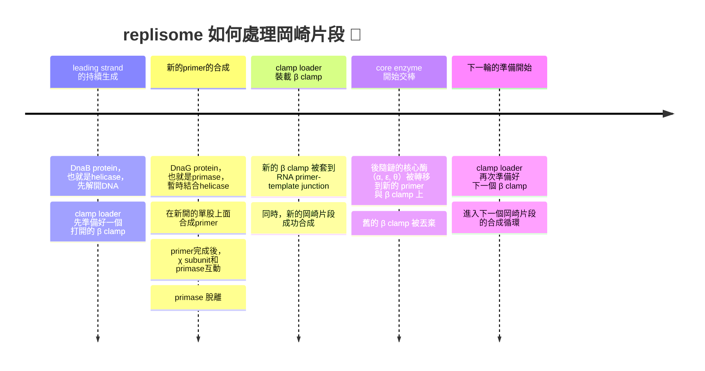

# biochem 3rd midterm
### before we start the class...
#### what is metabolism?
- 代謝跟能量、生物質 (biomass) 有關係
- 身體的能量來源是來自於NTP、FADH2、NADH、NADPH等
- 而生物質就包含醣類、胺基酸、核甘酸等等
- 通常是用這些能量分子，讓這些生物質單體一個一個連在一起
- 例如，肝醣的形成要透過UTP的水解磷酸基形成。UDP-Glc是一個高能分子，可以斷鍵跟其他葡萄醣分子結合
- 至於核酸，本身就是UTP水解焦磷酸鹽後連接在一起的，這反應需要靠聚合酶幫忙

|unit|polymer|
|----|-------|
|glucose|glycogen、starch|
|nucleotides|DNA、RNA|
|amino acid|polypeptide、protein|

#### 規則說明
- DNA可以被複製，也可以被轉錄成RNA
- mRNA會被轉譯成多肽

##### replisome
- 又稱為DNA複製機器 (媽的這好中二 🤣)，裡面的最重要主角之一就是DNA polymerase

##### transcription and translation
- transcription用的是RNA聚合酶。根據你做的RNA不同，會用不同的聚合酶

| RNA 種類 | 功能 | 負責的 RNA pol | 備註 |
| --- | --- | --- | --- |
| **mRNA** | 攜帶基因資訊，作為蛋白質合成模板 | **RNA pol II** | 轉錄大部分的 snRNA、miRNA 等 |
| **tRNA** | 將胺基酸帶到核糖體，對應 mRNA 密碼子 | **RNA pol III** | 同時也轉錄 5S rRNA 與一些小 RNA |
| **rRNA** | 構成核糖體的主要結構與催化成分 | **RNA pol I** | 專門轉錄 28S、18S、5.8S rRNA |

#### 核酸到底是什麼
- 核酸由含氮鹼基、五碳糖以及磷酸基組成
- 一共有兩種形式: DNA 跟 RNA
- 含氮鹼基跟五碳糖由糖甘鍵連在一起
- 沒有磷酸基叫做nucleoside，有的話叫做nucleotide 🙋‍♀️

#### 分子生物學超概覽
- 每個生物體都至少有一套完整的遺傳訊息，這整個遺傳訊息又稱為基因組
- 多數基因組都是DNA，但是有些病毒屬於RNA
- 最小的病毒可能基因組只有幾千個鹼基，而植物的基因組可以高達160 billion base pairs[^1]的數量 (如*Tmesipteris oblanceolata*，叉蕨) ，人類只有3 billion 🙂

## ch25

> 由於我實在是有點寫不下了，所以這一次我直接以課本的slide為主，至於我的心事，兄弟們不需要知道太多，不過我還是會另外發一篇寫下來 👀

### 基本特性
#### DNA 的變性
- DNA變性受到以下原因促進: 
  - 鍵間靜電排斥 (磷酸基團帶負電荷，部分電荷會被陽離子中和)
  - 因此，高離子強度可以穩定雙股結構
  - 跟雙股比起來，單股DNA可以增加entropy，所以DNA熱力學上面偏向單股
  - 鹼性環境跟加熱也會促進變性
- 互補鹼基之間的氫鍵以及van der waals interaction是穩定雙股的力量
- DNA變性不像是蛋白質變性，其只是雙股螺旋間的分開，緩慢冷卻即可恢復正常

> [!Note]
> 不可迅速冷卻，不然會產生大量單股的，未配對的捲曲的DNA !! 👀

#### DNA的吸光值變化
- DNA變性後，鹼基堆疊與氫鍵被破壞，鹼基暴露在溶液中，能更自由地吸收紫外光
- 吸光值會在260 nm區域顯著上升，這就是所謂的 "超色效應"  (hyperchromic effect)

> [!Note]
> - 熔解溫度 (Tm) = 吸光值達到最大與最小之間的 50% 時的溫度
> - GC 含量高 → 熔解溫度高 → 變性較難 🐱

### 複製前介紹
- DNA變成兩個單股後，兩股都可以做成模板，當複製完成後，會產生兩個子DNA，每一個都跟母DNA序列一樣

#### helicases
- Helicases是一種多聚體蛋白質，會先結合其中一條單鍊，並且利用ATP水解產生的能量主動解開雙股

##### 主動滾動模型
- 解旋酶像是一個 "滾輪"，主動推開 DNA 雙股。它利用 ATP 水解驅動，直接破壞鹼基間的氫鍵
- 常見於一些病毒或細菌的解旋酶研究

##### 被動模型
- 解旋酶並不直接破壞氫鍵，而是等待 DNA 自然熱擾動造成局部打開。當出現小的 "氣泡" 或鬆動區域時，解旋酶就繼續推進
- 效率較低，但能量消耗少

##### 尺蠖模型
- 解旋酶像尺蠖一樣，一端固定在 DNA 上，另一端向前移動，再把後端拉過來
- 這種模式強調解旋酶的結構域交替伸縮，推動 DNA 解開

##### 旋轉楔入模型
- 解旋酶像一個楔子插入 DNA 雙股之間，並伴隨旋轉運動
- 這種模型解釋了某些環狀解旋酶如何 "像馬達一樣" 旋轉分開 DNA

80716-3/asset/371241c8-71af-4815-9f97-d919bb799aa8/main.assets/gr1_lrg.jpg)

### 早期研究跟酵素介紹
- Watson and Crick在論文中提出三個假說: 
  - DNA屬於半保留複製 (semiconservative)
  - 複製發生在複製叉處，此處親代解旋，子代鏈進行延伸
  - 複製起點從Ori開始，Ori可以是一個或是多個
- DNA聚合酶催化多核甘酸鏈的延伸
  - 其複製符合半保留複製的價說
  - 沿著5' 到 3' 方向進行，可以以半間斷的方式複製
  - 需要引子跟模板 

> [!Tip]
> ##### DNA der 延伸化學哲學
> DNA的合成跟以下化學特性有關: 
> - Nucleotide triphosphates (dNTP) 是延伸鏈的底物，產生焦磷酸鹽後變成NMP接上去
> - 生長鏈或是引子 3' 的羥基跟核甘酸的 $\alpha$ -磷原子形成鍵結
> - 焦磷酸鹽 (pyrophosphate) 比你想像中的還要容易脫落

#### DNA的聚合
- 當dNTP 的 $\alpha$ -磷酸靠近引子 3'-OH，引子 3'-OH 的氧原子作為親核劑，攻擊 $\alpha$ -磷酸

> [!Note]
> 這一步需二價金屬離子 ( $Mg^{2+}$ ) 幫助穩定負電荷，並降低反應能障 🐱

- 這一反應會形成形成新的磷酸二酯鍵 (phosphodiester bond)，延長 DNA 鏈
- 同時，dNTP 的 $\beta$ -和 $\gamma$ -磷酸以焦磷酸的形式釋放

##### Exonuclease (外切核酸酶)
- 從 DNA 或 RNA 的**末端開始**，一個一個移除核苷酸，常見於 DNA 聚合酶的校正功能，可以是 5' → 3' 或 3' → 5' 方向
- 當 DNA 聚合酶在延伸時，若新加入的核苷酸與模板不匹配，會造成局部結構不穩定
- 聚合酶偵測到這種 "錯誤配對" 後，DNA 3' 端會被移到外切酶活性位點
- 外切酶活性從 新合成鏈的 3' 末端開始，一次移除一個錯誤的核苷酸，錯誤核苷酸被移除後，DNA 聚合酶再把正確的核苷酸加上去
- 校正會讓DNA出錯機率大幅下降 
  - 無校正: $10^{-4}\text{~}10^{-5}$ base pairs
  - 有校正: $10^{-6}\text{~}10^{-8}$ base pairs

##### Endonuclease (內切核酸酶)
- 在**分子內部**直接切斷磷酸二酯鍵，不需要從末端開始，可以在中間隨機或特定位點切割，例如限制酶 (restriction enzymes)

| 特徵 | Exonuclease | Endonuclease |
| --- | --- | --- |
| 切割位置 | 分子**末端** | 分子**內部** |
| 切割方式 | 一次移除一個核苷酸 | 在特定位點或隨機位置切斷 |
| 方向性 | 有 5'→3' 或 3'→5' | 無方向性限制 |
| 功能例子 | DNA 聚合酶校正、RNA 降解 | 限制酶、DNA 修復切割 |

#### dNTP的不平衡
- 如果四種脫氧核苷三磷酸 (dATP, dTTP, dGTP, dCTP) 的濃度比例不平衡，DNA 聚合酶在選擇核苷酸時就會受到干擾，進而增加錯誤率
- 如果某一種 dNTP 過量，聚合酶可能 "偏好" 加入它，即使不是正確配對，這會導致錯配 (mismatch)
- 同時，過量的 dNTP 會加快聚合速率，聚合酶更容易 "跳過" 校正；相反，不足的 dNTP 則可能造成停滯或不完全複製

#### DNA pol I in E.coli
- DNA pol I可以被蛋白酶體分解成一個大片段 (Klenow fragment) 跟一個小片段[^2]
- 其具有三種酵素活性:
  - 5' → 3' 聚合酶活性 (來自於Klenow fragment)
  - 3' → 5' 外切酶活性 (又稱為校正，proof-reading，來自於Klenow fragment)
  - 5' → 3' 外切酶活性 (來自於small fragment，切除RNA引子)
- Domain包含: 
  - N 端 (35 kDa): 包含 5' → 3' 外切酶活性，負責移除 RNA primer 或受損 DNA
  - C 端 (Klenow fragment, 68 kDa): 保留 DNA 聚合酶活性與 3' → 5' 外切酶活性
  - palm、fingers、thumb結構域: 典型的 DNA 聚合酶 $\alpha/\beta$ 結構，用來抓住 DNA 與 dNTP
- 聚合酶與外切酶活性位點位於不同結構域，確保高精準度
- 它的 Klenow fragment 常被用於分子生物學實驗，例如 Sanger 定序

#### 深入解析聚合酶作用機制
- 手掌 (palm)、手指 (fingers)、拇指 (thumb) 三個區域共同協調反應

| 結構區域 | 主要功能 |
| --- | --- |
| **Palm** | 含有催化位點；負責形成磷酸二酯鍵。包含兩個 $Mg^{2+}$ 或 $Mn^{2+}$ 幫助穩定負電荷 |
| **Fingers** | 抓住即將加入的 dNTP，確保正確鹼基配對。錯誤配對時會拒絕反應 | 
| **Thumb** | 穩定 DNA–酶複合體，維持聚合酶與 DNA 的接觸 |

- 兩個二價金屬離子共同協助完成磷酸二酯鍵的形成，這又被稱為**two-metal mechanism**
  - **catalytic metal, metal ion A**: 降低引子 $3\text{'}-OH$ 的 $pK_a$ ，使它更容易去質子化，產生 $3\text{'}-O^-$ ，變成親核基攻擊 $\alpha$ -磷酸
  - **stabilizing metal, metal ion B**: 穩定 dNTP $\alpha$ -磷酸的負電荷，同時協助穩定離去基團焦磷酸的釋放

- 其實很多的DNA聚合酶，幾乎都有這三個palm、fingers、thumb結構，這包含但不限於*Taq* polymerase (PCR聚合酶主角)，以及病毒的逆轉錄酶

#### DNA pol III in E.coli
- DNA Pol III 是一個多亞基複合體 (holoenzyme，全酵素)，結構很複雜... 

##### 核心打字頭 (?)
- 分為 $\alpha$ 、 $\varepsilon$ 、 $\theta$ 三亞基

| 亞基 | 名稱 | 功能 |
| --- | --- | --- |
| $\alpha$ (DnaE) | 聚合酶亞基 | 負責 5'→3' DNA 合成 |
| $\varepsilon$ (DnaQ) | 3'→5' 外切酶 | 校正錯誤核苷酸 |
| $\theta$ (HolE) | 穩定 $\varepsilon$ 亞基 | 增強校正效率 |

##### 效率推手
- $\beta$ sliding clamp是一個環狀二聚體，負責固定住DNA，使其不會脫落
- 這導致高過程性 (processivity)，使其可以連續合成上百萬個核甘酸，速度還特別快 😏

##### 誰裝 $\beta$ subunit?

| 亞基 | 名稱 | 功能 |
| --- | --- | --- |
| $\gamma$ 、 $\delta$ 、 $\delta\text{'}$ 、 $\chi$ 、 $\psi$| ATPase 活性 | 打開 β clamp，裝上 DNA |
| $\tau$ | 連接核心酶與 helicase | 協調前導鏈與後隨鏈合成 |

_structure_in_E.coli.png)

#### 比較 pol I 跟 pol III

| 特徵 | **DNA Polymerase I** | **DNA Polymerase III** |
| --- | --- | --- |
| **分子量 / 結構** | 約 103 kDa，單亞基 N 端有 5'→3' 外切酶 C 端 (Klenow fragment) 有聚合與 3'→5' 校正活性 | 約 900 kDa，由多個亞基組成 核心 $\alpha$ + $\varepsilon$ + $\theta$ + clamp loader + $\beta$ sliding clamp |
| **主要功能** | DNA 修復、移除 RNA primer、加工 Okazaki 片段 | 複製叉的主要 DNA 合成酶 |
| **聚合方向** | 5'→3' | 5'→3' (用 $\alpha$ subunit) |
| **校正活性** | 3'→5' 外切酶 (proofreading) | 3'→5' 外切酶 (proofreading，用 $\varepsilon$ subunit) |
| **特殊外切酶活性** | 5'→3' 外切酶，移除 RNA primer 或受損 DNA |**無 5'→3' 外切酶** |
| **速率** | 較慢 (~10–20 nt/s) | 非常快 (~1000 nt/s) |
| **processivity** | 低 (合成幾十個核苷酸就脫落) | 高 (可合成數百萬核苷酸不脫落，靠 β clamp) |
|**突變是否致命**|只有在 5'→3' 外切酶出現問題才有致命可能|會致命|

### DNA 的複製過程
- 核糖跟蛋白質的生物合成是透過複製、轉錄、轉譯過程進行的

#### adenosylhomocysteine
- Adenosylhomocysteine (AdoHcy，腺甘同半胱胺酸) 是一個在甲基化反應 (methylation reactions) 中非常重要的中間產物
- 其來自S-adenosylmethionine (SAM) 在提供甲基給 DNA、RNA 或蛋白質後，轉變成的
- 通常來說，DNA複製後，甲基化需要重新建立。SAM 提供甲基，生成 SAH。
- 如果 SAH 累積過多，會抑制甲基轉移酶 (methyltransferase)，導致甲基化異常，這屬於反向抑制

| 分子 | 前體 | 甲基化酶 | 甲基來源 | 功能意義 |
| --- | --- | --- | --- | --- |
| Epinephrine (腎上腺素) | Norepinephrine | PNMT | SAM | 戰鬥/逃跑激素 |
| Creatine (肌酸) | Guanidinoacetate | GAMT | SAM | 能量儲存 (ATP 快速供應) |
| Phosphatidylcholine (卵磷脂) | Phosphatidylethanolamine | PEMT | SAM | 細胞膜主要成分 |

### 原核生物的複製情形: a closer look
#### ori
- 主要結構如下: 

##### DUE (DNA Unwinding Element)
- 一共三個重複序列，每一個共13bp (GATCTNTNTTTT)
- 這裡的 AT-rich 區域容易被打開，作為 DNA 解旋的起始點

##### DnaA binding sites (9 bp 序列)
- 共五個，序列通常為TT(A/T)TNCACC，並且順序跟方向不一
- DnaA 蛋白會在這些位點結合，形成 DnaA–ATP 複合體，幫助 DNA 解開

#### other DNA protein
- 這些蛋白質型態不一:

| 蛋白質 | 功能 |
| --- | --- |
| **DnaA** | 結合 oriC 的 DnaA boxes，利用 ATP 幫助 DNA 在 DUE 區域打開 | 
| **DnaB (helicase)** | 六聚體解旋酶，打開 DNA 雙股 | 拆封工人，拉開拉鍊 |
| **DnaC (loader)** | 幫助 DnaB 裝到 DNA 上，ATP 依賴性 | 
| **HU** | 非特異性 DNA 結合，造成 DNA 彎曲 | 
| **IHF** | 特異性 DNA 結合並彎曲，協助 DnaA 複合體組裝 |
| **DnaG (primase)** | 合成 RNA primer，與 DnaB 組成 primosome | 
| **SSB** | 結合單股 DNA，防止再度配對，保護 DNA |

#### 功能近距離分析
- HU and IHF這兩個蛋白可以跟DnaA protein結合，這導致了DNA在ori的地方被 "拖起來"、"彎曲"
- 同時，DUE區域的地方因為彎曲而打開雙股，這導致DNA helicase (DnaB protein) 的附著。也就是說，樣先有棟，helicase才可以安裝 !!
  - DnaB protein要安裝，需要跟小型蛋白質DnaC protein附著，同時，DnaC會水解ATP，這是裝載上去的動力來源
- 之後SSB跟DnaG (primase) 結合在打開的單股上面，Dna A protein被移除

> [!Note]
> **primase + helicase + primosome** 🐱

#### 複製時的狀況
- 複製方向: 複製股的5' → 3' 也就是模板股的3' → 5'，所以**新的核甘酸會一直往 3' 加**
- 超螺旋形成: 需要拓撲異構酶，topoisomerase
- ssDNA需要能穩定，不能在分裂途中又結合在一起

> [!Note]
> ##### 細菌染色體的超螺旋
> - 細菌染色體是環狀 DNA，會形成負超螺旋。由 DNA gyrase (type II topoisomerase) 引入，讓 DNA 像彈簧一樣緊縮
> - 染色體被分成許多獨立的超螺旋區域。每個區域可以獨立放鬆或收縮，避免整條 DNA 打結
> - NAPs (如HU、IHF、Fis、H-NS) 會會彎曲、橋接 DNA，幫助進一步壓縮。功能類似真核的組蛋白，只是結構不同

- leading strand的合成是連續的，而lagging strand合成不連續，形成 "岡崎片段" (Okazaki fragments)

- DNA polymerase III 又稱為 "全酵素" (holoenzyme)，基本上就是因為他是一個超大複合體，啥都做

> [!Important] 
> leading跟lagging strand是由 "同一個複製機器" 做的 !! 👀

#### 拓撲異構酶冷知識
##### type I
- 結構上包含:
  - **核心催化區**: 三個亞基組合而成，含有tyrosine residue，負責切割 DNA 單股
  - **Linker 區域**: 連接不同結構域，提供柔性，在 DNA 旋轉時允許構象變化
  - **C-terminal domain**: 在某些生物中幫助 DNA 的進一步定位

- Tyr 殘基的 $OH^-$ 是個超強親核基，電子攻擊DNA的磷原子，這會形成enzyme-DNA中間體，同時斷開DNA雙股

- camptothecin (CPT) 是一種天然來源的抗癌藥物，CPT作用在topoisomerase I上面，穩定enzyme–DNA共價中間體
- 它和 Type II 不同，專門處理單股 DNA 的切割與重接
- 這阻止了DNA斷口的再封合，導致細胞死亡 (也就是打開後關不回去，一複製細胞就斷DNA)

> [!Note]
> ##### 超螺旋在實驗中的特性
> - 超螺旋DNA的結構更緊密，體積小，在凝膠電泳中會比未supercoiled的DNA跑得快
> - 在質體 DNA 的檢測中，常能看到三種 band: 
>    - 超螺旋 (supercoiled，快)
>    - 線性 (linear，中等)
>    - 開環 (nicked，最慢) 
> - 也就是說，同樣長度的 DNA，因為超螺旋程度不同，會呈現不同的 "表觀大小"，所以跑出不同的 band! 😲

##### topoisomerase II
- 其一次切斷雙股 DNA，讓另一段 DNA 通過斷口，再封合。這個過程需要 ATP 水解提供能量
  - Topo II 會先抓住一段 DNA，該DNA被稱為gate segment 或是 G-segment
  - 酶的 Tyr 殘基各自攻擊 DNA 的兩股磷酸骨架，形成 enzyme–DNA 共價鍵，這時G-segment 被切成雙股斷口
  - 第二段 DNA 被稱為 transport segment 或是 T-segment，在 ATP 的幫助下被引導穿過斷口
  - 原本G-segment自由的5'-OH攻擊enzyme–DNA 共價鍵，導致DNA重新接上

#### primase
- 在細菌裡面，DnaG protein就是屬於細菌的primase，primase合成primer (引子，屬於一小段RNA)
- 在複製過程中會由 5'→3' 外切酶活性切除

> [!Note]
> - **nick translation**:
>   - 5’→3’ exonuclease切除RNA後，polymerase 活性會補上 DNA
>   - Nick = 單股斷裂 (single-strand break)，但雙股 DNA 沒有完全斷開
> - **DNA repair**: 
>   - 若 DNA 有受損片段或錯誤核苷酸，5’→3’ exonuclease 可以切除受損區域
>   - 如果該外切酶活性突變，該個體會容易受到UV傷害 🐱

### replisome 詳細介紹
- 基本上在原核生物裡面這就是DNA polymerase III 組成的 holoenzyme (這傢伙到底出現了多少次了... never mind then 🙂)
- 由於這個holoenzyme被認為長得有點像是管樂器的長號 (你告訴我哪裡像了??) ，所以又稱為 "trombone model"
- clamp loader complex ( $\tau$ + $\delta/\delta\text{'}$ + $\gamma$ + $\psi$ + $\chi$ ) 會水解ATP把 $\beta$ -clamp打開又關閉，好固定DNA
- 其中， $\tau$ 也負責聚合酶的二聚化，兩個聚合酶一個複製leading strand，一個複製lagging strand

#### clamp loading
- $\beta$ -clamp看起來像是一個甜甜圈似的，通常還連接著聚合酶

>[!Tip] 
> 具體clamp loader裝載 $\beta$ -clamp的方式... 有看過登山安全扣嗎 (carabiner)? 登山繩是DNA，扣子是$\beta$ -clamp 😏

- 不同的sliding clamp長得幾乎一模一樣，序列可能差很多，但是最後都 "有志一同" (?) 
- 雖然 $\beta$ -clamp屬於dimer，人類的sliding clamp (PCNA) 屬於trimer，但是最終長得都像是six-fold pseudo-symmetry ring

- 當 clamp loader complex 等亞基結合ATP時，loader會改變構象，把 $\beta$ -clamp 撐開
- clamp loader 識別RNA primer後，在該處把 $\beta$ -clamp套上去

#### primase 
- 在大腸桿菌中，primase (DnaG) 會暫時和 helicase (DnaB) 結合
- DnaB 是六聚體環狀結構，解開 DNA 雙股。primase會在helicase打開的單股膜板上面合成一段約10~12 bp的引子
- 合成之後， $\chi$ 亞基透過和SSB的交互作用，幫助 "把primase從DNA上拆掉" ，避免它阻礙後續的clamp裝載與 pol III 延伸

#### 岡崎片段的合成循環
- replisome在lagging strand上裝載 $\beta$ -sliding clamp 與 DNA Pol III，屬於一個周期性的流程

#### 複製終止
- 兩個複製叉從oriC開始跑，但是到了終點之後呢? 相撞? 如果沒有阻止replisome停止，helicase會開始拆新股
- 為了避免這種事情發生，細菌的DNA上面有多個Ter位點
- 當Tus protein (terminus utilization substance) 結合到Ter未點上時，形成tur-tus複合體
- 該複合體是單向路障，一個複製叉能通過，另一個複製叉會被擋住。最終，兩邊施工隊最後被導流到同一個終點
- 這確保genome被完整複製一次，而且不會複製第二次

#### catenane風險
- 要是你的DNA複製完後是兩個獨立的環還好說，但是如果不是的話，這兩個環互相套著，這樣DNA還是分不開，這叫做catenane (像是鎖鏈一樣的樣子，請自行腦補... 🙂)
- 因此，這個時候就需要topoisomerase IV的幫忙。雖然它跟DNA gyrase一樣可以斷開雙股，但是它最主要是在DNA複製最後解決catenane為主

### 真核生物的DNA複製
#### 前情提要
- 比細菌更為複雜，因為真核有多個ori，需要控制細胞分裂的時間點，也需要更多種的蛋白質或是酵素
- 細胞週期分為 $G_1$ 、 $S$ 、 $G_2$ 、 $M$

#### 染色體的基本單位
- 染色質中凝集的基本單位被稱為 "核小體" (nucleosome)，大約纏繞兩圈DNA，組蛋白屬於八聚體構造，每一個核小體旁邊有一個H1蛋白

    

#### 複製時的必需蛋白質
##### origin recognition complex
- ORC一直都接在DNA上面，主要辨識並接在ori上面
- 其是六個亞基組成的蛋白質

##### replication activator protein
- 在複製開始時，RAP會接在ORC上面開啟複製
- 它也協助ORC、Cdc6、Cdc1等物質一起招募MCM helicase

##### replication licensing factor
- 通常有多個，例如Cdc6、Cdc1等，會多個附著在DNA上面，標示可以打開雙股的地方
- 如果沒有接上RLFs，無法啟動複製機器
- 一旦複製到了該處，上面的RLFs被分解，確保它只被複製一次

#### 複製前複合體
- pre-replication complex (pre-RC) 包含更更我們提到的ORC、RAP、跟RLFs
- 要促進細胞週期的推進，需要: 
  - cyclins: 週期素，會隨著細胞週期合適的轉錄、產生跟分解
  - CDKs: 週期素介導激酶，會跟cyclins作用而活化
- 核膜的分解

#### DNA聚合酶種類
- 真核生物的DNA聚合酶一共有五種: 

|polymerase|3'→5' 外切酶活性|精確度|功能|
|---|---|---|---|
|polymerase $\alpha$  |沒有❎| $10^{-4}\text{~}10^{-5}$ |合成延遲股跟RNA引子|
|polymerase $\beta$ |沒有❎| $5\times 10^{-4}$  |修復DNA為主，非主力|
|polymerase $\gamma$  |有✅| $10^{-5}$  |mtDNA複製|
|polymerase $\delta$ |有✅| $10^{-5}\text{~}10^{-6}$  |**合成延遲股**|
|polymerase $\varepsilon$ |有✅| $10^{-6}\text{~}10^{-7}$  |**合成領先股**|

- PCNA相當於細菌的 $\beta$ clamp，名字叫做 "proliferating cell nuclear antigen" (當然這東西一般來說不是抗原，只是科學家剛開始發現有些人的抗體很傻的攻擊這種東西，所以被稱為 "antigen")

#### 功能對應總整理

|species|E. coli|Yeast|Human|Phage (T4/T7)|function|
|-------|-------|-----|-----|-------------|--------|
|啟動|DnaA|ORC|ORC|gp59/origin proteins|辨認 replication origin|
|hgelicase|DnaB|MCM2-7 (CMG)	|MCM2-7 (CMG)|gp4 (T7)、gp41 (T4)|解開 DNA 雙股|
|helicase loader|DnaC|Cdc6/Cdt1|Cdc6/Cdt1|varies|幫 helicase 上 DNA|
|primase|DnaG|DNA Pol $\alpha$ -primase|DNA Pol $\alpha$ -primase|	gp4 primase domain|合成 RNA primer|
|leading strand polymerase|DNA Pol III|Pol $\varepsilon$|Pol $\varepsilon$|gp5 (T7)	|主要領先股合成|
|lagging strand polymerase|DNA Pol III|Pol $\delta$|Pol $\delta$|gp5 (T7)|主要延遲股合成|
|校正功能|$\varepsilon$ subunit|Pol $\delta / \varepsilon$ exonuclease|Pol $\delta / \varepsilon$  exonuclease|polymerase intrinsic|3'→5' 外切酶活性|
|sliding clamp|$\beta$ clamp|PCNA|PCNA|gp45 (T4)|提高 processivity|
|clamp loader|$\gamma , \tau ,  \chi$ complex|replication factor C|replication factor C|gp44/62 (T4)|把 clamp 套上 DNA|
|單股結合蛋白|SSB|replication protein A|replication protein A|gp32 (T4)|穩定單股 DNA|
|RNA primer 去除|DNA Pol I, RNase H|RNase H + FEN1|RNase H + FEN1|RNase activities vary|去除 RNA primer|
|Nick 縫合|DNA ligase|DNA ligase I|DNA ligase I|T4 ligase|縫合單股斷裂|
|拓撲異構酶|Gyrase / Topo IV|Topo I/II|Topo I/II|phage topo proteins|解超螺旋壓力或是拓撲結構改變|
|termination control|Tus-Ter|fork convergence|fork convergence|	varies|複製終止控制|

### 端粒是何方神聖
- 線性的DNA往往在延遲股複製完的最後，會在末端留下一段未去除的RNA primer 
- 由於DNA polymerase 只能在已有 3’-OH 的位置延伸，最後一段的 RNA primer 位於染色體末端，沒有後續的 DNA 片段提供 3’-OH 來替換它
- 這段RNA被水解後，聚合酶無法補上，就會出現一個小缺口，進而導致DNA變短一點。因此真核生物會用telomerase去補上缺失序列
  - 端粒酶由一小段RNA模板跟蛋白質組成
  - 通常體細胞中沒有這種東西，只有生殖細胞或是腫瘤才有
- 在人類中，端粒的 DNA 序列是由重複的六核苷酸單元 **TTAGGG** 構成，並在染色體末端形成一段 G-rich 的單股突出 (3′ overhang)

|生物|端粒重複序列 (5' → 3')|
|---|----------|
|*Tetrahymena themophila* 嗜熱四膜蟲 (纖毛蟲類)| $TTGGGG$ |
|*Saccharomyces cerevisiae* 釀酒酵母| $T(G)_{2-3} (TG)_{1-6}$  |
|*Arabidopsis thaliana* 阿拉伯芥| $TTTAGGG$ |
|*Bombyx mori* 家蠶| $TTAGG$ |
|human| $TTAGGG$ |

#### telomerase
- 端粒酶屬於ribonucleoprotein complex (核糖核蛋白複合體) 要能合成端粒，需要滿足: 
  - RNA 模板存在
  - 染色體末端必須有一段 3′-OH 的單股 DNA
  - 要有Shelterin 複合體中的 TRF1、TRF2、POT1 等蛋白負責保護端粒
- 合成時一樣以合成的那一股的 5' → 3' 進行，具體來說: 
  - 先延長 3′ 單股突出端
  - 再加上RNA 引子，由常規 DNA 聚合酶補回互補股

#### G-四聯體
- 常見於端粒的 TTAGGG 重複序列
- 四個 guanine 透過 Hoogsteen 氫鍵相互配對，形成一個平面環，中間通常需要單價陽離子 (特別是 $K^+$ ) 穩定結構
- 多個 G-quartet 疊加在一起，就構成 G-quadruplex

### RNA病毒
- 由於RNA病毒在複製時並沒有校正的機制，所以它特別容易突變
- 有些逆轉錄病毒 (retroviruses，例如HIV)，有逆轉錄酶，屬於RNA依賴型的DNA聚合酶 (RdDp)
- 如果以中心法則去了解逆轉錄病毒的生活史，大概會變成... 🙂

- 逆轉錄病毒會用自己的genome，利用逆轉錄酶去合成一個雙股的DNA，用來嵌入宿主的基因組裡面潛伏

#### RdRp
- 大多數的RNA病毒都含有一條的單股RNA分子，可以是+ssRNA或是-ssRNA
- 如果是以+ssRNA當作genome，其酵素可以用+ssRNA產生一條dsRNA，然後其中合成的-ssRNA股可以形成更多的+ssRNA (也就是genome)

#### 不同病毒基因組的複製週期整理

|group|description|
|-----|-----------|
|**dsDNA**|基因組合成方式:dsDNA → dsDNA，mRNA合成方式:dsDNA → mRNA|
|**ssDNA**|基因組合成方式:ssDNA → dsDNA → ssDNA，mRNA合成方式:ssDNA → dsDNA → mRNA|
|**dsRNA**|基因組合成方式:dsRNA → ssRNA → dsRNA，mRNA合成方式:dsRNA → mRNA|
|**+ssRNA**|基因組合成方式:+ssRNA → -ssRNA → +ssRNA，mRNA合成方式:自己就是mRNA|
|**-ssRNA**|基因組合成方式:-ssRNA → +ssRNA → -ssRNA，mRMA合成方式:-ssRNA → mRNA|
|**逆轉錄病毒**|基因組合成方式:ssRNA → dsDNA → ssRNA，mRNA轉錄方式:ssRNA → dsDNA → mRNA|
|**反轉錄DNA病毒**|基因組合成方式:dsDNA → ssRNA → dsDNA，mRNA合成方式:dsDNA → mRNA|

[^1]:https://www.kew.org/about-us/press-media/worlds-largest-genome
[^2]:https://link.springer.com/chapter/10.1007/978-3-642-83709-8_3
